As the title suggests, I really went there just to idle the time away.

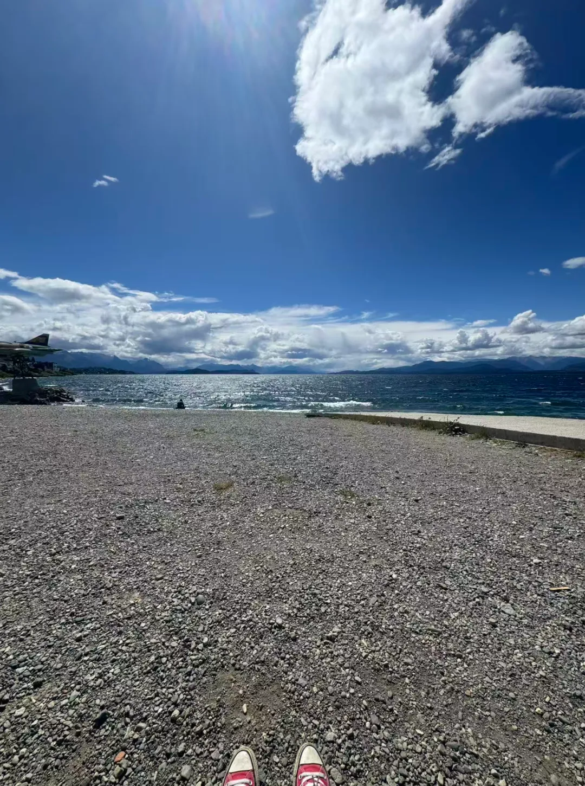
*Photo: Sitting on a chair by the lake, dazing in the sun. If I didn't have to worry about finding a restroom, I could have dazed there all day.*

Bariloche, officially known as San Carlos de Bariloche, is located in the Patagonia region. Compared to the glaciers further south, Bariloche is famous for its stunning lakes and mountains, earning it the nickname "The Little Switzerland of South America" (though my friend insists it looks nothing like Switzerland).

The earliest immigrants to Bariloche were primarily German-speakers from Central Europe—Germany, Switzerland, and Austria—later joined by people from many other regions. Undoubtedly, those first immigrants laid the cultural foundation of the town. The wooden cabins and chocolate shops are echoes of Europe, but the ferocious winds and the lupines lining the roads are pure, unadulterated Patagonian soul.

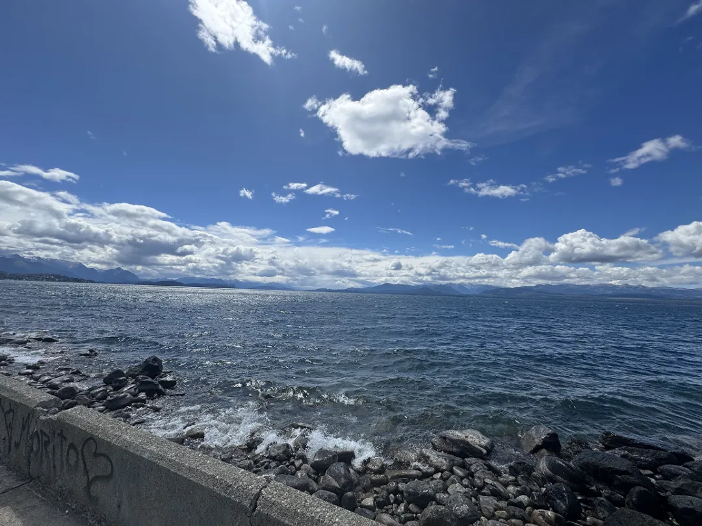
*Photo: Strolling along the lakeshore.*

I spent five days in Bariloche at the end of last November. While my friends were back in Buenos Aires watching the rain and dodging dog poop, I was in sunny Bariloche, windswept and soaking in the lake views. Aside from the wind, everything here is gentle.

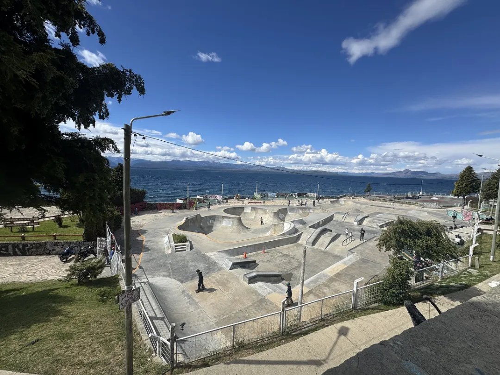
*Photo: Watching local kids skate along the lakeshore.*

To be honest, compared to Ushuaia, Bariloche is a relatively "niche" destination within the Chinese travel community, though it's a favorite for European and American tourists. I first heard of it through a friend in Spain who told me he wanted to stay there for a while and sent me a travel intro on Instagram. After some research, I was sold—mostly because I wanted to "lie flat" (relax completely). I was very insistent on this destination from the start. Plus, my friend V said she was going to Bariloche for rock climbing (though she spent most of her days up on the mountains), so we agreed to meet there. In the end, Iguazu and Bariloche were the two most "certain" stops on my Argentina itinerary.

What makes Bariloche unforgettable, however, was the blow to my wallet. First, I missed my flight because I stopped to buy water at the airport and arrived at the gate less than a minute after the jet bridge door closed—the first time in my life I've ever missed a flight. Then, as I was leaving, I realized I had lost my relatively new Sony XM4 headphones (the blue ones!), and I had no idea where I left them. When I tried to buy them again back home, I found they were discontinued and the price had actually *risen*. I was fuming at my own stupidity. Well, I'll just consider it "spending money to ward off bad luck" (破财消灾) 🙏.

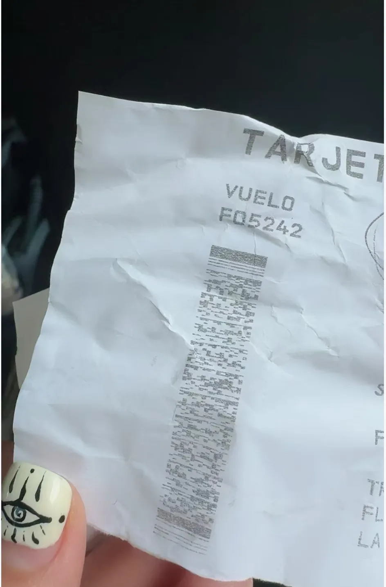
*Photo: 💸 A silent loss.*

Anyway, back to the trip. On the day I arrived, I discovered another Singaporean friend was also in Bariloche. To make it to a steak dinner with him, I took an Uber directly from the airport to my Airbnb, which cost about ¥100. The driver spoke great English; he was originally from BA but had moved his whole family to Bariloche to escape the big city for the mountains, water, and better weather. On the way from the airport to the center, you can see massive fields of lupines in full bloom.

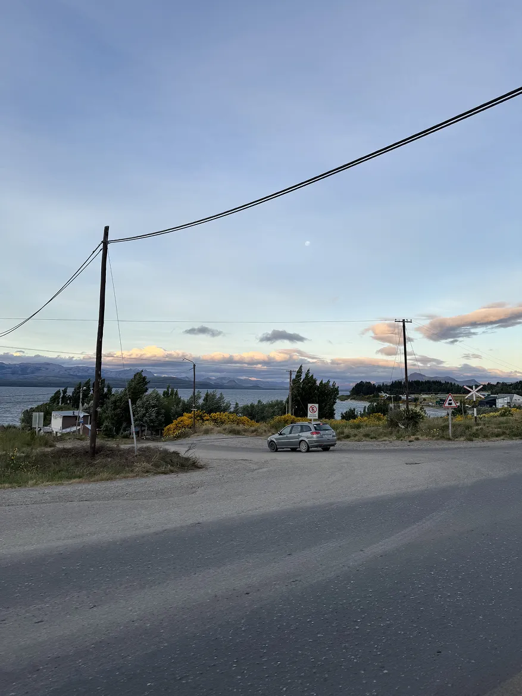
*Photo: On the way to the airport.*

*"The stars in the sky don't speak, the children on earth miss their mothers... the eyes in the sky blink, a mother's heart is a lupine flower."* This childhood song suddenly started playing in my head. I finally know what a lupine looks like.

I suspect that once I switched into "Bariloche mode," I started doing silly things—entirely my own fault, not a slight on the city. I think because I just wanted to veg out after so much traveling, my mental gears were slipping, resulting in constant brain fog. The most direct evidence: after arriving at my Airbnb, I looked at the Google Maps link for the restaurant my friend sent me and walked to a steakhouse with a line outside. I just *assumed* that was the place. Even more bizarrely, I didn't feel anything was wrong. When my friend texted saying he had arrived and I replied I was already there, yet we couldn't see each other, I still didn't catch on. It wasn't until he asked, "Did you go to a different one?" that I realized—Oh crap!!

Well, the steak was still delicious, and my friend treated me, so I was happy! To my surprise, the only two other Chinese men I had seen on my flight were sitting at the table right next to us. So, in that entire steakhouse, all four Chinese faces were gathered at two adjacent tables. When I locked eyes with them, I bet they were just as astonished.

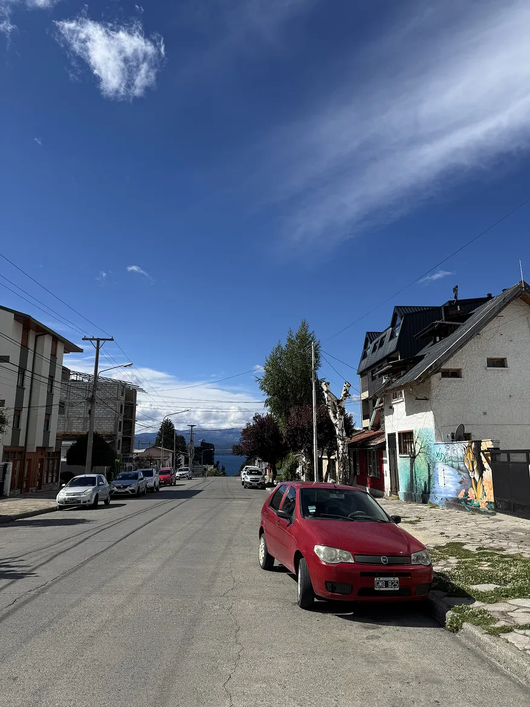
*Photo: Looking up at the blue sky and white clouds.*

After dinner, something interesting happened. On the walk back to my Airbnb, I stopped at a small supermarket across the street. The owner tried to communicate with me in very broken English, but I couldn't understand him at first. Eventually, I realized he was asking if I had any Chinese RMB banknotes—small denominations were fine. He likes to collect banknotes from different countries. I felt bad because, aside from Pesos, I hadn't brought a single cent of RMB with me (and you never need cash in China anyway). I could see his disappointment; Bariloche probably doesn't see many Chinese tourists in a year. After this, I realized it might be a good idea to carry a few small RMB bills when traveling to remote places.

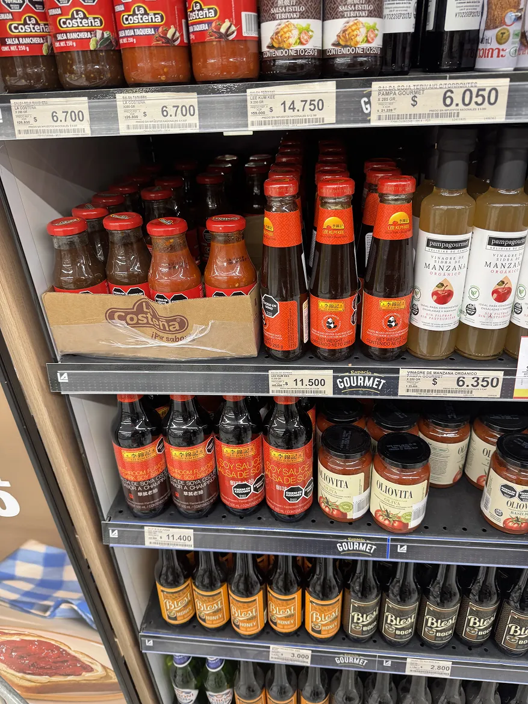
*Photo: I forget if this was the "Anonymous Supermarket," but it was a large local one. So many Chinese seasonings! Lee Kum Kee dark soy sauce was even more expensive here than in BA 😂*

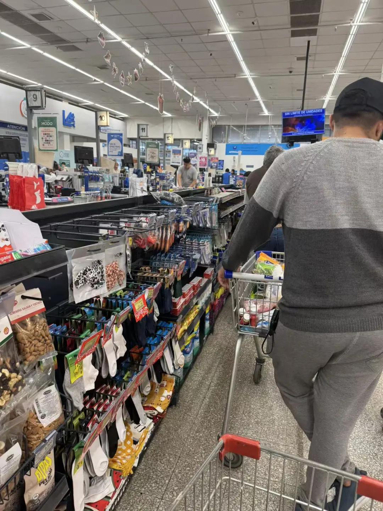
*Photo: The supermarket line was so long!*

The friend I had dinner with told me he had booked an 8-hour hiking tour and asked if I wanted to join. My "lying flat" soul firmly declined. Instead, I spent the next two days lounging in the Airbnb, doing a "city walk" in town when I went to the supermarket, and dazing by the river.

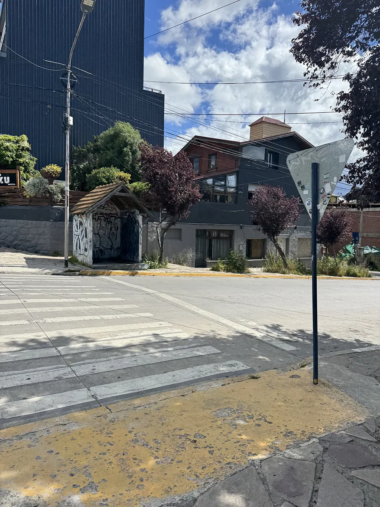
*Photo: The streets. Unlike Buenos Aires, the houses here don't have heavy anti-theft bars installed.*

Eventually, I felt like I couldn't stay a "waste of space" forever; I had to explore the mountains at least once. So, I took a bus to the cable car (**Aerosilla Cerro Campanario**). This is a chairlift style, like at a ski resort, so it's open-air. When the wind is strong, you can hear the friction between the cable and the chair, and there's a slight swaying.

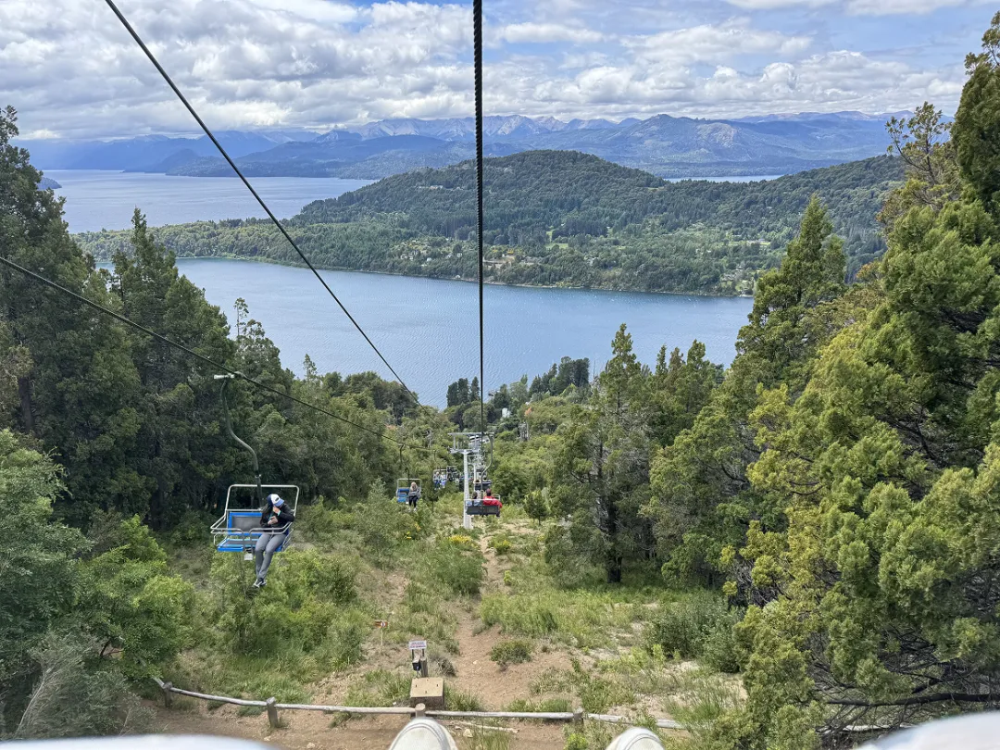
*Photo: On the way down.*

Actually, you can hike up instead of taking the chairlift; it takes about half an hour. But I was lazy. The round-trip ticket was 20,000 Pesos (about $14) for a ten-minute ride. Looking back, it was a bit pricey, but I had time to kill. The benefit is the view: as you ascend (or return), you see the emerald lake and the deep blue sky, connected by lush green mountains. There's a photographer near the drop-off point. If you want a photo, pose early and decide later if you want to buy it. I figured since I was only visiting this one spot, I might as well have a memento, so I bought it. I can't say I'm thrilled with the shot, but it has commemorative value. One photo was about ¥40.

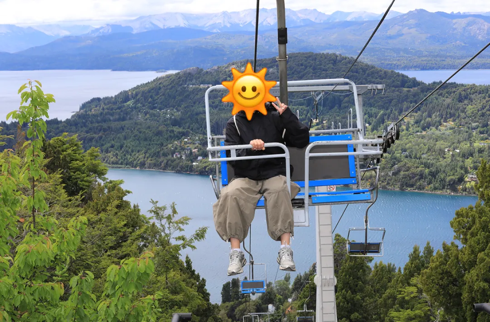
*Photo: Well, this is the result. Showing you the first paid "tourist photo" of my life, which cost me $6.*

After getting off the chairlift, there are several observation decks nearby where you can take photos and look out over the mountain ranges.

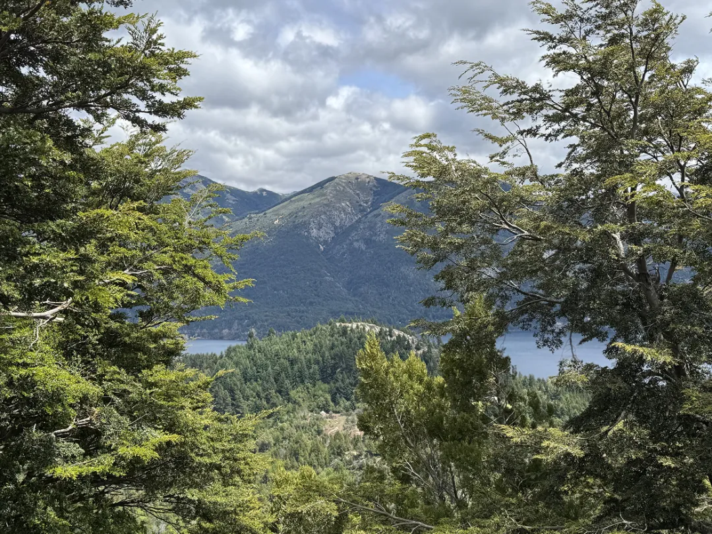
*Photo: View from Observation Deck 1.*

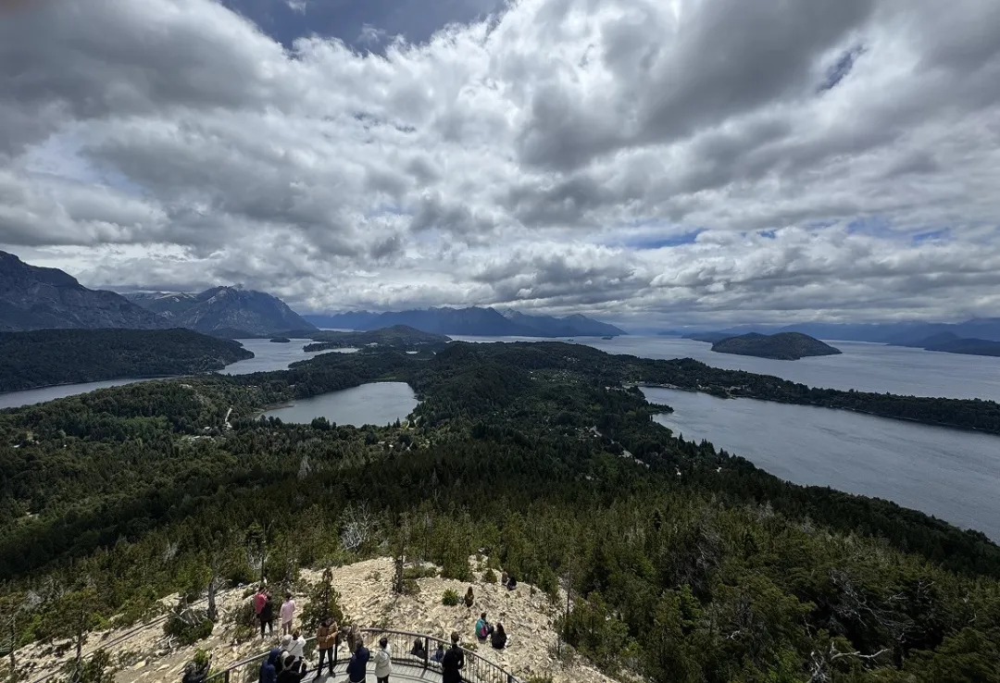
*Photo: Another deck, where you can see even further.*

I was back down quite early; the chairlift and sightseeing took less than an hour. So, I took the bus to the **Llao Llao Hotel** area. Walking down from the hotel, I met a girl from the US. We chatted for a bit, and I realized I’ve met a lot of Americans on the road, even though they say not many Americans choose Argentina for vacation—most go to Europe.

On the way, I kept running into local dogs who were very interested in the chips in my hand. The scenery in that area is truly lovely—lakes and mountains that aren't as "shocking" as the glaciers in El Calafate, but more delicate and exquisitely carved by nature. I think that's why it's called "Little Switzerland."

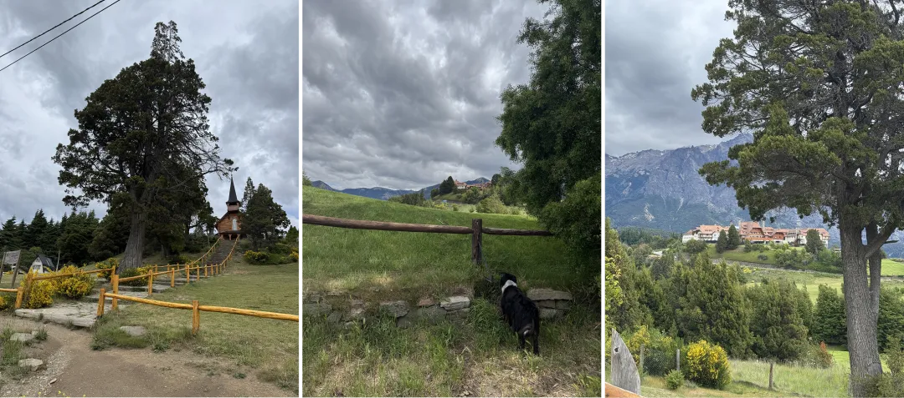
*Photo: From left to right: a church, a dog begging for pets, and Hotel Llao Llao (arranged as they appeared).*

Since V was coming down from the mountain that evening and we had dinner plans, I didn't linger and took the bus back to the center. Interestingly, the bus played music, and the driver was a local man with a white beard—a real veteran driver, haha. He seemed to know everyone in town. I also saw many tourists from other parts of Argentina. I was once again struck by how **Mate** is truly their national drink; I saw a 12-year-old girl with a Mate cup tucked into her bag.

That night, V and I went to the steakhouse the Singaporean friend had originally recommended. It was excellent. Honestly, the baseline for steak in Argentina is consistently high. After dinner, we headed back to our respective accommodations—there isn't much nightlife there. For the final two days, I found a café where the cakes were amazing. To be fair, I didn't have much great coffee during my 20+ days in Argentina, but this place was decent—perhaps only because the competition was weak—but at least the milk foam was even and they gave me latte art. But the cake was the star. V ordered a Hawaiian White Chocolate one, which was a bit too sweet for me. For me, the highest praise for a dessert is "it's not too sweet."

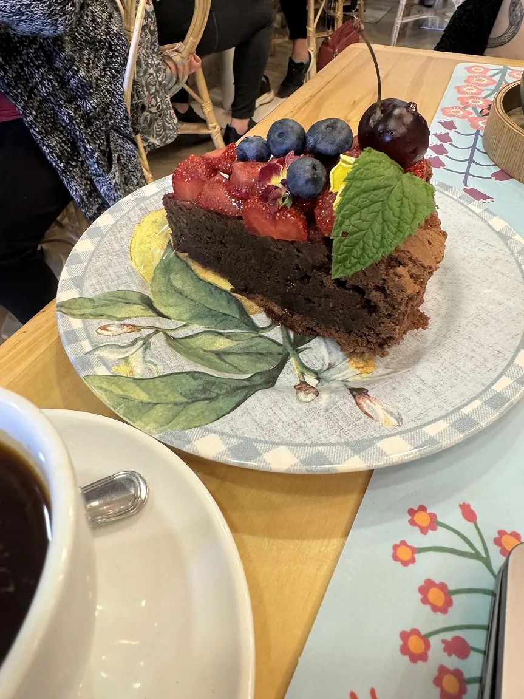
*Photo: I fell in love with this cake the moment I saw it! 😍*

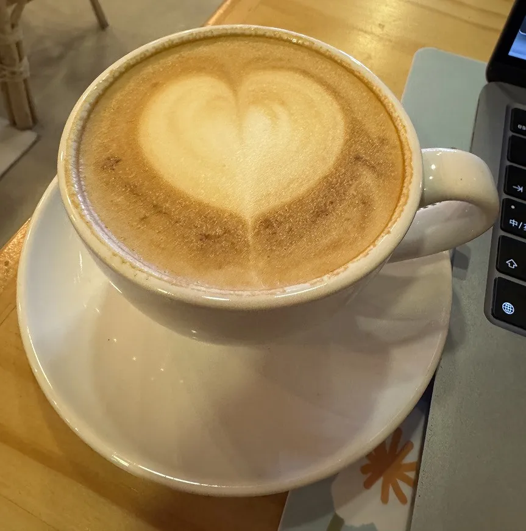
*Photo: It's a bit sad that this was the first latte with a heart I had in Argentina.*

Additionally, I had my first Peruvian meal in Bariloche. V recommended I try the purple corn juice (**Chicha Morada**), and it was quite good! Peruvian food feels like fusion cuisine. I never got around to trying it in BA, so I had it here. While the flavor was good, V and I both agreed it wasn't cheap. Overall, perhaps because it's a tourist hub, the prices in Bariloche felt comparable to Europe.

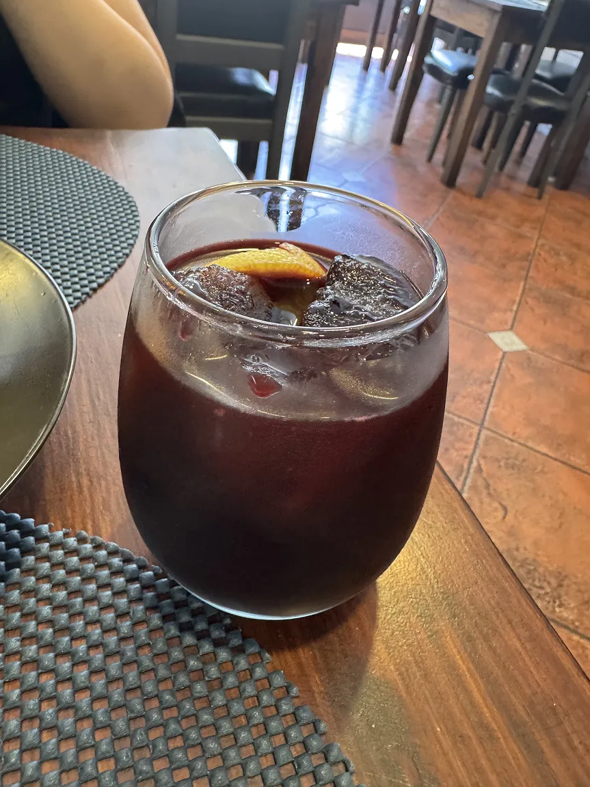
*Photo: I thought it was fruit juice at first, but it's made from corn. In Peru, it's called Chicha Morada.*

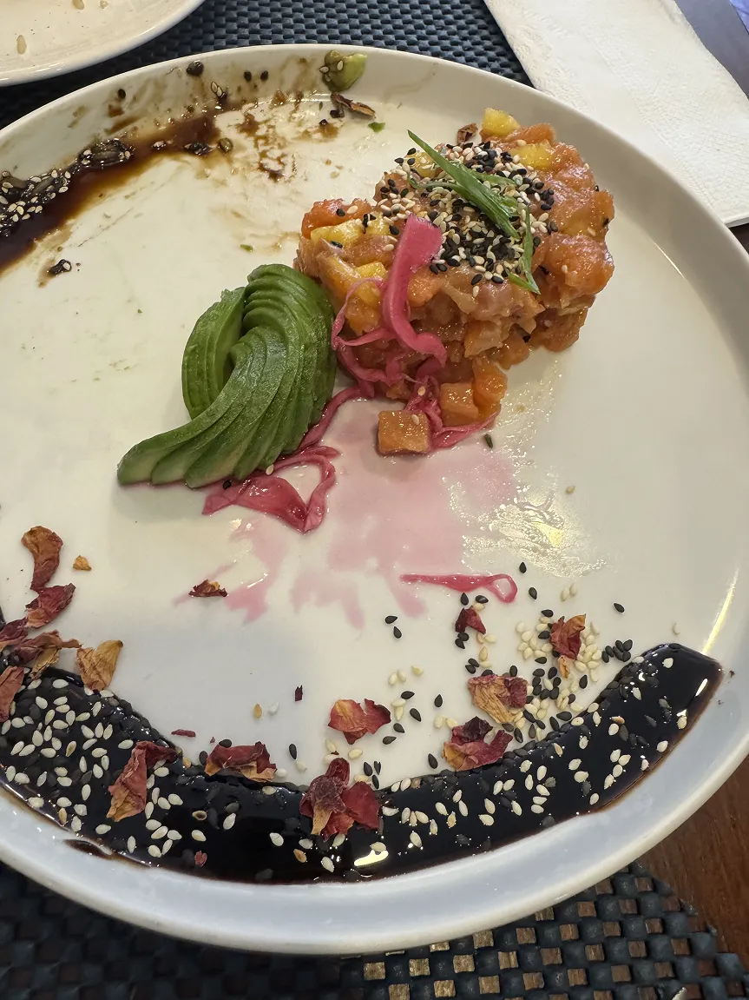
*Photo: Halfway through I remembered to take a photo of my first Peruvian meal. The sauce was sweet and sour, very refreshing—honestly, a bit like the Eastern European food V and I had in Berlin.*

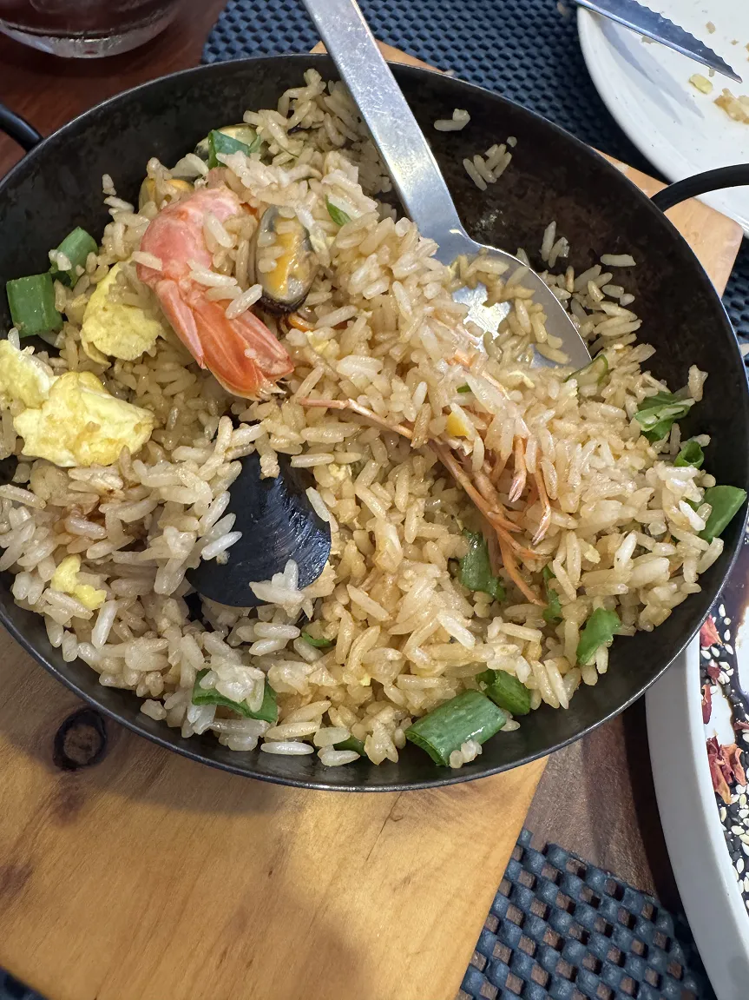
*Photo: The fried rice wasn't great; the rice was a bit hard. Neither of us liked it much.*

One last thing: taking the bus in Bariloche. If you have a **SUBE card**, you can just tap it, but top-up points are scarce, so it's better to load a lot at once. The common bus lines also accept credit cards directly (Visa or Mastercard are usually fine). Just tell the driver your destination when you board, they will enter the price, and you tap your card on the machine. The fare is significantly higher than in BA. There are no stop announcements, so you have to keep an eye on your location.

---

**Summary:** My biggest takeaway from Bariloche? The education in solitude that taught me to cherish my friends even more. That concludes my Argentina series. 👋 Until the next journey!