阿根廷系列预计会比较长，我会分成几篇写，涉及的城市包括阿根廷首都布宜诺斯艾利斯（Buenos Aires），与巴西接壤的伊瓜苏（Iguazu），Patagonia 地区的埃尔卡拉法特（El Calafate）、通向南极的乌斯怀亚（Ushuaia）和被誉为南美小瑞士的巴里洛切（Bariloche）。话题与内容基本会覆盖在阿根廷的衣食住行。

首篇将主要囊括我的前期准备，和我在首都布宜诺斯艾利斯的记忆，想尽可能记录，因此篇幅较长。

注：文章仅为个人观点，全文字数约 12000。

# 一、计划 & 准备
十月份开始计划去阿根廷的旅行，原是很想先去墨西哥的，因为十一月初那几天正好是墨西哥的亡灵节。去年在清迈也差不多是这个时候，正好看了「寻梦环游记」，被大力种草，很想亲身体验一番。

墨西哥的签证规定是持有有效美签、长期申根签以及三年日签以上日签的免签入境，但是我有看到即便是有三年有效日签，也有可能会被遣返（事实证明的确如此，后来有个认识的女生从阿根廷去墨西哥，用了三年日签入境被遣返了）。加上去南美，如果可以从美国转机，机票不仅选择更多且价格更便宜，所以赶在那之前又去申请了一次美签，好吧又被拒绝了。

真的蛮搞笑，如果你是女生又对自己没什么自信，那么去申美签吧，被拒的原因无外乎就是觉得你的国内约束力不强，大概率是要婚绿的。我和我国内的朋友讲这个事，我朋友吐槽我的打扮以及我的气质往那一站就像是要出去婚绿的样子，我真的是笑哭。后来在阿根廷和 V 聊天，她提到现在纽约很贵，我跟她讲我在来之前又头铁地去申请美签并且毫不意外地又被拒了，美国移民局一定是知道了我很穷，在帮我省钱 lol。

顺便问了 V，难道真的在美国很容易婚绿吗？答案是肯定的。她和我说因为美国很多本地男的也找不到对象，事实上相关产业链也很多，这里就不做展开了。类似的国情案例就是越南新娘，其实放到全球来说算是大同小异吧。人口是随经济流动的。发达国家女性意识觉醒后影响择偶选择，那么剩下一些又有择偶需求又条件一般的，就向其它国家兼容。

说回签证的事，虽然美签被拒了，但没关系，我还有其他备选方案。因为买了某个会议的票，这个会议主办方和政府有合作，可以凭票据获得阿根廷一个月的签证豁免，和最近持有美签可以豁免其实差不多。凭豁免信可以在阿根廷待一个月，因为当时的时间已经来不及另外申请墨西哥签证，所以我就放弃了墨西哥亡灵节的计划，直接飞了阿根廷。

东方航空最近出了上海-奥克兰-布宜诺斯艾利斯的航线，不过时间上来说和我的行程毫无关系。我去的时候是选了土航，从上海到伊斯坦布尔，在伊斯坦布尔中转 17 个小时，再从伊斯坦布尔经停圣保罗到布宜诺斯艾利斯。所以我的去程时间是：12+17+18=47(h)。坐了那么多次飞机，第一次坐到脚肿。当时特别好玩，第二程从伊斯坦布尔到布宜诺斯艾利斯，当时我想换鞋，一开始还纳闷为什么鞋子空间变小了，忽然意识到不是鞋子变小了，而是我的脚肿了，和馒头似的，略搞笑。

犯了一个误区，在此之前，我看到有朋友提醒长途旅行会出现血液不顺， 有引发血栓的风险。所以我出行前首次买了一双防应脉曲张袜，但是我发现脚肿的原因很有可能是这个袜子穿戴不当。我买的不是带袜子的长袜，而是从脚踝到大腿的部分。后来看到由于地心引力，人体静脉的静水压在脚踝处最高。弹力袜应该是包裹住脚踝，而不是袜口卡在脚踝处，我偏偏是后者。所以这可能也是我此次脚肿的原因吧，脚部血液流通不畅。后来换了鞋走路后逐渐恢复正常。提醒大家，如果长途旅行，引以为戒，可别像我，弄巧成拙。

*绿色部分是我的袜子🤣*

这是我第一次坐土航，之前去土耳其坐的是南航。说实话土航体验感确实很好啊，吃得也不错，还会有飞行包，里面有袜子、拖鞋、一次性牙刷、牙膏、眼罩。另外，因为我这次中转时间特别长，如果联程机票都是土航并且中转时间超过五个小时以上的，每五个小时可以去服务台领取免费的餐食券，之后可以凭餐食券去机场内，在美食广场里选你想要吃的点，他们会有套餐给你。也谈不上好吃不好吃吧，基本上都是快餐，有披萨、三明治、汉堡，但免费的不能说不香。

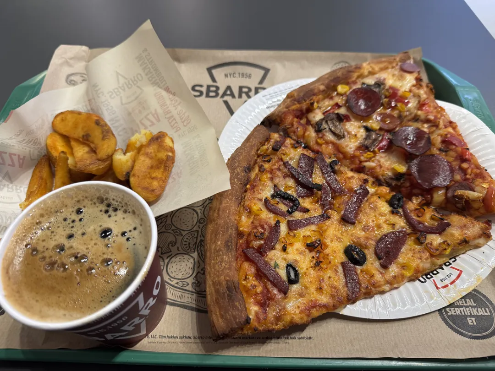
*某免费的机场中转餐，店员小哥愣是多给了我一块饼让我尝尝🤣*

另外中转超过一定时间土航还有四五星级的酒店提供，但是我们的行程不符合规则。酒店那个机会比较少，相关的约束条件也比较多，而且需要出机场，再额外申请一个土耳其的电子签证。感兴趣的或者行程正好符合的朋友可以自行去了解一下，土航官网有说明，不懂的话可以直接联系他们客服咨询。

这次在伊斯坦布尔中转不免让我想起了第一次出国的经历，曾经在伊斯坦布尔机场经历了落地没网、机场过夜、狂奔十多分钟从机场一边到另一边赶上飞机，恍如隔世。两年已过，不一样的是这次我已经不再对一个人出国感到胆怯，这次也不是一个人同行。并且因为之前在这个机场遭遇的事情让我对这个机场的地形非常了解，似鱼回到水，悠然自得。比如，和朋友在机场中转过夜的时候提到之前一个人在安检外过夜的情景。因为曾走错登机口的经历，知道哪个区域有躺椅、充电的地方并且没什么人。还有，走到之前候机的地方和我朋友描述我当时是如何穿越了一个机场，并且顺利登机的。总之，之前那些经历历历在目，确感受完全不同，很有意思，这就是成长吧。

因为此行是去阿根廷，总归有些忐忑，但担忧的不是南美的治安，反正安全问题众说纷纭，而且我也问过在阿根廷的朋友，告诉我住在 Palermo 附近没什么问题。于是，担忧的而是能否持有特殊豁免信顺利入境阿根廷的问题。

在去之前一周，得知我朋友的同事（可能是俄罗斯或者是塞尔维亚人）乘坐土航从贝尔格莱德飞布宜诺斯艾利斯，在伊斯坦布尔中转，土航不让他上第二程飞机，尽管他提供了住宿。后来小哥因为这事有点 EMO，去泰国「疗伤」了。此外，我另两位认识的人（一男一女）也是土耳其航空，不同的是他们先到伊斯坦布尔入境土耳其，在土耳其待了两天，再重新从伊斯坦布尔飞去布宜诺斯艾利斯。当时他们被反复问询了三次，check-in 的时候，过安检的时候，以及登机前。除了基本的材料齐全以外，他们还会再核对预定和购买机票、住宿的时间，以此来检验出境目的。好在最后他们反复争论后顺利登机。

不过，他们的经历引发了我极大的担忧和焦虑，我就怕最坏的结果是我和我朋友也像那个外国小哥一样，就算有材料也被拒绝登机，那我俩可就太惨了。不过事实上比我想象中的顺利，从上海走非常丝滑，当时值机柜台的小哥给了懂西语的同事看了一眼我的豁免信，直接就让我过了。

我想一部分原因是我的材料本来就很充足；另一部分原因是阿根廷移民局官网正好在我出行前几天发布了活动特殊豁免的事项，所以有了凭据后和机场人员说明更顺利，否则机场柜台工作人员不知道的话确实是不敢放人过的。若因航空公司疏忽导致旅客被遣返，航空公司将承担罚款和遣返成本。不过，起飞前确实还遇到了一道核验，需要出示抵达阿根廷的住宿证明，并且告知之后的行动轨迹，并提供返程机票。当时因为我的网不好，而且着急登机，给我检查的那个小哥英文也不好，我出示住宿证明的时候手都发抖了，想想真是搞笑。

我们的飞机是经停巴西圣保罗，当时看到一些人下机，我也以为要下机再重新上，因为之前在国内有一些经停是把人都赶下去再重新上的。另外就是有先抵达的朋友讲述自己在圣保罗中转还是经停的遭遇，工作人员的不靠谱让他错过了航班。对于南美工作人员工作水准的保留态度，我在出舱之前问了一嘴空姐，才知道这个经停到布宜诺斯艾利斯是不需要下机的，于是又回到了原位。但很想吐槽一句在圣保罗经停等待的那一个半小时左右的时间真的挺难受的，因为就在飞机上待着，加上飞机补燃料什么的味道也不是很好闻，好在我回程不走来时路。

 

# 二、布宜诺斯艾利斯，初印象
我去之前是没想到我还蛮喜欢布宜诺斯艾利斯（后文用 BA 代称）的，喜欢的原因非常简单——蓝花楹，让我觉得这似乎是属于我的城市。我落地 BA 的时候已经是 6 号凌晨，所以并没有欣赏到什么特别的景色，仅是在黑灯瞎火中粗看这个城市的大概风貌。

从米尼斯机场到 BA 市区的话打车约莫 40 分钟，Taxi 也许会绕路，所以推荐 Uber、DiDi 或者是 Cabify。三个打车软件里一般最贵的是 Uber，Cabify 会更偏本地化，实际打车可以对比一下。

在车窗里最初看 BA 这个城市从机场到市区的道路，看起来和东南亚的城建很像。后来到了 BA 市里，尤其是 Palermo 那块，确实觉得比较欧洲。但是 Palermo 两边的梧桐树，外加充满年代感的建筑，真让我恍惚回到了南京。于是突发奇想发了条朋友圈，说：我在南京。原意只是调侃这街景的相似，没想到后来好多人以为我早已回国，有趣。

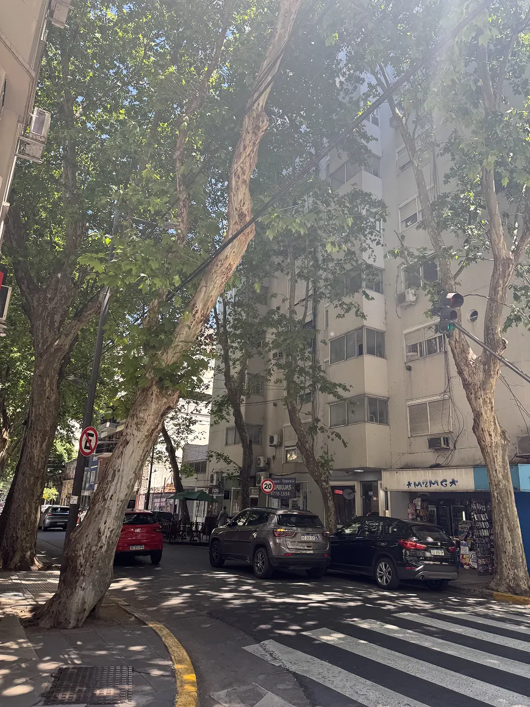
*我说这是南京的街道也没问题吧？*

发现满城的蓝花楹，是我有一天和我的好友 V 步行去超市，从小路拐角到大道，抬头一串紫进入我的视线。阳光下，翠绿的枝叶配着浓密的紫色，在湛蓝的天空以及微黄的墙壁映衬下，格外显得迷人。虽然颜色不一样，景色也不同，但我不由想到了清迈的凤凰花树，那是生命橙的活力。而布市的蓝花楹，则是优雅紫的静谧。

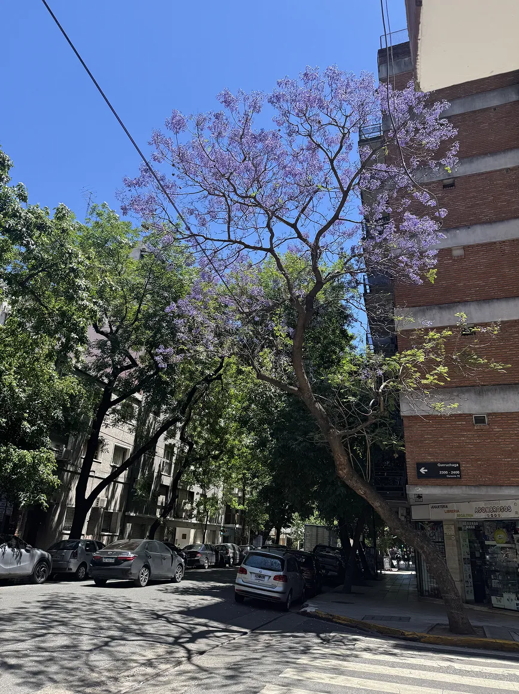
*爱呢💜*

 

# 三、在布宜诺斯艾利斯的衣食住行
## 🏠 住宿

Palermo 是阿根廷当地朋友推荐的住宿区，这里的街道很像是欧洲，石子路街道配上欧式的建筑风格，临街的餐厅、酒吧和咖啡店，为这个街区增加了更多的风情。阿根廷著名的作家博尔赫斯小时候就住在这个街区，我们住的 Airbnb 距离他小说中提到的餐厅非常近，每天回家必经，但到了临走都没去尝试过哈哈。

阿根廷这几年随着通货膨胀，物价越来越高。然而，相比较甚至超过欧洲的食物价格，阿根廷当地的住房算是比较便宜的，尤其是 Airbnb，我们在 Palermo 附近住的 Airbnb 折算下来人均 100-200+ RMB 一晚。要知道一般出去餐厅吃饭，一顿价格人均基本会在 20000+ 比索，折算成人民币基本都是 100+ 以上。然而，Airbnb 的问题就是隔音不太行。但我觉得这个应该是布宜诺斯艾利斯整个城市大部分楼房的问题，隔音效果都不怎么好。

我当到 BA 一开始是住在我朋友办活动整租的青旅，他给了我一间单独的房间，当时我就觉得隔音效果挺差的，因为那间房间的位置有点像是四合院，院子里有人聊天或者经过说话，在里面可以听得一清二楚。甚至第二天早上，我醒过来耳边是隔壁大哥的环绕呼噜声。因此，我去完伊瓜苏回 BA 后毅然地舍弃掉了免费的住宿，搬去和我另外两个朋友一起住。毕竟是青旅，所以我最初只是觉得那是房间改造的问题，我住的房间像是后来另外搭建的。

不过后来我发现不是个例，因为发现我朋友她们选的 Airbnb 隔音效果也不怎么样。那间 Airbnb 是临街的，真的是字面上的临街。房间是在一楼，开窗的话其实从外面可以看到里面整间房屋的景象。晚上睡在沙发上，旁边经过的行人的交谈声透过窗户传进来。但整体还好，因为 Palermo 街区整体还是算比较安静。

再后来有一天我去 V 在 Palermo Hollywood 住的公寓，算是价格相对较高的 Airbnb。她的公寓是中间隔断，上下楼梯式。她也和我吐槽了她房间的隔音问题，我才意识到隔音差很可能就是 BA 这些楼的顽疾。那天她在楼上午睡，我坐在沙发上工作。邻居一群人在外面聊天的交谈声清晰可闻，可惜我听不懂西班牙语，不然高低可以竖起耳朵听听墙角。

 

## 🛍️ 购物

民以食为天，而我尤甚。由于 BA 的物价较高，外加 Airbnb 的厨房让我手痒，我在 BA 重拾了我的厨艺。毫不夸张，我这次的行李 70\% 都是吃的，主要有一些泡面、米线、酱料，还有一堆我觉得有用的东西。

我朋友最初还嫌弃，觉得我带的太多，后来事实证明，果然没有一样东西白带。举个例子，我带了一盒话梅，后来受到了众人之爱。这就不得不说起我的真香朋友 F 姐，典型的人菜瘾大。我带了快 20 袋泡面，她最初听到的时候觉得过于离谱，觉得我们好不容易来了阿根廷，怎么能总吃泡面呢，应该多下馆子，这点我不否认。但最后吃腻了肉，叫着想吃泡面且吃得无比之香的，是她。

甚至有一回想来就非常搞笑，F 姐对附近的酒吧跃跃欲试。于是某晚闲来无事，我们一行人去酒吧，一人点了一杯鸡尾酒，并附带一份炸蘑菇的小食。喝完刚出酒吧一切都好，没想到刚过了个马路 F 姐就拉住我说：我不行了，我走不动了。我一看她唇色发白，感觉随时要嗝屁的样子，但我当时实在是尿急得很。我问 F 姐能否再坚持，她说她不行了，想吐想晕倒。除了她以外，我们另外三人毫无反应，我实在不知道是不是她太过脆弱还是倒霉，但她人菜瘾大也不是一两天了。彼时，尿急使我力大无穷，于是我主动背了 F 姐一段路，笑得她重新积蓄能量，颤颤巍巍地迈着虚浮的脚步回了家。回去后她冲进卫生间直言恶心，却在吃了一颗话梅后重获新生。怎么说呢，这都是我过去踩坑的经验，话梅治恶心，真的绝了。

因为要下厨，逛超市成为了我在 BA 的消遣娱乐方式之一。我的理解是，超市和菜场是了解当地人民生活的绝佳场所，而且我喜欢研究当地超市里的产品。Palermo 附近就有很多的超市和杂货店，我比较喜欢逛 Coto，因为这个超市比较平民化，种类也比较齐全。很多超市里的肉都被预切好，但是在 Coto ，我可以选择要的部位，并让超市的服务员现场帮我切后称重。除了 Coto 以外，我也去过 Jumbo、Cordial 还有一些 Palermo 附近的小中国超市，但还是 Coto 对我来说性价比较高，种类相对多元，既可以买到可以自行称重和自选的牛肉，也可以买到便宜的猪排骨。此外，Coto 的蔬果也相对新鲜，选择多元。

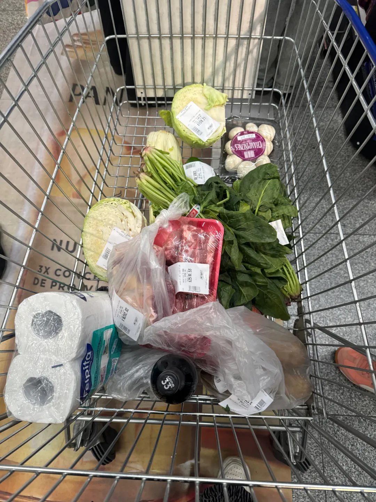

当然，如果想要买到更为便宜的蔬果其实专门卖蔬果的杂货店是最好的。Palermo 附近其实有很多，但是不得不说质量良莠不齐，需要仔细去挑选。很多蔬果店的蔬菜和水果已经非常不新鲜以及腐烂了，但是还是会放在架子上售卖，所以如果不是肉食动物，想买到新鲜品质又不错的蔬菜和水果，我觉得在阿根廷是需要做实地探索和研究。

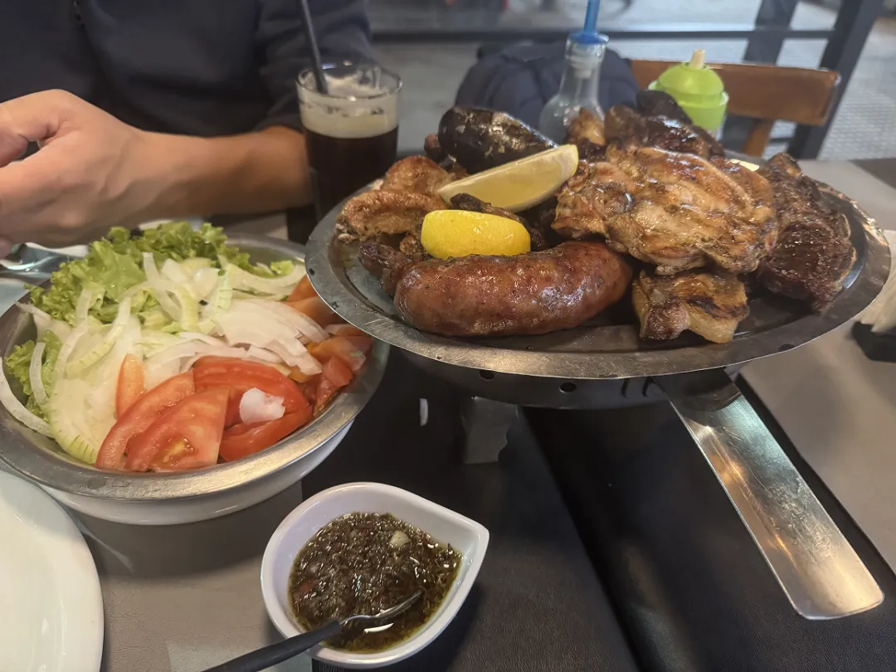
*经典组合，Asadao + mix salade*

下面讲讲我在超市购物的心得吧。毋庸置疑，肉类在阿根廷的超市相对便宜，但是有一些精品牛肉的价格还是挺高的。但是像我在肉柜台让工作人员给我切的牛肉我觉得性价比就特别高。我之前切了一整块的 1kg 的肋眼，价格在 16000 比索，大概 80 人民币。比较便宜的是骨头一类的东西，比如我买的猪大骨，大概 700g 的排骨价格在 2000-3000 比索，也就是 10-15 块钱人民币，我觉得这个价格是很不错的。另外，牛奶的价格也像欧洲，还算便宜。并且我发现阿根廷的牛奶是用不用的包装颜色来区分脂肪含量。以某款牛奶为例，绿色的脂肪含量是最低的，之后是橙色，再到红色，脂肪含量从低到高。牛肉类以及大部分蔬果以外的农产品，在阿根廷的价格并不贵，包括葡萄酒，一些葡萄酒的价格和饮用水的价格差不多。比较贵的是工业制品，比如薯片、糖果等零食，我觉得价格相对高昂一些。比如我记得之前买一包乐事的原味薯片，净含量在 148g，大概是 5000 比索，折合 25 人民币，国内大概卖个 10 块钱。

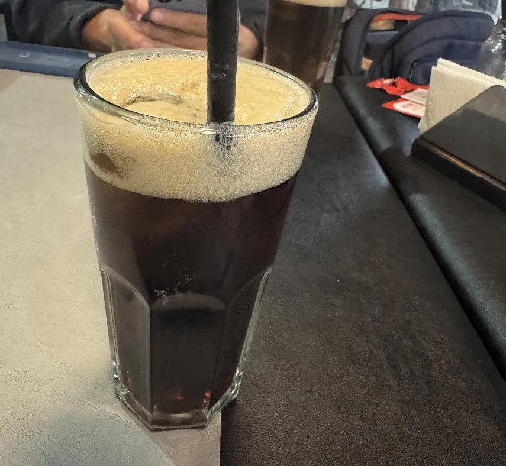
*特色饮料，Fernet con cola*

想要吐槽的是，BA 的咖啡不太行。过去我以为像危地马拉、哥伦比亚都是产咖啡豆的地方，那阿根廷又有着很多家的咖啡店，理论上好喝咖啡是应该的，但事实上真的很难喝。我一个一般都是喝黑咖的人，在 BA 被迫开始喝奶咖，实在是因为黑咖不太好喝。而奶咖，也是一言难尽。好几家我试过的咖啡店的奶咖，奶泡打得丝毫没有水平，拿铁/馥芮白的奶泡堪比卡布奇诺，甚至奶泡粗糙，气孔犹如肥皂泡沫，喝起来不顺滑。

整体来说，除了肉类，我与我的朋友们对 BA 的食物总评都不太高。

 

## 🚶 所见，安全与交通

如果说伊斯坦布尔是猫猫之城，那么 BA 可以说是狗狗之都。每天在街道上都可以看到大量的遛狗人士，据说当地还有专门职业是遛狗。在 Palermo 附近也经常可以看到一个人牵着狗狗大队，最多的时候我见到过有 15 条左右，场面一度较为壮观。相对应的，虽然 BA 对狗狗友好，但并不是所有铲屎官都捡屎，所以在 BA 一些街道走路，甚至走夜路要格外小心。安全问题之外，踩狗屎的「危机」四伏。

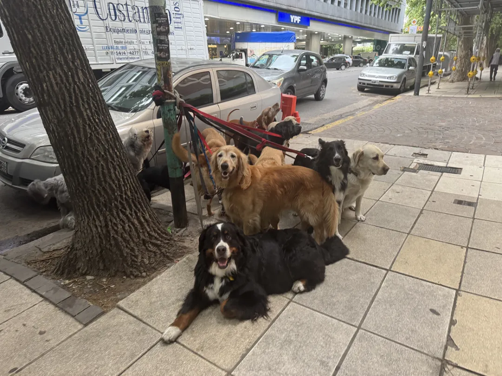
*姨姨我呀，一整个心花怒放💜*

接下来讲讲「安全」。在 BA 待了半个月，我们总结了一条怪论：狗屎越多的地方越安全。这并不是瞎说，我觉得是很有道理的，因为狗屎越多的地方代表人们有闲情逸致去遛狗，那么这个地方是相对比较安全的。之所以讲到这点，是因为我有几个朋友早上会去公园跑步，他们发现公园里狗屎特别多；同时，Palermo 街道狗屎也不少，于是得出此结论，不无道理是吧？

有一个反常识的点，一般人出去旅游往往会住在市中心，觉得市中心繁华地带，相对会安全，但实际上并非如此，市中心往往鱼龙混杂。也就是说，其实 BA 市区的话，像五月广场那块的治安反而没有特别好，尤其是晚上，更容易被犯罪人员盯上。

Palermo 附近的治安整体还不错，可以说是 BA 街区治安的标杆了。因为这个街区是阿根廷中产及以上阶层、外籍人士和年轻专业人士的聚集区，所以犯罪几率较少。与此同时，因为这个地方的商业较为繁华，有不少正经的酒吧、餐厅等等，政府投入了相对多的警力来治理，因此在 Palermo 街道看到穿着防弹衣，人高马大的安保人员是很正常的事。另外，Palermo 的街区规整，主干道宽敞，许多小巷也充满活力，而隐蔽性不足，不适合罪犯藏身，这也减少了犯罪的发生。当然，这并不是说绝对不会有犯罪事件发生。我记得有一天白天走在前往超市的路上，目睹了安保人员在追击一个小偷还是抢劫犯，至于结果如何不得而知。我也听 V 告诉我有一个外国小哥走在路上被人打了一拳，还被抢了东西，顶着一个黑眼圈见人，好不可怜。

日常出行的交通方式其实挺多，但我们最多的还是选择打车。前面有提过几个打车平台，阿根廷打车价格虽说不比国内便宜但还是可以接受的，在相对正常的范畴，起步价在 15 人民币左右。除了打汽车以外，有时候也可以选择摩托车，我试过，感觉还可以。因为 BA 的街道设计也是单行道，外加有很多的街区，每个街区之间基本都有红绿灯，所以有时候一公里的路，打车未必比走路快多少。而摩托车呢，虽然也要遵循当地的交通规则，但相较汽车来说还是更容易灵活变通的，价格也会更低些，比较适合一个人出行。我叫过两次摩托车，一次是白天，一次是晚上，都是在 Palermo 附近叫的。两次摩托车司机都给了我准备的头盔，戴好头盔这点很重要呀！不过说实话，BA 这边的摩托车论速度和狂野程度还是远不及泰国的。泰国，尤其是曼谷的摩托车司机的狂野和抽象，绝对是世界前列😹。

除了打车以外呢，公共交通，比如地铁还有公交是当地人的常选。阿根廷这边坐地铁和公交可以用 Sube 卡，这个卡可以在 BA 的某几个地方凭护照申领再激活，也可以直接在路边的 kiosk——便利店购买，后者会更贵一些，具体如何购买和申请可以查看小某书上的笔记，有不少，但是毋庸置疑直接在 kiosk 买会更贵一些。我是知道有这个途径但是我懒得搞了，因为我发现阿根廷的公交车可以直接刷卡，起码我在 BA 搭乘的都是支持 visa/master 支付的，而且坐公交频次也不高，不差多少钱，我就直接用 Apple Pay 了，很方便。公共交通的价格挺亲民的，如果你乘坐公共交通的需求比较高，建议还是搞张 Sube 卡比较方便，尤其有一些城市的公交系统只支持 Sube，而不支持 visa/msater 刷卡。

 

## ☎️ 电话卡与支付

由于我的手机是国行，所以没法使用 esim，还是老习惯需要购买电话卡。此前我一些旅游我是在某宝购买了电话卡之后再去的，但是我发现阿根廷的电话卡某宝上的价格比较高，于是我线下才去办，办过之后发现很方便，甚至价格会比某宝上的便宜 2/3。

我是抵达了 BA 后的第四天才去买了卡，此前先是买了无忧行的流量苟了一天。中间曾路过过一家 kiosk，但是那家只有 Movistar，听人说 Claro 比较好，所以我一开始没办。后来有一堆事搞得我中间没时间去买卡。是和 V 见面后，她带我去了她家附近的 kiosk，给我付了现金买的。一个月的游客卡，去的那家 kiosk 正好有 Claro。讲道理，Claro 这个月卡的价格令我感到十分迷惑，因为当时 V 帮我买的时候是 2000 比索一张卡，三天后我带我另一个朋友去另一家 kiosk 买也是 2000 比索，再过两天我带另一个朋友去第二家 kiosk 买竟然变成了 1700 比索，再过两天再带另一个朋友去买直接变成了 1200 比索。我很确定买的都是同样的游客卡，这价格起伏实在有点太大了。但转念一想，这是南美的阿根廷，孕育出魔幻现实主义的作家，再结合比索的通货膨胀率，我瞬间又觉得合理了。

Claro 的电话卡在 kisok 购买的时候也不需要护照，直接现金付钱就好了。Sim 卡插入手机后会有短信提醒，根据短信提供的网址到特定的页面激活，激活完成后购买流量包。我当时买了一个月有效期 15G+1000分钟通话+短信 的套餐，花费是 9600 比索我记得。所以加上之前买卡的 2000 比索，实际电话卡花了我 11600 比索，大概是 60 块人民币。

其实阿根廷的电子支付比我想象中要发达很多，但是系统出现 bug 也是常有的事。南美很多国家都支持 Mercado Pago，这是拉丁美洲一种常用的电子钱包支付，有点像是中国的支付宝，都是为解决电商平台的问题应运而生的支付，只是就生态影响来说支付宝的涵盖范围更广，而 Mercado pago 更垂直于电商生态。

这次来拉美我并没有预先换汇，而是带了一些美金。当地有不同的汇率兑换市场，有「蓝市」和「官方汇率」。但其实自从 2025年4月起，阿根廷实行区间浮动汇率制度后，官方汇率更灵活，这使得通过正规渠道获取美元变得容易。也正因为该政策改革，目前政策已使得两者价差缩小。

当地有很多直接换汇的渠道，比如在地的中国超市基本就可以直接换。另外，线下也有很多换汇的机构。甚至走在景点，或者人多的地方的路上，会有人在那问来往的路人是否需要换汇的业务。我去阿根廷之前看了某个博主的视频，这些换汇的业务有时候会有一些小手段，比如那个博主遇到的问题就是在清点的时候没什么问题，但是最后拿到的钱少了。然而这种基本上都是现清的，如果遇到了也只能吃哑巴亏。

作为游客，最简单的方式就是用现金消费，尤其在一些餐厅，使用现金可以享受 10\% 的折扣。但是如果你可以使用 Mercado Pago 进行电子支付，那也是极好的。Mercado Pago 所享受到的就是蓝市的汇率，而我们所使用的信用卡则是后者，按照结算的汇率，一般会多付 10-15\% 的价格。如果担心比索贬值太快，那多带点美金现金总是不会错的。我后来去埃尔卡拉法特的时候定的酒店扣款有问题，最后使用美金现金支付也是支持的，并且还少收了我一点钱。

 

## ⛰️ 游玩与景点

断断续续在 BA 期间，作为游客去了：Obelisco（布宜诺斯艾利斯方尖碑），Teatro Colón（科隆/哥伦布大剧院），Cementerio de la Recoleta（雷科莱塔墓地），El Ateneo Grand Splendid（雅典人书店），El Rosedal Garden（玫瑰园），Museo Histórico Nacional（历史博物馆）；体验了马黛茶制作。

其中方尖碑是免费的，它是为了纪念布宜诺斯艾利斯建城 400 周年，在 1936 年建的，它是七月九日大道这项工程的纪念碑。中间经历争议，后来因为很多文化、政治等活动在这个附近，方尖碑逐渐成为阿根廷的象征。

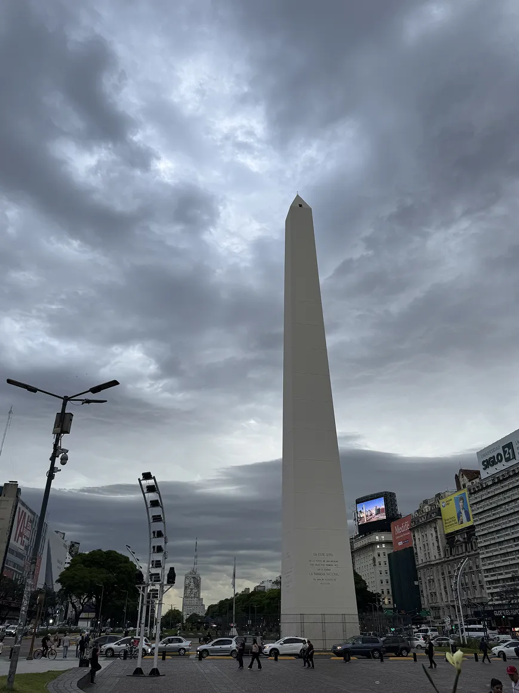
*下公交的时候刚好下雨，晚上六点多*

科隆大剧院，或者是哥伦布大剧院也是在世界上享誉盛名的，就在七月九日大道附近。这个大剧院被马歇尔·隆（Marshall Long）主张为是世界五佳之一，另外四处是柏林音乐厅、维也纳金色大厅、阿姆斯特丹音乐厅和波士顿交响大厅。当时我们是报了该大剧院的 tour(https://teatrocolon.org.ar/?lang=en_US)，这个 tour 需要提前网上预约，因为不是我付钱预约的忘记多少钱了。内容是会带你游览这个大剧院内的一些重要摆设和建筑、装饰要点，最后一个环节是让你进观众席体验和感受，全程约莫一个半小时。

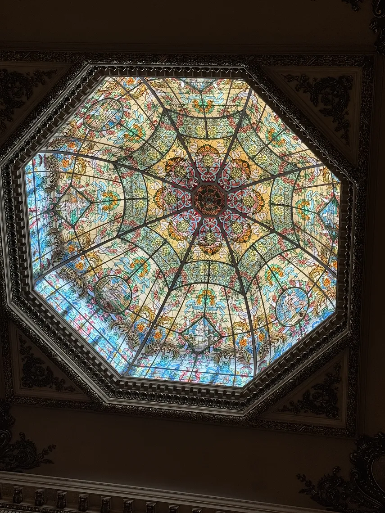

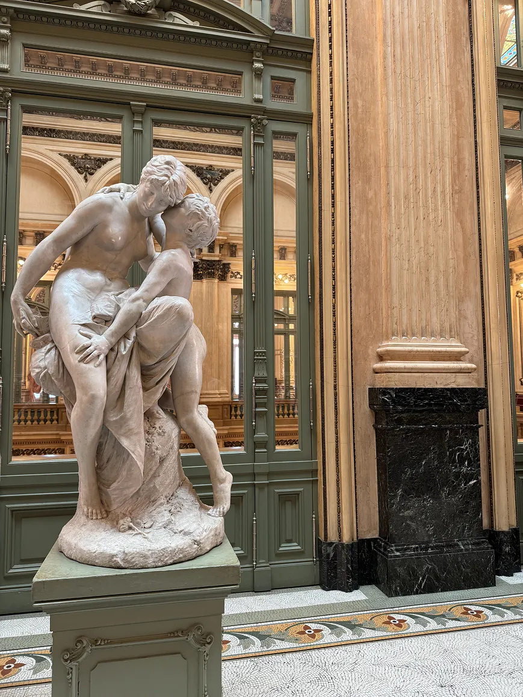
*这个是仿品，据说托运不当，雕像断了根手指*

*全厅一览，据说还可以到最上面去体验*

雷科莱塔墓地是我比较想去的一个景点，后来终于去成了。当时我去参加了一个马黛茶的体验课就在附近，但是他们下午 3 点才开始，我早到没事干就在附近溜达。本来想去买冰激凌但是那会冰淇淋店 3 点以后才开。有点尿急就去附近的商场上了个厕所，出来发现边上是一圈围墙，围墙上面是各种微缩了一些的别有设计的建筑，当时就很好奇。但是后来差不多到点了就没进去，仅仅只是记住了。顺嘴在马黛茶体验课上问了给我们上课的本地小姐姐，才得知原来那是个非常有名的公墓，藏着阿根廷的很多权贵家族、社会名流，以及多任阿根廷的总统。我被大力推荐有机会可以去参观。于是我上网搜索关于雷科莱塔墓地的信息，了解了阿根廷的第一夫人——Eva Perón 的生平，她是个平民但是后来靠自己的努力成为名流，嫁给总统后做很多帮助普通百姓的事，英年早逝，后来遗体还被藏起来了。她的头像就被印在阿根廷 100 元纸币上。

![]100.png)
*正好钱包里还有一张 100*

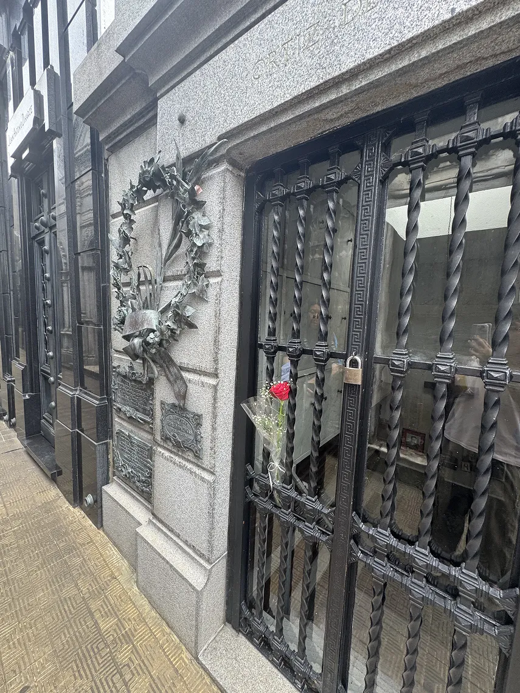
这个家族墓碑门插了一朵🌹引发了我的好奇；这里葬着 Juan Manuel de Rosas——阿根廷19世纪的强权领导人；联邦派标志性颜色是深红色，红色玫瑰花就成为了对罗萨斯本人及其政治运动 (Rosismo) 的一种强烈的、非官方但普遍被理解的致敬和怀念的符号。

再后来我错过了从 BA 去 Bariloche 的航班，正好空出了一个下午在 BA，这空出的时间似乎就是专门让我得去那。顺便问了一嘴我 ex-crush 后来去了没，之前和他经过这里但已过开园时间，他跟我说觉得挺不错，推荐。而此时，恰逢我另一个朋友离开 BA 前也对此颇有兴趣，我俩欣然同行。我站在 Eva Perón 家族墓前，发现它们墓前贴着其它墓没有的蓝色纸片，似乎是花钱祈愿的票据，蓝色的貌似会比白色的更贵。

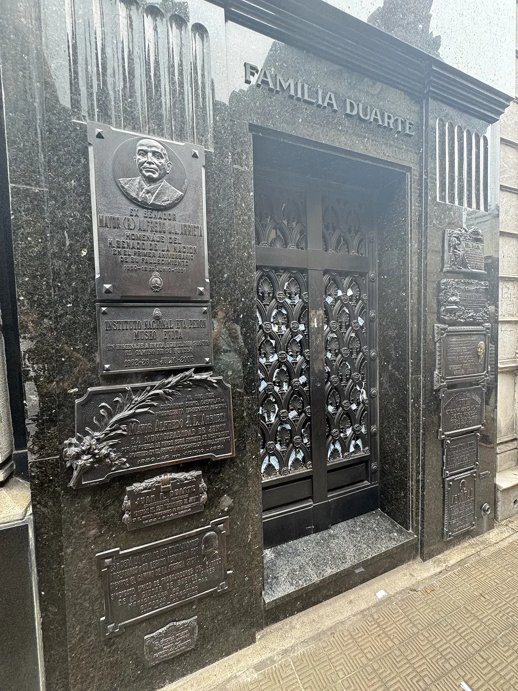

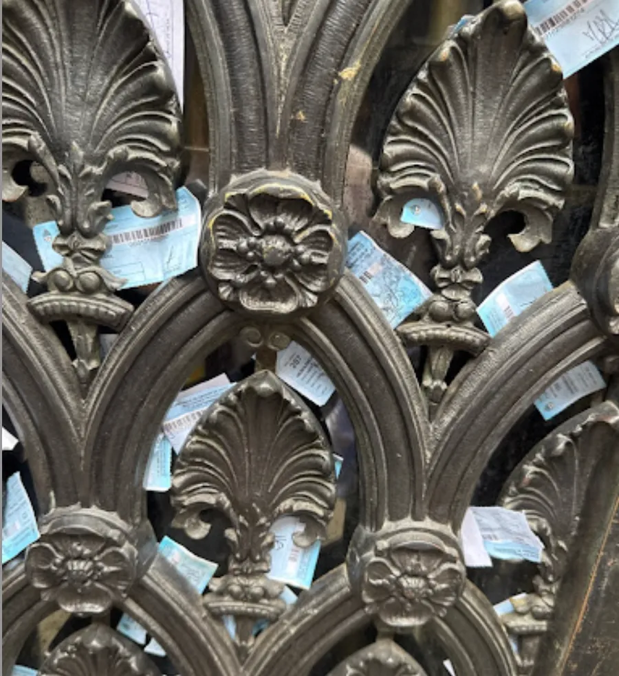
不得不说，毕竟是贵族公墓，所以很多墓看起来都很精美，即便有不少已经破坏了，但还是不少可以看出往昔的辉煌。至于也有一些，完全荒废，无人打理，对比格外鲜明。不由感慨，这些名人死前不知道自己是否会被后人参观和评说，是否死后还不得安宁。不过死了就是死了，终究是化作一抔黃土，有些坟墓完全破败成为了鸟儿的巢笼，有些其中已经长出了新的翠绿，有些早已从曾经长出的翠绿又变枯黄，算是回馈自然？还是以另外的方式获得相对的自由呢？

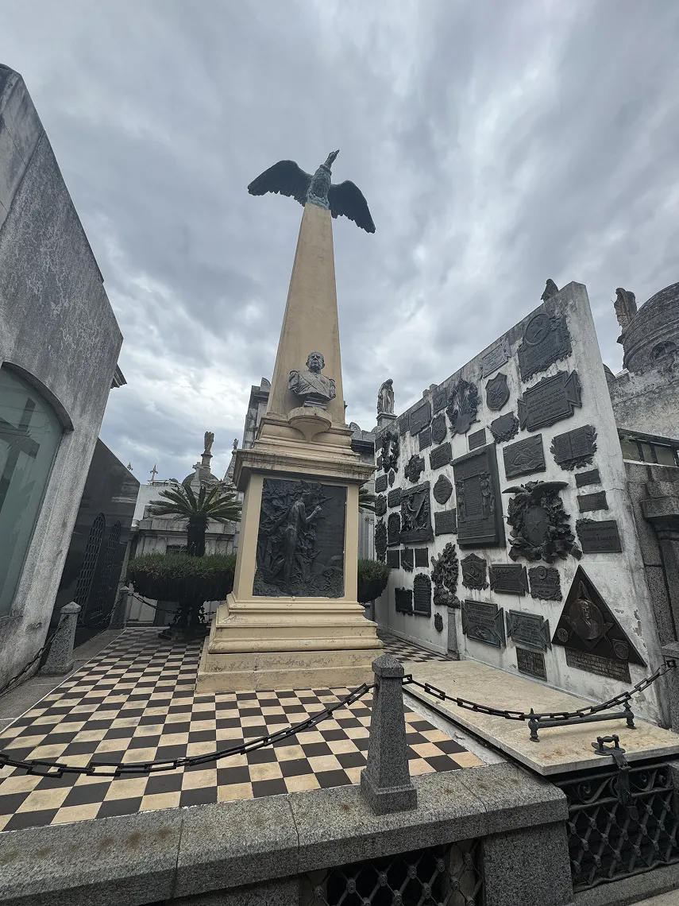
*这是阿根廷第七任总统——Domingo Faustino Sarmiento，代表物是秃鹰*

有一些极具影响力和声望的，出过很多名人的家族公墓上会有关于这些名人的介绍，也有一些仅仅只是朋友和家人对逝者的悼念和墓志铭。看了一些，基本上是在夸赞、追念逝者的品格。后来和 V 在 Bariloche 吃饭聊到了这个问题，她问我如果死后想要选择什么词，我说：叛逆。她哈哈大笑。我问她，你呢？她说：当你在阅读这段话，我会打你。我建议改成：当你在阅读这段话的时候我在看着你。我俩相视，大笑。

雅典人书店是朋友比较想去，我跟着去了，不过对我吸引力一般吧。那天去的时候正好书店刚漆器，味道比较大，配合我朋友们拍完照就走了。

El Rosedal Garden 算是意外之喜。当时报名参加了一个晨跑活动就是在附近集合，但是我太菜了，仅跑了一公里就不行了，直接开始沿着公园步行。发现这个公园真漂亮，这里早上会有很多本地人晨跑、运动，或者只是坐在椅子上发呆。那个时候蓝花楹还盛开，翠绿的草地、紫色的蓝花楹点缀、湛蓝的天空、和煦的微风还有成群的大鹅，令人感到非常惬意。当然也有一些问题，就是大鹅多的地方粪便太多而没怎么清理。除此以外，整个环境确实非常美。

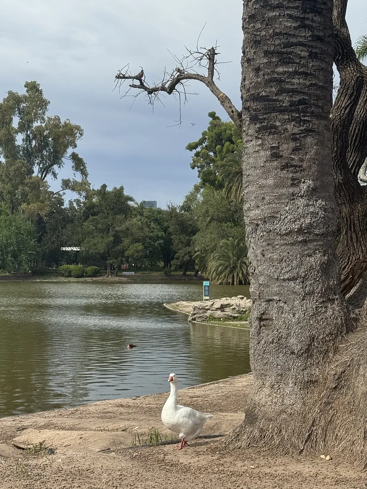

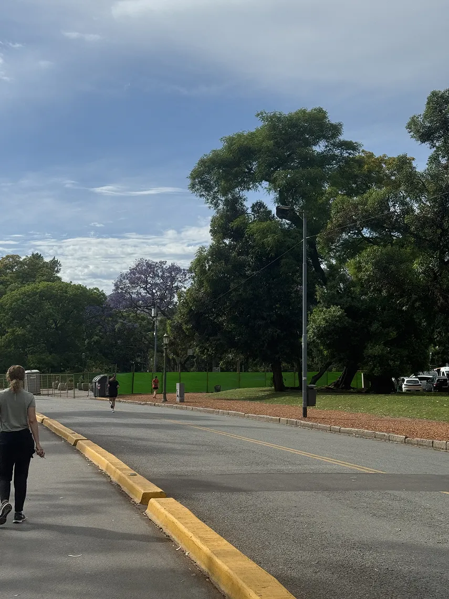
*早上8点多，很多跑步、遛狗人士*

历史博物馆是我和我朋友特地坐了 40 分钟的公交去的景点，我俩都对阿根廷的历史比较好奇。去了后我发现基本上阿根廷的历史竟然都是从 19 世纪初开始的，也就是说在这片土地上之前生活的原住民的历史基本都消失了。我是后来突然意识到，阿根廷是个移民国家，并且大部分移民都是来自欧洲。说实话，像是泄了气的皮球，一下子觉得有点无聊。后来，在 Bariloche 从机场打车到 airbnb 遇到的本地 Uber 司机，竟也与我感慨本国历史的短暂。

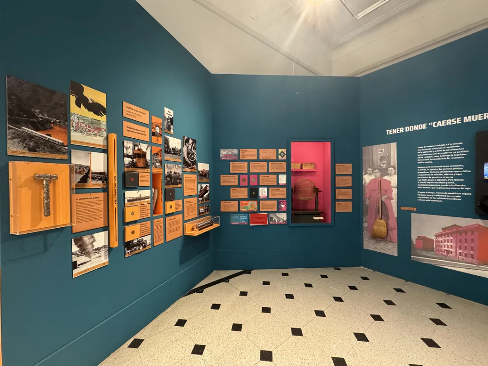
*我很喜欢这种有强烈视觉冲击的媒介配色*

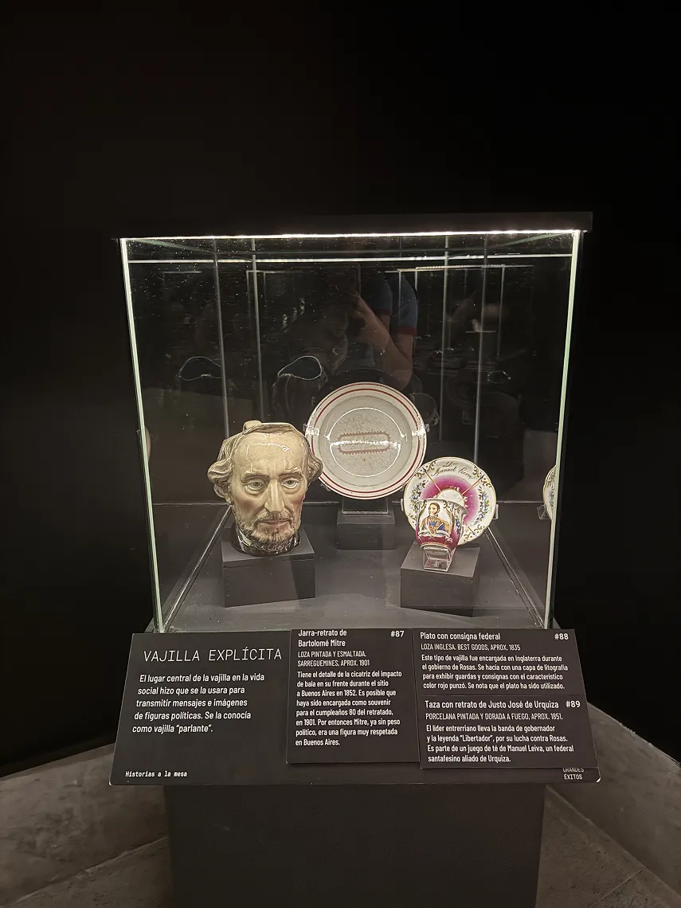
*名人被做成物件好像真的很有宣传的力量 lol*

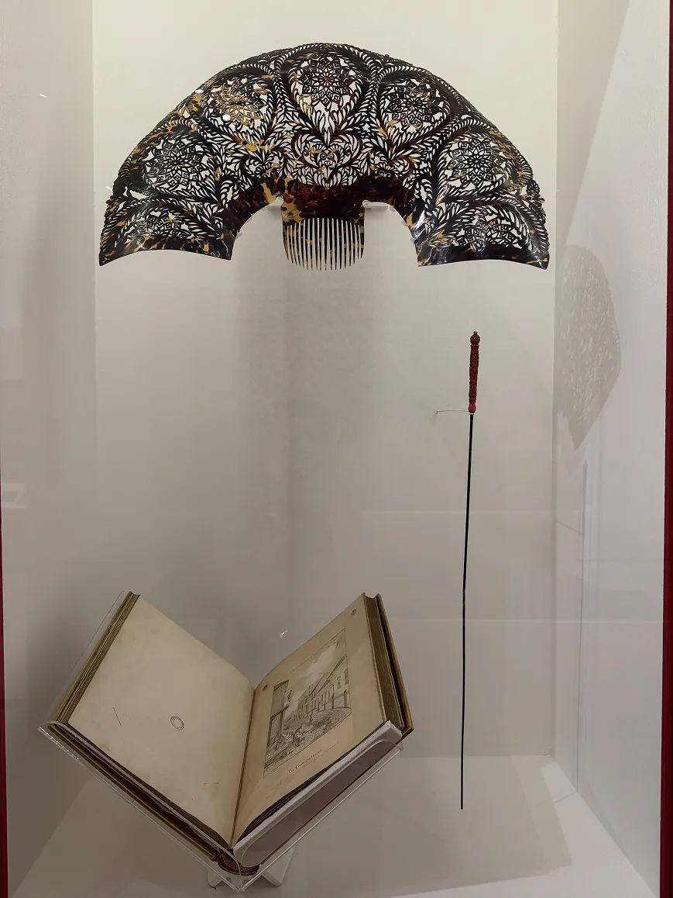
*有在新加坡 ACM 的知识，这的确是玳瑁制品，女子配饰，以高/大为美*

有点遗憾没去成打卡 La Boka，毕竟都到 BA 了，也算是知名景点。说到 La Boka 特别想分享一个故事，主角不是我，而是我一位认识的中年莽汉。他当时一个人在 La Boka，想找厕所，于是就逐渐远离了游客区。这个时候有个本地人和他说一大堆话但他愣是没听懂，还好他带了个翻译器。于是他才明白人家是问他要去前面干什么。他说他要上厕所。人家告诉他不要乱走，前面很危险，给他指了个上厕所的地。他才如梦初醒，原来自己差点就走到危险区了。

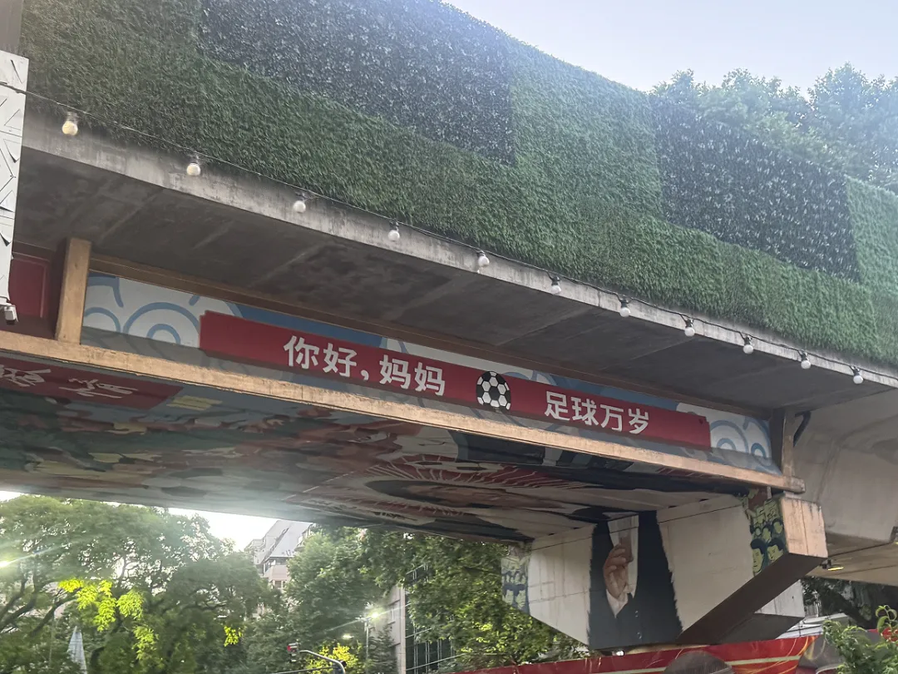
*唐人街一隅*

另一件头铁的事是关于足球，穿错球衣很危险。上述这位头铁一无所知的莽汉，如果我没记错队名，那么他买了件河床球衣后，在博卡区穿河床球衣乱逛，后来经人提醒，才深知危险，火速脱下。在 BA 街头，随处可以看到很多人穿着球队的球服。当时博卡和河床的比赛，那会正逢我刚抵达没多久，那个下午我在 V 家办公，就听到从楼下传来的助威游行，声势浩大。

其实遇到了很多热心的本地人，比如我去超市买肉帮我把翻译成西班牙语后的文字读给切肉小哥的姐，拖着行李箱在楼下等房东开门的时候问我们是否需要帮助的老奶奶。当然，也有遇到一些非善意的部分，但总体上，我觉得 BA 这座由蓝花楹浸润的紫色之城，还是有着相当的温度。

我想讲讲我的马黛茶（Mate）🧉制作体验。在阿根廷，马黛茶是老少皆饮的特色。正好蹭到了朋友免费的马黛茶体验课，开心。我们去的那家马黛茶体验课就在公墓街区附近，除了提供马黛茶体验课之外，店内也会销售马黛茶+配具。

体验课是一个人可以制作两种不同味道的马黛茶。为了适应更多人的口味，推陈出新，不同的处理方式下，马黛茶叶也有不同的风味，比如那天我们可以选择的就有：最传统的原味、莓果味、巧克力和椰子味、烟草味。第一杯尝试的是原味，我觉得味道尝起来很草木、自然、温和，我还蛮喜欢的。我个人一开始比较喜欢莓果味，但后来巧克力味让我忍不住上头。

一开始，授课的姐姐会介绍马黛茶的一些知识，包括马黛茶的饮用习惯、马黛茶的文化与礼仪、制作马黛茶需要的材料和器具等等。马黛茶的饮用通常是一群人围坐，共用一根金属吸管（bombilla）和一个容器（mate），由一个人担任斟茶人（cebador），负责准备、冲泡并依次传递给圈子里的每个人。

我们那次的课程是授课姐姐在讲完知识和制作后先给我们制作了一杯，然后从我开始依此传递。之后我们再自己挑选想要尝试的口味自己制作。哦对了，传统的马黛茶饮用是大家共用一根吸管。我一开始也是不知道的，但觉得也无所谓吧，哈哈哈当时我正好是第一个喝的，虽然后来还有第二轮。

其实一杯马黛茶最重要的其实还是茶叶，容器的重要性因人而异。马黛茶叶倒入杯中 2/3 的位置，然后最简单的方式是用手盖住杯盖开始摇晃，目的是让马黛茶叶中的草木灰滤出，可以这样反复几次，通过查看手掌上的草木灰程度来判断。之后将茶叶在杯中倾斜一定角度，再插入吸管，最后注入热水。要注意，吸管是不需要移动的。

除了喝马黛茶，现场还提供了当地的特色甜点搭配，但我忙着吃忘记拍了。嗯，下次一定。

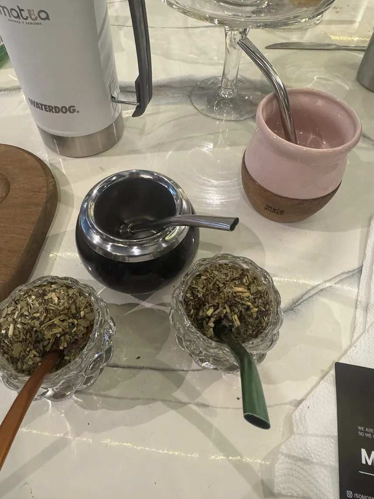
*马黛茶体验课地点：https://maps.app.goo.gl/N8VZ37GpwCvLCszr7?g_st=it*

 

# 最后
今年真的没想到一直都在路上，阿根廷之行是柏林之后定下的，这应该是我今年最后几程了。最后在 Bariloche 的几天，我找到了真的想做的一些事，明年计划会基本待在国内。虽然我朋友都说我是旅游圣体，每天能吃能喝能睡，但我心里上觉得玩累了。

这次阿根廷系列会比较长，即便我已经根据城市来分篇，但很多发生的事情我都想要好好记录。这篇主要是布宜诺斯艾利斯，下篇根据内容长短，我会继续写伊瓜苏、埃尔卡拉法特、乌斯怀亚、巴里洛切。如果我的感悟和经验对你有帮助的话，那也很不错。感谢阅读，下文再见。