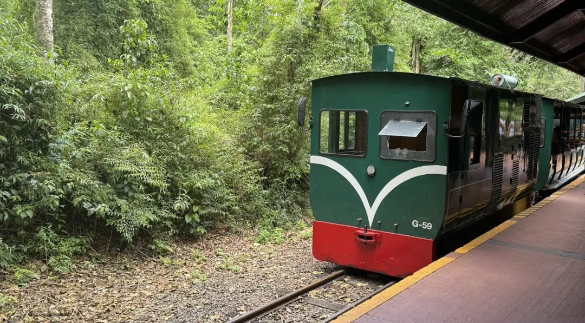
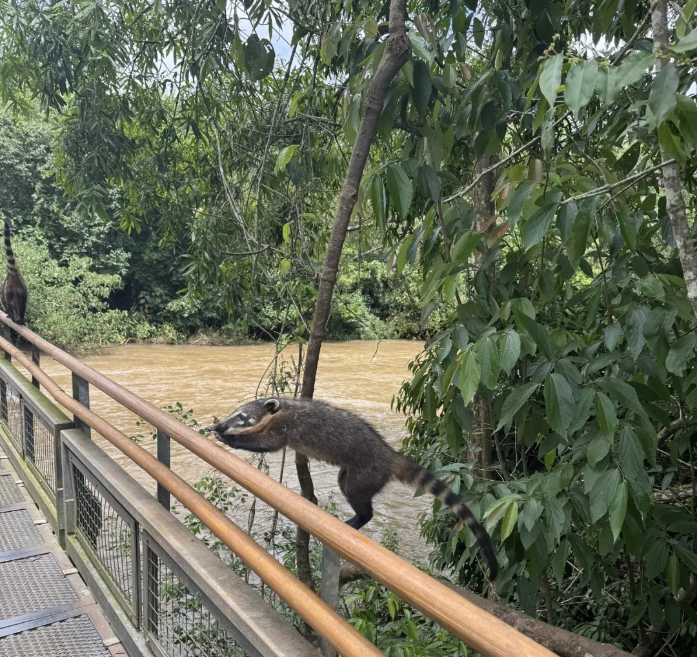
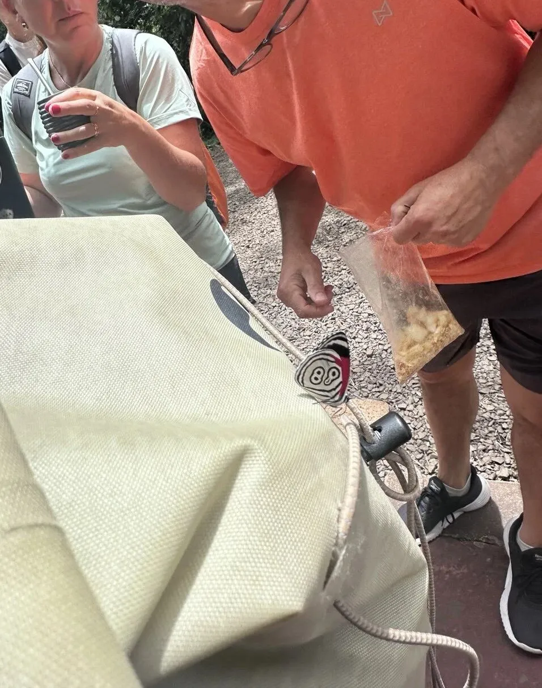
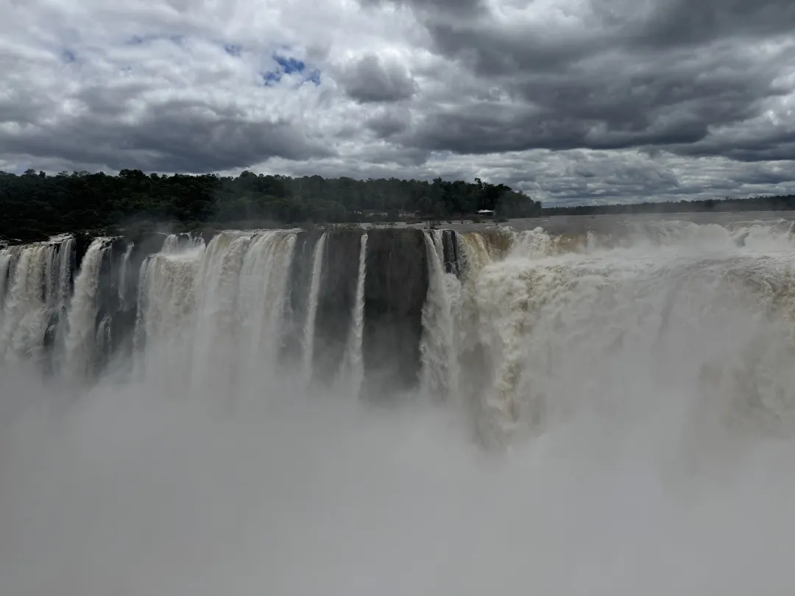
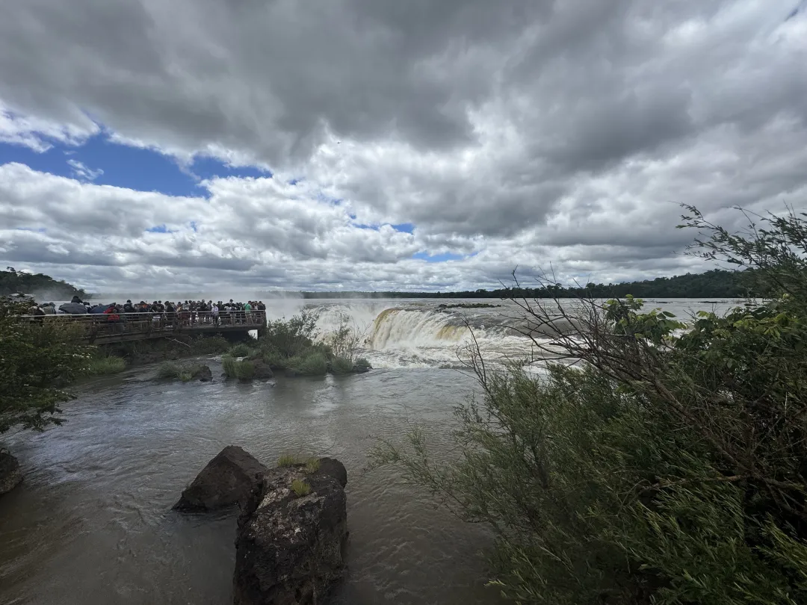
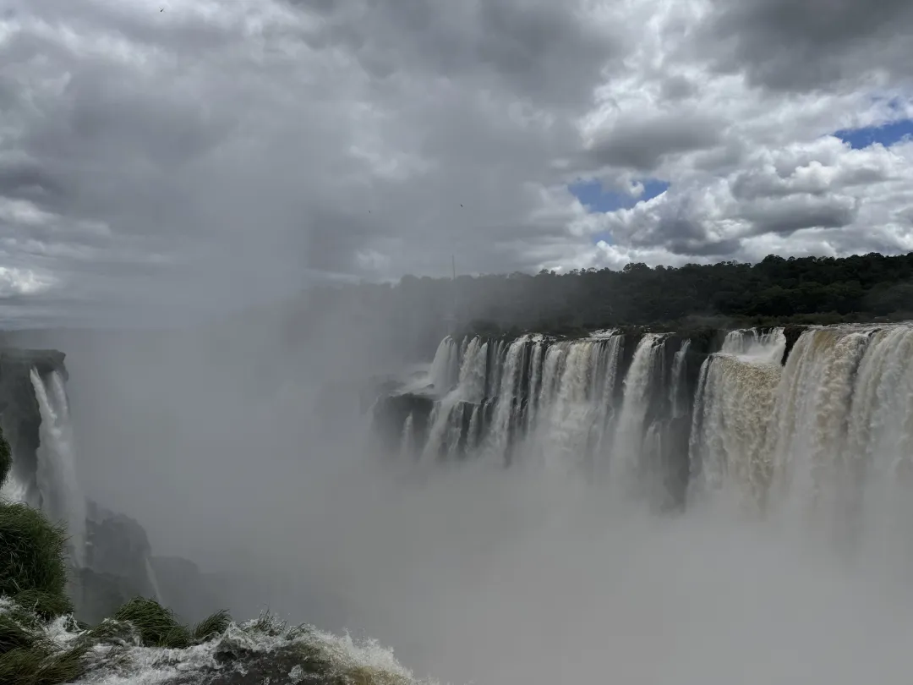
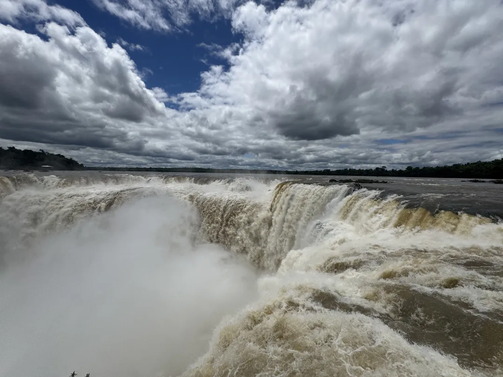
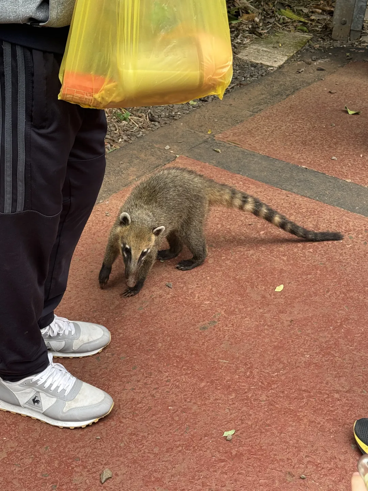
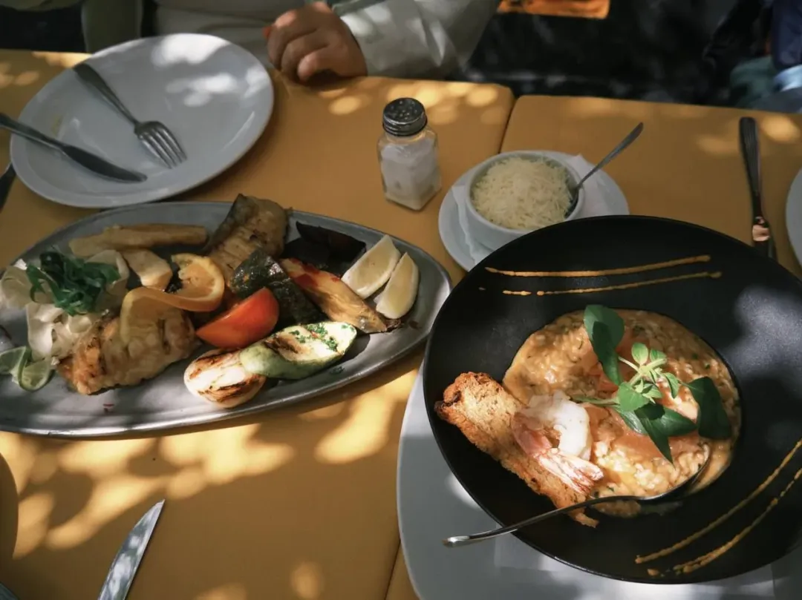

# 🧳 准备
定下去伊瓜苏瀑布的行程是在去阿根廷的两个月前，伊瓜苏的行程也是第一个被定下的，所以我们享受到了做计划的好处——便宜的机票。

我们购买的是 flybondi 的机票，买完才发现小某书上有特别多的避雷帖，这个航空公司做事比较夸张。但咋办呢，买都买了，退了也不退钱，于是当时就抱着好心态死马当活马医，希望它别太离谱🤷。

后来事实上证明阿根廷，甚至南美的航空都不是很靠谱。因为行程，后续还发生了许多和航空公司的故事。flybondi 的去伊瓜苏的机票，在我们购买后的两个月内修改了三次航班飞行时间，最后延迟了八个小时。好在我们那天本来就不计划在伊瓜苏干什么，不然总共加起来一天（一个晚上+第二个白天）的行程，直接会被动削减大部分。

伊瓜苏的交通方式基本就是巴士和驾车。我们当时定的民宿有接送的服务，直接联系了民宿的工作人员来接送。巴士的话，某书上有不少的笔记攻略。记得从机场到我们民宿，再从民宿到机场的往返价格是三万八比索四个人（如果我没记错的话）。

 

# 🗺️ 行程安排
看到了小某书上一些朋友分享的经验，说可以从阿根廷直接包车去巴西侧当天往返，不需要签证。但是也有看到一些帖子说会被抽查。鉴于我们四个人里三个人都是中国护照也没有巴西签证，稳妥起见，所以我们就只选择去在阿根廷侧的瀑布，放弃了巴西侧的。

我们计划：到达民宿后好好休息，第二天八点出发去伊瓜苏瀑布，下午三点半的飞机回布宜诺斯艾利斯。

购票是在官网在线买的，外地游客一人三万五比索一张。当时我朋友还多买了一张，以为需要身份信息，后来发现只刷码就行了。除了正常买票，也可以找一些旅行网站预订一些 tour，看自己的需求。

官方售票网站：https://ventaweb.apn.gob.ar/reserva/parques

 

# 🏞 到达瀑布
阿根廷侧的伊瓜苏瀑布在伊瓜苏国家公园内，进入国家公园后可以乘坐小火车，小火车需要额外付费乘坐。小火车有时刻表，到点发车，中间会停几站，终点站是伊瓜苏瀑布站。

小火车到站后需要步行 15-20 分钟时间才能抵达瀑布，一路上会经过一些河流，幸运的话也可以遇到很多当地的小动物，比如长鼻浣熊（Coatimundi，简称 Coati）。

还有各种蝴蝶，比如八斑蝴蝶。当时我们要坐小火车离开的时候，就有一只八字蝶停在我的包上。

事实上，世界上最宽的瀑布还是很震撼的。低头望下去有一种自己随时可能要陷入那激流中的感觉。

值得一提的是，如果去伊瓜苏的话，尽可能把食物存放好，并且不要喂食当地的动物。我们在离开瀑布的时候，那边的 Coati 应该是已经习惯了小火车的到来，知道上面会有人散落的食物。于是，在火车上下换人期间，它们会到座位上搜刮一通，甚至会打架。

长鼻浣熊的嗅觉很敏锐，所以也会可能导致攻击行为（如抓伤或咬伤游客以抢夺食物）。当时我们在一旁等小火车，我和我朋友两个人坐在木板凳上，就有 Coati 上前来，凑着我朋友的包闻，她的确在里面放着一包糖。本来我朋友还觉得可爱不为所动的，被一旁的当地阿姨及时拉了起来，示意我们愿意这些动物。

 

# 🍚 关于吃饭
其实已经记不太得在伊瓜苏吃了啥了，因为在那停留的时间很短。因为飞机延误，起飞就是晚上了。晚饭貌似是在民宿里煮了泡面，之后去了机场，到伊瓜苏的时候已经接近凌晨，接近两点才睡。半夜感受到外面狂风大作，以为第二天要下雨，谁知道是个大晴天，可开心了。

后来早饭是在伊瓜苏国家公园进门口吃的，门口有咖啡和面包店，还有零食店，不是很好吃，但是也能吃。除此之外，有一些公园周边的贩售店，以及出售当地手工艺品的摊位。

唯一在当地下的馆子，是在游玩伊瓜苏之后。因为我们没有去冲瀑，基本上就是坐了小火车到最里面看了大瀑布就走了，所以时间很充裕。如果有精力的话其实也可以到中间站停下来，徒步到大瀑布线或者是其他的点。

据说有一家当地做鱼的餐厅很不错，我们趁着结束的比较早，加上肚子饥饿，当地机场也没啥吃的，加钱给民宿接送我们的阿姨，让她来送我们到餐厅，再送我们去机场。到了这家当地比较出名的餐厅，如下图。

我们点了个烤鱼，还有一个烩饭，还有别的我忘了，总体还是挺不错的。烤鱼是百香果酱，融合一些其他的烤蔬菜。唯一让我觉得有点不足的是烤鱼的鱼皮过黑，有些焦苦。四个人，加上默认 10\% 的小费，人均三万多比索。

 

# 💡 注意事项
我们去的时候是 11 月中上旬，那会我个人觉得我没遇到什么蚊子，但是有另一拨朋友他们是我们后一天去的，同是去瀑布，据说就有很多蚊子，猜测可能是去的地方不一样。

所以如果是在当地春夏季去的朋友，记得做好防蚊措施。当时的蚊子一旦咬人，是非常厉害的。我在布宜诺斯艾利斯被咬过一次，半夜睡到一半发现蚊子在我耳朵边叫。于是一拍，一大包血，第二天手上肿起了一大块，快一周才消。

另外，前往瀑布的的路是一条铁栈道。我们走到一半的时候遇到了一位外国大个大叔摔倒了，磕到了额头，坐在一侧，血一直在流。大家步行的话注意安全！

 

# 总结
那么伊瓜苏的就先这样啦，下篇文再见👋。