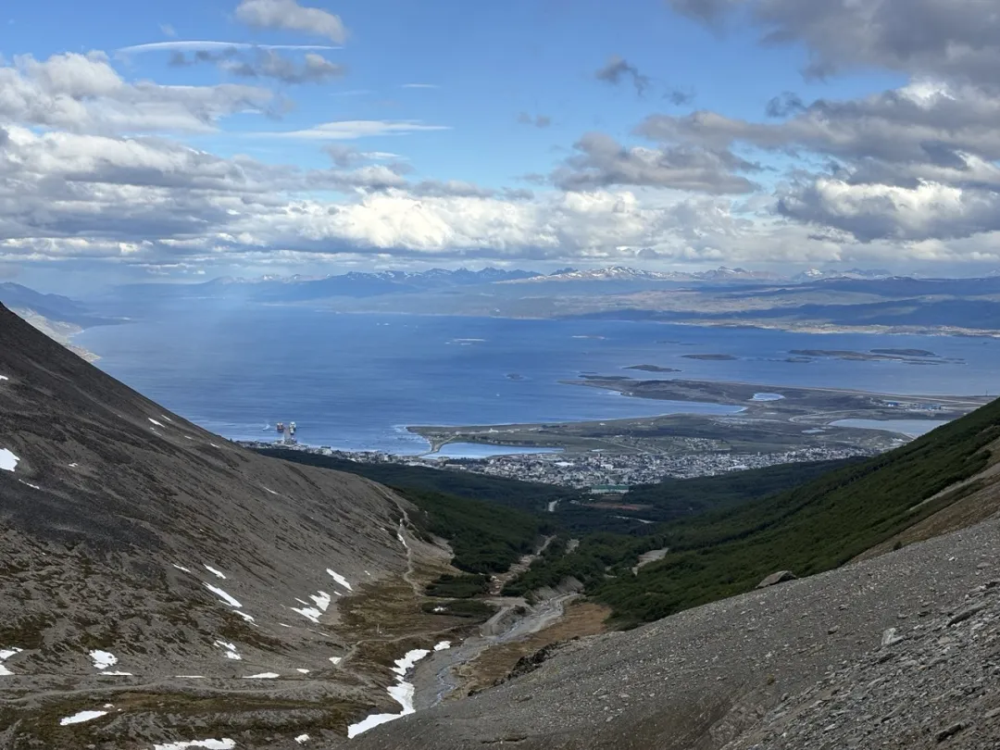

# ✍️ Foreword
To be completely honest, Ushuaia is a bit... boring. This "boring" is specifically directed at how "over-hyped" it is under the heavy filter of social media. However, the place does have its own character. After spending four days there, I realized that Ushuaia used to be Argentina's "Ninguta" (a legendary place of exile). If people today associate Ushuaia with keywords like *End of the World*, *Lighthouse*, *Antarctica*, and *King Crab*, my observation is that the old keywords were: *Loneliness*, *Prison*, and *Antarctica*.

 

# 🐎 Itinerary
1️⃣ **Day 1: Arrive at the guesthouse in the afternoon; after check-in, take a taxi to the town center to book a penguin tour.**

💡 **Tip 1:** Only one tour operator in the entire town is allowed to actually set foot on the penguin island (**Piratour**), so that specific tour needs to be booked well in advance. All other local tours only view the penguins from the boat and cannot land on the island. (Personally, I don't think there's a massive difference unless you are specifically looking for "the perfect shot," because many boats get close enough to the island to see the penguins clearly.)

*The exclusive Penguin Island tour*

💡 **Tip 2:** If you are traveling solo or in a pair, keep an eye out for last-minute cancellations. When our group of six asked about Piratour for the following three days, it was fully booked. However, a friend of mine traveling solo went the next day and snagged a spot at half-price. I suspect someone canceled last minute, and with only one seat left, they offered a "fire sale" price. 🤣

2️⃣ **Day 2: Took a taxi to Tierra del Fuego National Park for a day trip.**

💡 **Tip 1:** You can use cash or a credit card to buy tickets for Tierra del Fuego. Once you've paid, you can take a bus inside the park. The bus accepts **Mercado Pago**, but I suggest just bringing cash. Drivers often prefer to avoid taxes and might tell you they "only accept cash."

*Ha, we walked a full loop around this part of the island*

We actually ran into this situation. We spent all our cash on the entrance tickets. When we tried to board the bus, the driver insisted on cash. We tried to go back to the ticket office to refund the cash and pay for the entrance with a credit card instead, but they refused. The ticket office staff said the bus *does* support Mercado Pago QR codes; the driver argued it didn't. Eventually, after the staff intervened, the driver—likely not wanting to lose the fare for six people—magically produced a Mercado Pago machine for us to scan.

💡 **Tip 2:** Basically, there is no signal at the entrance of Tierra del Fuego, and even less once you're inside. However, I had a brilliant friend who brought a **Starlink**, so they were probably the only two people in the park with internet. 😆

*Photo borrowed from my friend's social media feed*

3️⃣ **Day 3: Penguin Tour + Prison Museum**

💡 **Tip:** If you don't finish the Prison Museum in one day, you can return the next day for free with the same ticket. The ticket costs roughly ¥160 (RMB).

*The penguin island near the lighthouse*

*The famous lighthouse*

This specific building is a part of the original prison that has had zero renovations. When I walked in, it was completely empty and felt incredibly eerie. Do you know that feeling of stepping out of a heated room into the bone-chilling wind of a derelict prison? It's hard to imagine how the inmates survived year after year in this literal "Ninguta."

4️⃣ **Day 4: Hiking the Glacier + Town Bus Tour**

💡 **Tip 1:** Ushuaia has its own glacier called **Glacier Martial**. When we went, it was under maintenance. Entry is free after 5:00 PM; otherwise, it's about ¥50 per person.

*Photo from someone else—the view looked great, so a friend and I decided on a "shallow" hike. Little did we know the weather on the mountain changes in the blink of an eye.*

*Me in front of Glacier Martial: I have no idea why my silhouette looks so sketchy here; I don't even know what I was doing. 🤷*

💡 **Tip 2:** The town bus also requires a ticket, which is around ¥50–60. There is also a train option. The bus tour ends with a voucher for a small cup of hot cocoa, which you can redeem at a designated shop nearby.

*Wind was so strong I just wanted to dance like a maniac hhhh*

 

# 🤔 Random Reflections
Exploring Ushuaia's sites—from the National Park to the Prison Museum—I finally saw information about the local indigenous people, the **Yaghan (Yámana)**. They were nomadic hunter-gatherers who adapted to the extreme cold, but their numbers plummeted due to disease and cultural shock following European colonization. Intellectually, this history filled a void in my understanding of the Americas before "discovery."

*A corner of the Prison Museum*

*Another corner of the Prison Museum*

*Looking out from the Prison Museum*

Tierra del Fuego is where the indigenous people lived, so if you go there, you'll see many exhibits explaining their way of life. Even the Prison Museum has extensive displays on them. But like many other civilizations, their traditional social structures and languages are on the brink of extinction.

Perhaps most people choose Ushuaia for the romance of the "End of the World" and want to send a meaningful postcard from the **End of the World Post Office**. Unfortunately, the post office was temporarily closed. I heard from friends that the 80-year-old gentleman who runs it is still fighting to get it reopened.

*The view from the Tierra del Fuego Visitor Center*

From Buenos Aires to Iguazu, El Calafate to Ushuaia, and later Bariloche—the more I experience these cities, the more I realize Argentina is a textbook "immigrant nation." Its population and culture were deeply shaped by massive waves of European migration (especially from Italy and Spain) in the late 19th and early 20th centuries.

*The view from the town bus*

If you're interested in Ushuaia's history and community, I think the town bus is a great choice. It's about an hour long on a double-decker bus with audio guides in different languages. It gives you a general layout of the local neighborhoods and stops at a few photo spots. I quite enjoyed it, and it even taught me a new Cantonese phrase—"游车河" (yau che hoh, meaning a leisurely drive).

*Trying to look artsy on the bus*

The food in Ushuaia felt mediocre, possibly because we spent most of our time in the tourist-heavy town center. There is one extremely popular restaurant that has a line forming as soon as it opens at 7:30 PM. I forget if you can book in advance, but it seems likely. We tried to go at 8:00 PM on the first day, but the queue was so long we gave up.

*We were so silly; we ordered six small bowls of seafood soup like this. It worked out to $15  per bowl—honestly, wouldn't it have been better to just buy a big plate of meat?*

Since we were usually outdoors at attractions, we noticed that Ushuaia is absolutely packed with Chinese tourists. In those four days, I saw more Chinese people than in BA, El Calafate, and Iguazu combined. Most were there for Antarctica. A couple in front of us in line, who had come from Shanghai, told us their Antarctic cruise tickets cost $14,000 per person.

*The pier has tour boats and those massive ships heading to Antarctica 🚢*

**King Crab** is the big business for these restaurants. Every time an Antarctic cruise docks, it brings a surge of tourists. I remember a video of Yu Minhong (a famous Chinese entrepreneur) treating people to king crab in Ushuaia went viral while we were there, but we missed that wave. Regarding Chinese food, there are several Chinese restaurants in town. We visited one for lunch; the prices are higher than local spots, but the advantage is that you can have king crab prepared in a traditional Chinese style. At the time, a king crab was about $140, plus a processing fee for the cooking, though we didn't order a whole one—just heard about it from friends.

In terms of thrill and "playability," Ushuaia isn't nearly as impactful as El Calafate (which, in my eyes, holds the same status in Patagonia as Huangshan does in China). However, I did leave that southernmost city with some very special memories. Beyond the sights, it was more about the shared experiences with friends. It was also there that I had a realization: it's okay to feel lonely; it's just part of being human. I feel like I've grown in how I handle my emotions, seeing the "lonely side" of people and viewing relationships with a more inclusive perspective (I feel different every time I look back at a new stage of life).

In short, my biggest takeaway from this city was an education in solitude. It made me cherish the fact that even in a lonely place, I still have friends.