# ✍️ 写在前面
实话说，乌斯怀亚，挺无聊的。这个「无聊」特指在社交媒体浓墨重彩的渲染下，在我看来乌斯怀亚被「过誉」了。不过，这个地方也有其特色，在乌斯怀亚待了四天，发现这里在以前就是阿根廷的「宁古塔」。如果说现在人们想到乌斯怀亚关键词是：世界尽头、灯塔、南极、帝王蟹的话，那么根据我的观察，以前的关键词应该是：孤独、监狱、南极。

 

# 🐎 行程
1️⃣ 第一天：下午抵达民宿，check-in 后打车到镇中心订企鹅 tour

💡 Tip1：全镇只有一个 tour 是可以登上企鹅岛（Piratour），所以那个 tour 需要提前订购。其他当地 tour 都只能在船上看企鹅，不能上岛。（但我个人觉得其实没什么太大的区别，除非特意要出片，因为很多 tour 虽然不能登岛但是距离企鹅岛很近，完全可以看得很清楚）

*那个只此一家的企鹅岛*

💡 Tip2: 此外如果是只有一到两个人那么可以蹲一下，说不定会有空出来的位子。因为当时我们一群人六个去问接下来三天 Piratour 上企鹅岛的 tour 是已经没有位置了，但我有一个朋友是自己玩的，隔天去问就有了，而且价格对半。猜测是有人临时不去了加上又只有一个位子所以价格大放送🤣。

2️⃣ 第二天：我们打车去了火地岛公园，火地岛公园一日游。

💡 Tip1：火地岛公园买票可以用现金或者信用卡。买完票入口也可以买大巴进去，大巴可以用当地的 Marcado pago 付款，但建议直接带现金算了，因为他们想尽可能避税，所以司机可能会和你说只能接受现金。

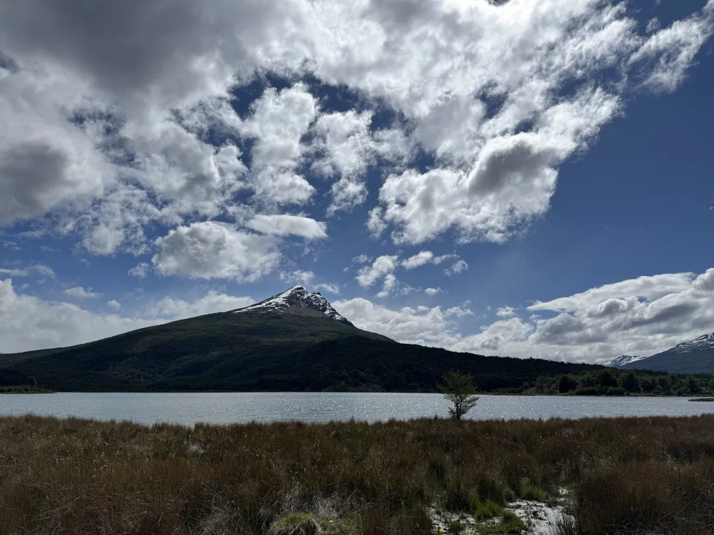
*哈，我们围着这个岛走了一圈*

我们之前就是遇到了这个情况，一开始买门票把现金花完了。想坐巴士司机说只能现金，回去想要让售票处退门票拿回现金，用信用卡重新支付说不行。售票处的人说巴士可以支持 Marcado pago 扫码付款，和司机掰扯说不行。后来售票处的工作人员帮我们再去沟通，应该还是不想错过赚我们六个人钱的机会，最后司机掏出了 Marcado pago 的机子让我们扫码付款。

💡 Tip2：基本上在火地岛公园门口就没网了，进了火地岛公园更是没网。但我有聪明的朋友带了 Starlink，所以他们应该是唯二两个去火地岛的时候还有网的人😆

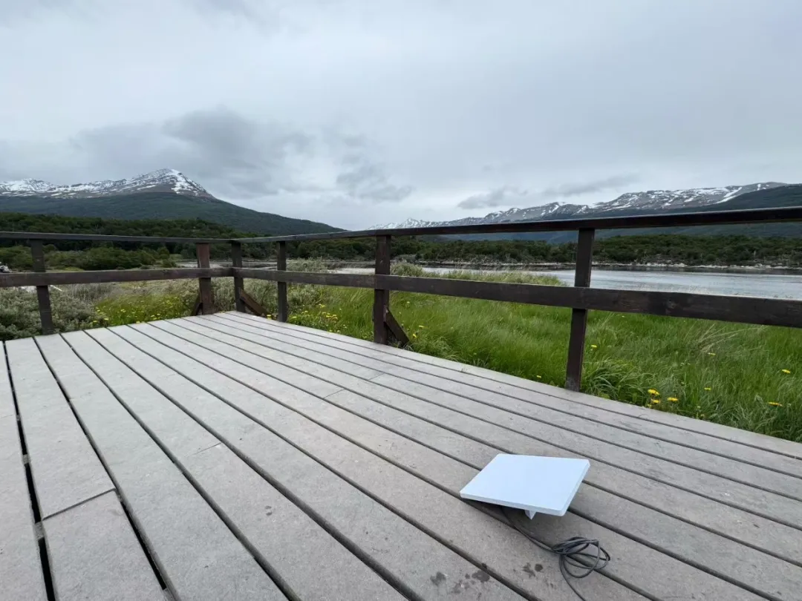
*此图来自我朋友的朋友圈，被我借用*

3️⃣ 第三天：去了企鹅 tour + 监狱博物馆

💡 Tip：监狱博物馆当天没参观完毕隔天还可以凭票来免费入场，门票折合人民币大概是 ¥160。

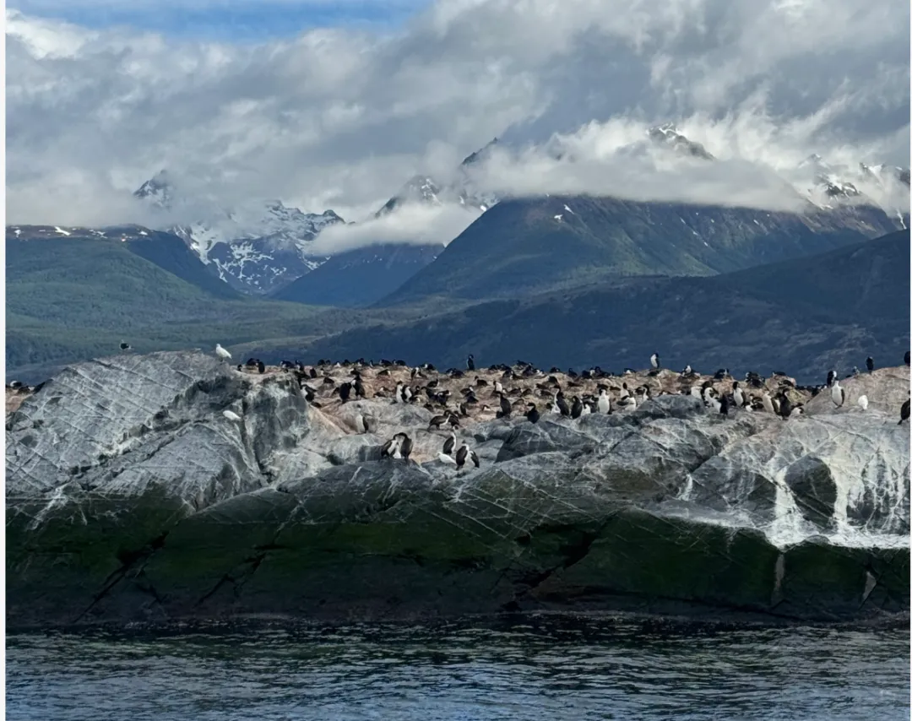
*在灯塔旁的企鹅岛*

*就是这个灯塔*

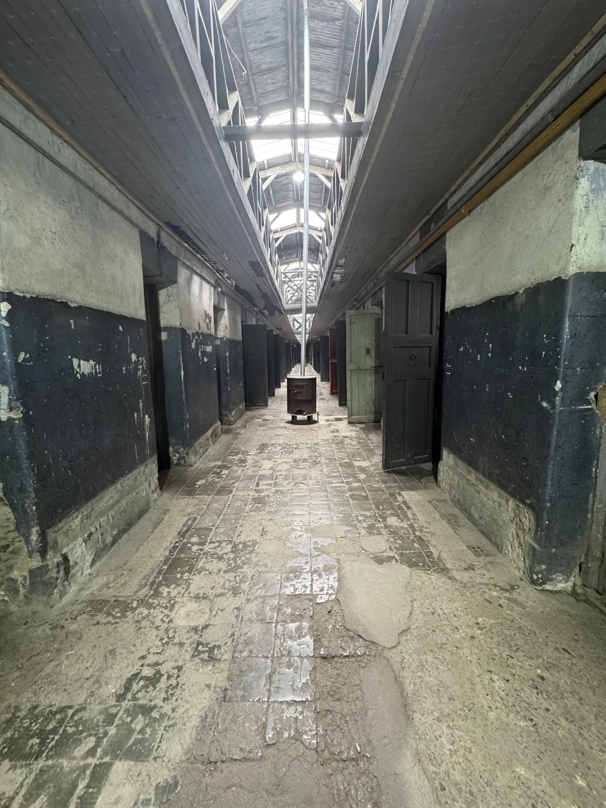
这一栋楼是没有任何修缮的原监狱，而且我当时进去的时候空无一人，阴气飕飕。谁懂打开门后一下从暖气房到寒风瑟瑟的监狱？真难以想象以前的犯人是如何熬过那一年又一年的，真·宁古塔。

4️⃣ 第四天：爬了冰川 + 坐小镇巴士

💡 Tip1：乌斯怀亚也有个冰川，叫马蒂亚尔冰川（Glacier Martial）去的时候还在维护，下午五点后上山免门票，否则门票是 ¥50/人。

*此图源自别人，景色还不错于是我后来决定与友友浅爬一下，没想到这山上天气瞬息万变。*

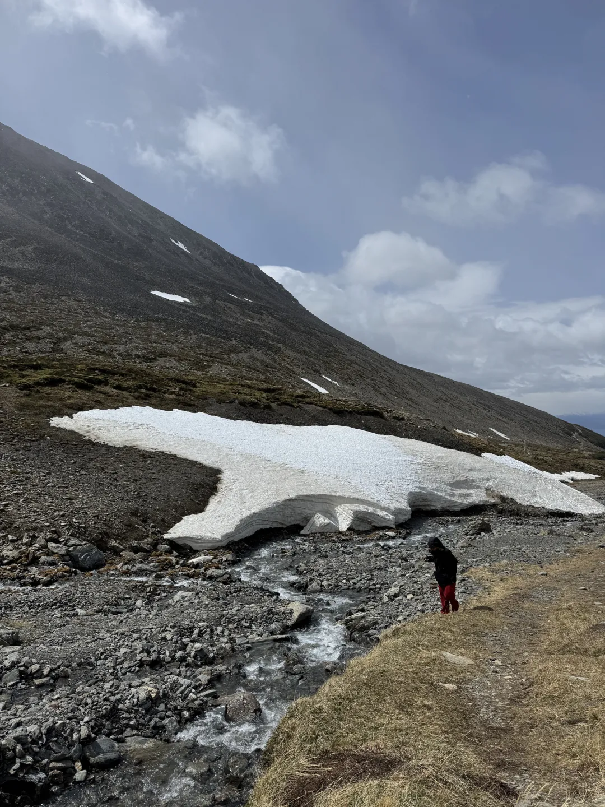
*在马蒂亚尔冰川前的我：为何本人背影看起来有点猥琐，我也不知道当时我在干嘛🤷*

💡 Tip2：小镇巴士也是要购票的，貌似也差不多是 ¥50、60，此外还有一个火车的，巴士结束会送一张小杯热可可的券，可以步行到指定的门店去喝。

*风太大只想狂舞hhhh*

 

# 🤔 杂想
游览乌斯怀亚的景区，从火地岛公园到监狱博物馆，我终于看到了当地真正的原住民——雅甘人 (Yaghan/Yámana)，他们是渔猎民族，适应了寒冷环境，但在欧洲殖民者到来后因疾病和文化冲击而数量急剧减少。如果就知识层面而言，这部分的历史确实补充了我对于在美洲被殖民发现前的空洞。

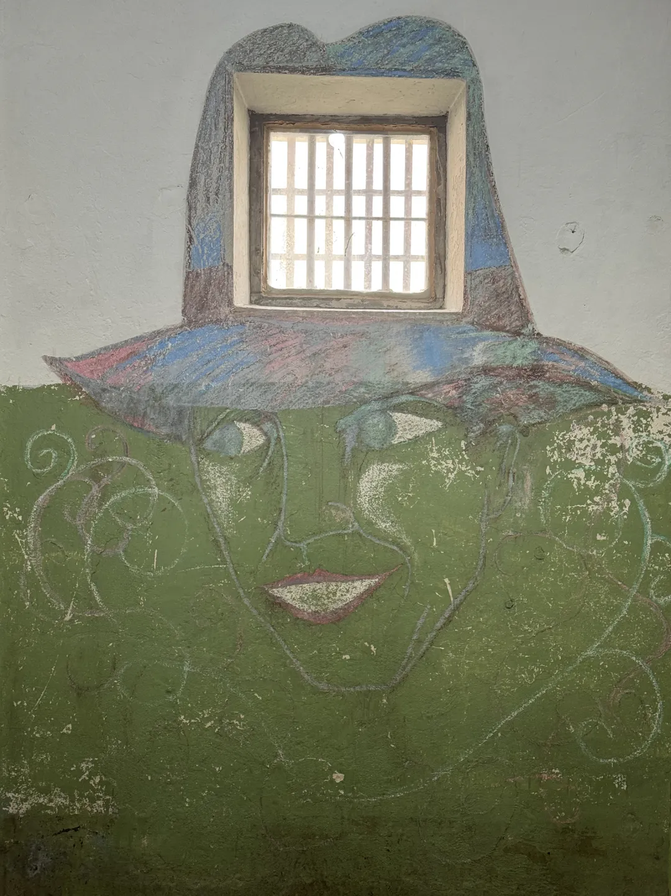
*监狱博物馆一隅*

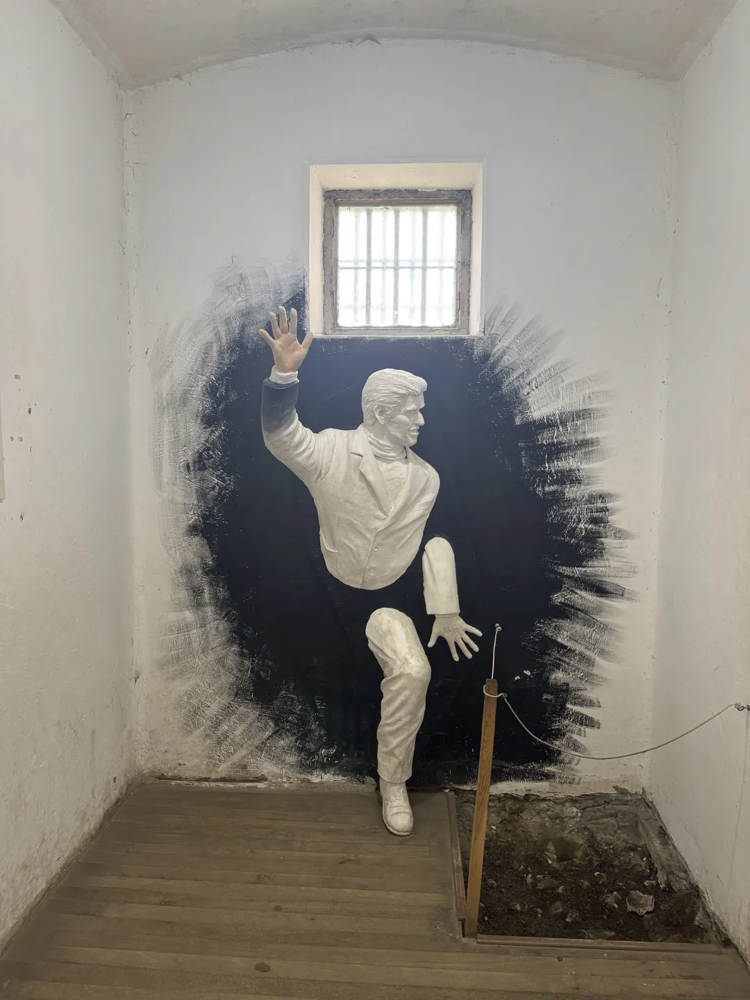
*监狱博物馆又一隅*

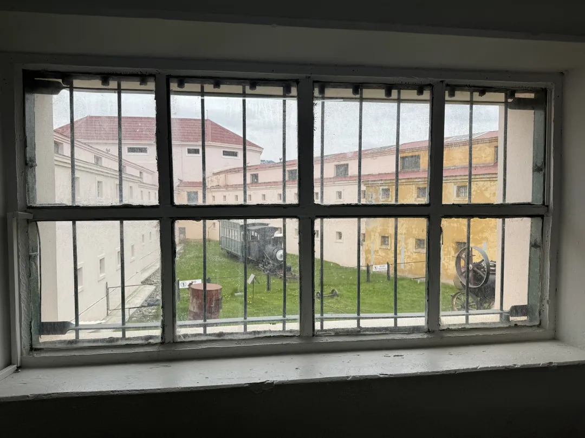
*监狱博物馆向外*

火地岛公园是原住民生活的地方，所以如果去到那里，可以看到很多和原住民相关的介绍，解释他们当时是如何生活的。甚至监狱博物馆也陈列了很多关于这部分原住民的介绍，但就像其他的文明也面临的问题一样，其传统社会结构和语言已濒临消失。

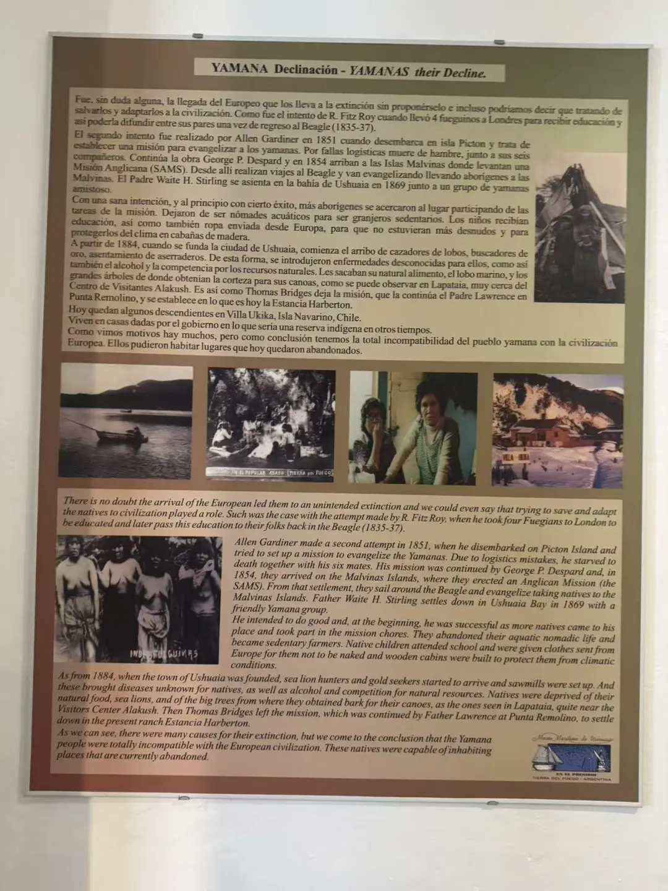

或许大部分选择去乌斯怀亚是受到了「世界尽头」的浪漫影响，想要在火地岛的世界尽头邮局寄出有价值意义的明信片，但很不凑巧地是，这个世界尽头的邮局暂时关闭。听我朋友们聊，据说那位八十多岁的老爷爷还在争取，希望可以重开邮局。

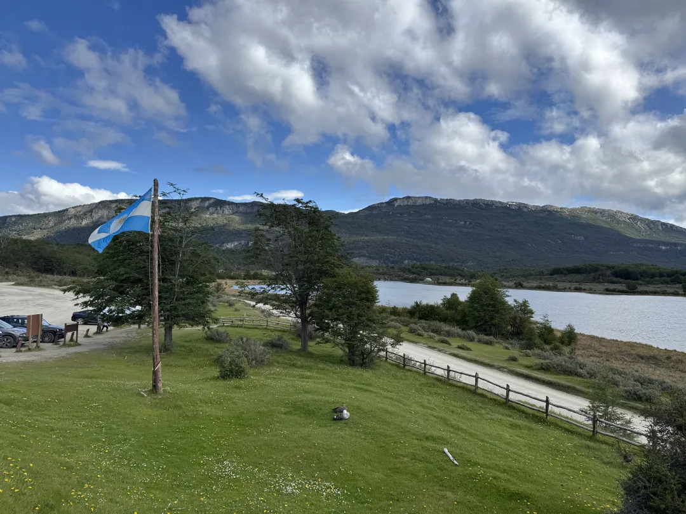
*在火地岛公园的游客中心望去*

从布宜诺斯艾利斯到伊瓜苏，到埃尔卡拉法特，再到乌斯怀亚，以及后来我去的巴里洛切。愈发了解和感受这些城市后，就会发现这个阿根廷这个国家真的是一个典型的移民国家，其人口和文化深受 19 世纪末至 20 世纪初来自欧洲的大规模移民（尤其是意大利和西班牙）影响。

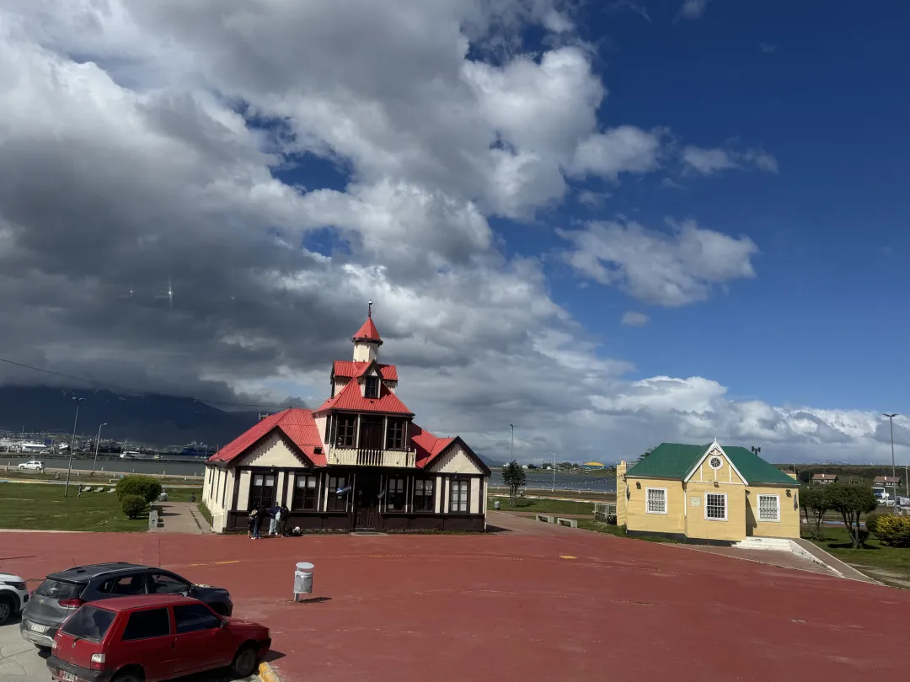
*从小镇巴士上望去*

如果对乌斯怀亚的历史和社区感兴趣，我觉得小镇巴士还是一个不错的选择。约莫一个小时，两层的巴士，车上有不同国家的语言讲解，一条线路带你大致了解当地的社区构成。中间会在一些打卡点停留拍照，个人觉得还不错，因为这个我还学到一个新的粤语词汇——「游车河」。

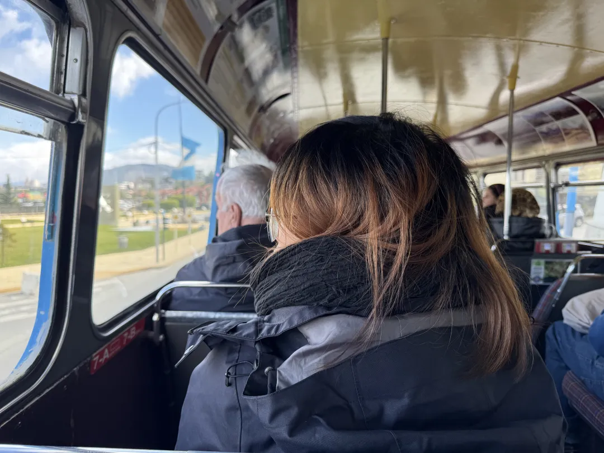
*在巴士上装文艺时刻*

在乌斯怀亚吃得感觉较为一般，也兴许我们那几天我们活动的地方是镇中心，专门为游客定制。镇中心有一家餐厅非常火热，基本上傍晚 7 点半刚开门，就有人开始排队，忘记是否可以提前预定了，貌似是可以的。我们第一天去的时候约莫晚上 8 点，看排了好多人便作罢（地址：https://maps.app.goo.gl/FLppJicVUi96BVzc7）。去了旁边一家，价格是相对便宜一些，但口味就真的差强人（https://maps.app.goo.gl/SpAYqbj81SqMZrKA7）。我意识到后来选的那家餐厅擅长的应该是做肉，其它海鲜、面类的菜品就是应付，我敢说国内小吃摊的水平也是吊打他们。

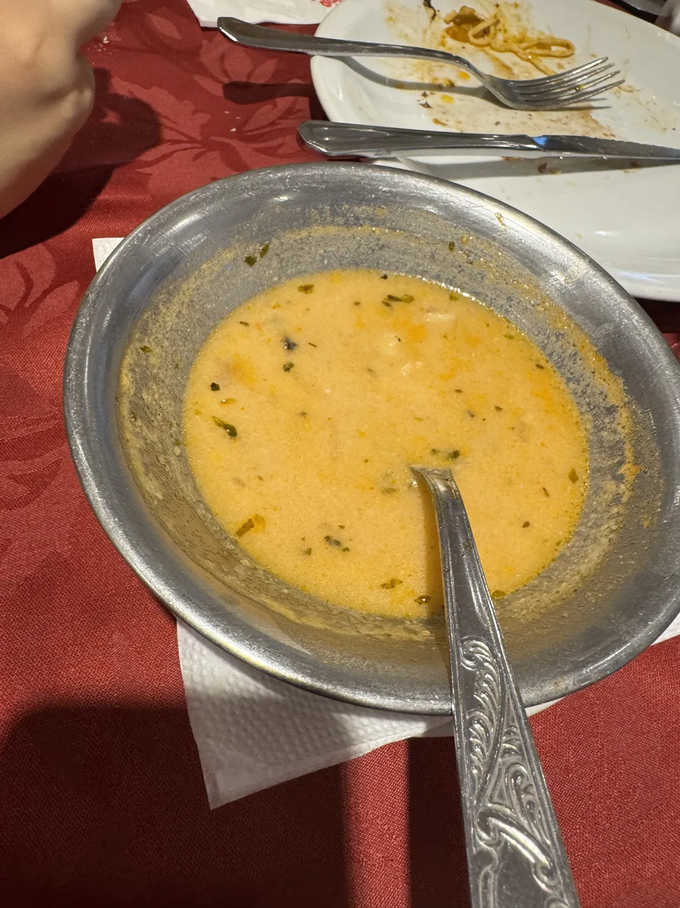
*我们太傻了，点了六份这样小碗的海鲜汤，折合下来一份一百块人民币，吃肉不香吗*

平常大部分时间我们都在户外景点，于是吃饭的时候就会发现，乌斯怀亚真的是聚集了好多中国人，在乌斯怀亚那四天见到的中国人比我在布宜诺斯艾利斯、埃尔卡拉法特、伊瓜苏加起来的还要多，大部分人都是为了去南极。当时排队在我们前方的一对情侣，从上海去的，告诉我们他们去南极的船票一人是十万人民币。

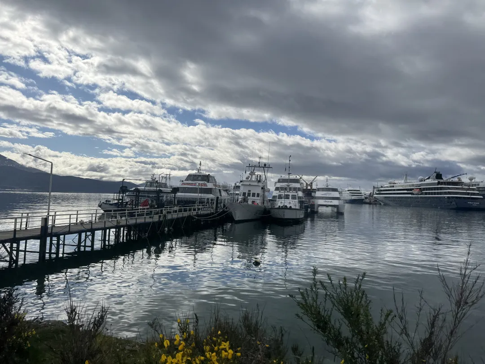
*码头停靠有 tour 的船，也有前往南极的🚢*

帝王蟹是这些餐厅的大生意，每每南极邮轮停靠，就能给当地的餐厅带来大波游客。记得当时我们在乌斯怀亚期间，正逢俞敏洪在乌斯怀亚请帝王蟹的视频走红，哎呀，但是我们没赶上这波。说到中餐，当地有几家中餐厅，我们有天中午去了其中一家。中餐厅价格比起当地餐厅来说会贵，选中餐厅吃帝王蟹的优势就是可以做中式的做法。当时一只帝王蟹的价格在 ¥1000，中式做法的话应该需要加上加工费，但我们在乌斯怀亚几天也没吃整的，只是听我朋友与我讲述了一些。

就景点或者旅游的刺激性和可玩性来说，乌斯怀亚显然不比埃尔卡拉法特有冲击力，后者在巴塔哥尼亚的地位在我看来犹如黄山。然而我的确在这个世界的最远城市留下了一些特别的回忆，景点之上，更多是因为和朋友留下的共同记忆。也是在这里，再次醒悟，觉得孤单也没什么，人之常情罢了。也是在这里，我觉得我在处理自己的情感上似乎更加成长，看到了人的孤独面，以更加包容的视角去看待和他人的关系（每个阶段看，我都不一样了哎）。

总之，在这座城里，最大的收获是孤独的教育，反而让我更加珍惜，即便在孤独之地，我也还有朋友。