近期好友男友来到了清迈，他们准备租车前往清莱，邀请我同行，行程非常简单且直白：白庙、蓝庙、黑屋，三处去完打道回府。我非常意志不坚定地被拉入其中，抛下我要看的文章和工作，成为闪亮的电灯泡。

今天我们一大早就出发，从清迈前往清莱，包车师傅人很不错，叫 Thep，他会说中文，聊天的时候还透露之前在苏州和上海工作过一段时间，中文就是在那期间学习的。除了泰语和中文，Thep 在大学期间学的是英文，所以掌握三国语言。尽管他谦虚地说他只会一点点中文，但确实是我来了清迈以后遇到的中文说的比较好的，咬字很清晰，只是欠缺词汇积累，存在部分语序的小问题。

Thep 在开车的时候向我们介绍了一家路边很不错的咖啡店，我们在那休息了大概二十分钟，然后直达白庙。简要说说我们的行程：

我们大概早上八点二十分离开宁曼路，到达白庙是中午十一点半。中午在白庙附近吃了个饭，再驱车前往蓝庙，到达蓝庙约莫一点半。在蓝庙逛了逛，再前往黑屋，大概两点四十分到达黑屋。五点左右离开黑屋，中间在路边温泉停靠了半小时，快晚上八点的时候回到宁曼。

逛完白庙、蓝庙和黑屋（尤其是黑屋），我特别想写点东西，怕到了明天我又全忘光了。

 

# 白庙：文化熔炉下的生死
我们在前往白庙的路上，在路边的咖啡店停靠的时候查了白庙的资料。一开始答应了好友和其男友的邀约，纯粹是觉得是个难得的机会，毕竟我目前为止还没去过清莱，也想看看清迈和清莱有何不同。

当我答应了以后，监视我的社交媒体自动给我推送相关内容。注意，这时候联系就显现了。之前认识的乌克兰小哥 Ins 上的帖子我有看过一两个，其中一个满诡异且充满着艺术色彩的，就是白庙的一景，然而在我当时看的时候并不知晓那是白庙的一处，这让我对白庙产生了一些又期待又略有害怕的念头。

我之前看的乌克兰小哥的帖子里的片段是关于地狱伸出的手的特写，和局部放大的散落的骷髅与雕刻面部特征，因为有滤镜的缘故，整体看起来有点阴森。但我可以理解是关于生死的映射，make sense。然而现场所看到的场景和小哥视频中呈现的感觉完全不同，并没有很阴森，甚至因为白庙的白墙和大量的银饰，和背后蓝天的映射，整个庙宇亮的有点晃眼，圣洁斐然。而乌克兰小哥之前视频里片段所展现的画面，是进入佛堂要经过的「桥」一段路中的两侧。

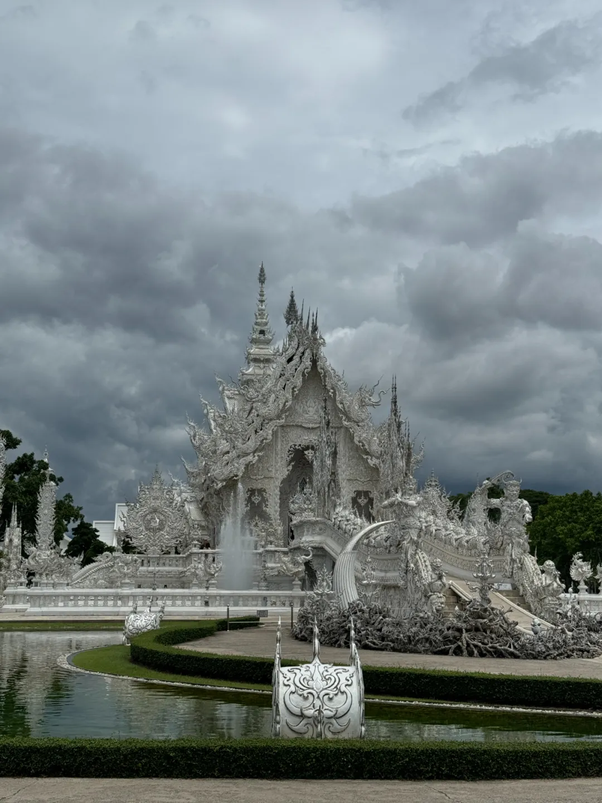
*white temple*

我最初以为清莱的白庙就像是清迈的庙宇一样，起码在几百年之前修建，但实际上白庙并不是。在去往白庙的路上，我查询了相关信息才知道，原来白庙是 1998 年建造的，由泰国的艺术家许龙才设计并出资建造，目前还在建设中，预计会在 2070 年建完。

我此前只是草草看过白庙最外围的照片，但是当我真的看到，我可以理解它的 Stylish 了，古代庙宇的框架，近现代元素的融合，以及多样的文化和艺术元素杂糅其中。我所注意到的让我印象深刻的几处：

1. 佛堂入口处的「地狱」样貌，经过的桥与不可回头的往生；

2. 地砖黑与白的阴阳交合，融合了中国道家的哲学思想，而其上的纹样则是泰国本土的元素；

*It incorporates the Yin and Yang elements of Taoism*

3. 假山的设计有点花果山水帘洞那味道，还有假山石有「鬼」的形；

4. 此外，假山处水池的雕塑小象加上了鱼尾，呈现了跃动的姿态，鱼尾部分在池中，象体在空气中，我想必然是有跃龙门的理念；

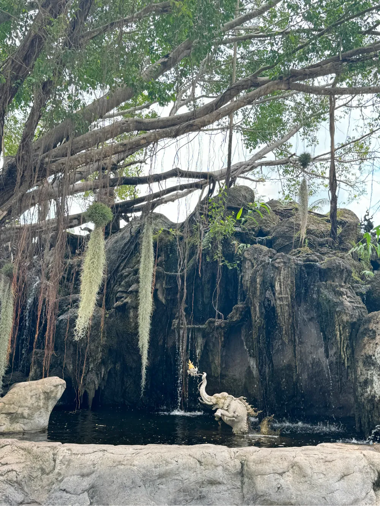
*Strange Rock Fountain*

5. 佛堂与马路中间有一条小河相隔，其间有一座像是牛鬼蛇神的雕像，上面的配色很像是现在 AI 画图经常使用的配色，外加上雕塑本身的样貌形态，赛博地狱如是一般；

6. 诸此种种

如上所说，尽管我们时间有限，并未参观完所有地方，但仅是几处就发现有很多中国的元素，我才想到白庙的设计者是泰国华裔，再加上这座庙宇建于二十多年前，并且现在还一直还在建设，期间不断吸收和融合新的元素，这就不难理解为什么它杂糅了多种的文化，甚至肯定还有很多我没有发现的结合与创作。

 

# 蓝庙：赛博朋克异化之蓝
据说蓝庙的设计者是白庙设计者的学生，所以蓝庙的设计理念也主要是采用了某一种颜色。在所去的三个地方中，个人觉得蓝庙给我的震撼力和新奇感相对没有那么强。

蓝庙看起来没有白庙那么精细，整体的工艺感觉上去更粗糙一些，另外它的占地面积也没有白庙那么大，我觉得这点和财力也挂钩。蓝庙相对比较有震撼力的是在两侧入口的超大雕像，如果有巨物恐惧症可能会有点害怕。

*Blue temple*

比较有趣的是，当天我穿了一身蓝色系的衣服，所以和蓝庙整体色调非常一致哈哈哈，五彩斑斓的蓝。蓝庙也还在持续建设中，我们进去的时候有另一座雕像正在建造。我推测这些雕像应该都是有钱人的捐助，因为我注意到某一座雕塑上专门留有某个人的名字。

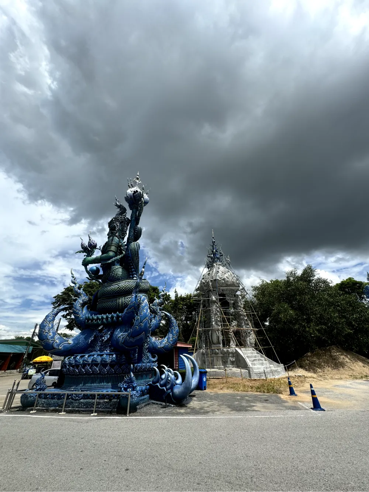
*Blue temple*

说实话，在这三处地方，不知道为什么蓝庙给我的感觉就是最浮于表面的「生死」，可能是因为它的表现手法在我看来是凸显「巨大」。就像是两侧出入口的四座巨大雕像，以格外显眼的方式强调「地狱」和「神」的存在，直白地让人难以忽视。

还有一点，可能我目前为止还是没有办法能够太接受异化的事物，说实话蓝庙的蓝，尤其是巨物雕像的蓝让我有一种妖化感，整体的设计给我的感觉是很奇异。当然，也正是这种妖化的感觉，让我觉得蓝庙是这三处里最有赛博朋克理念的。一方面是如上文所说的粗糙之感，这种区别于精致的粗糙可以理解为平民化和叛逆感，就像朋克、嬉皮这些文化，是区别于上流社会的精致高雅和小众的存在；另一方面，配色的运用很有当下 AIGC 绘画的风格，就像白庙河里的牛鬼蛇神雕塑的配色，能在现代科技产物中找到共鸣。

 

# 黑屋：绿与黑，动物的献祭台
我觉得黑屋是三者之中带给我最大冲击力的地方，也是让我写这篇文章的最强动力。我们到达黑屋的时候，刚准备出车门就下起了雨。不知道是不是雨水的作用，这层朦胧的雨水面纱，给本来就神诡的氛围更添神秘与难以捉摸。

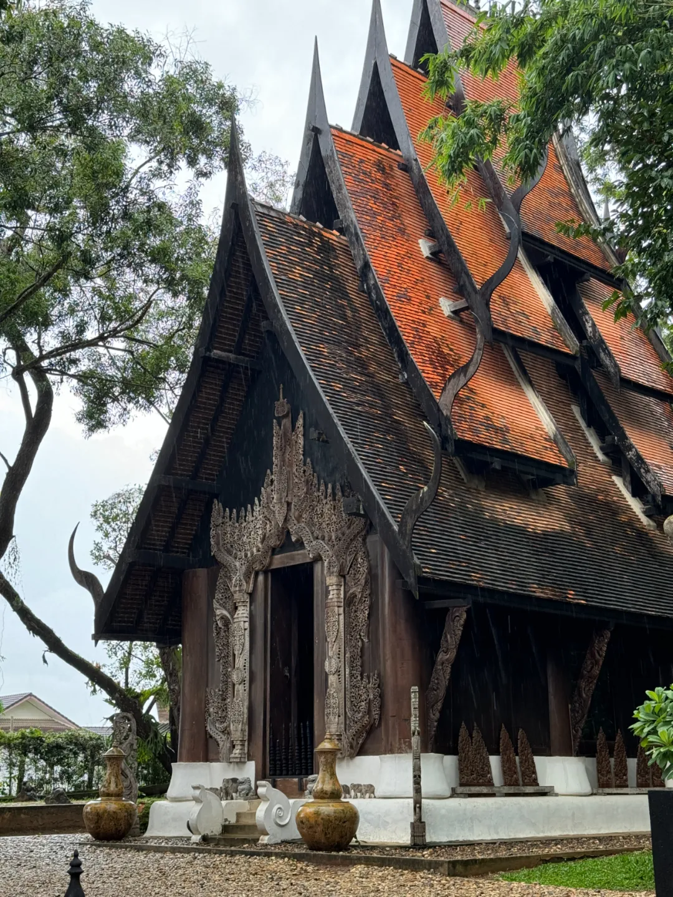
*Black House Museum*

虽然有人会将黑屋和白庙、蓝庙一起成为庙，但我更偏向称它为黑屋。它也是传统的泰式建筑风格，整个由屋群构成，最大的是展堂，旁边还有很多不同类别的屋子，它们的外墙都被刷成黑色。

以前我觉得红与黑是相当有冲击力的配色，激情昂扬的红和至暗的黑，而血红最后也会变成暗黑，瞧，结局是颓唐死亡，然而过程又充满着淋漓的昂扬。但是我在黑屋，第一次感受到绿和黑的碰撞。

说实话，黑色的外墙加上传统的泰式风格，屋子看起来像是棺椁。而自然生态让这片土地都是翠绿盎然，茂密参天的大树、碧绿纯然的湖水、嫩绿丰饶的草地，这些五彩斑斓的绿与各种形态的死亡与黑交织。

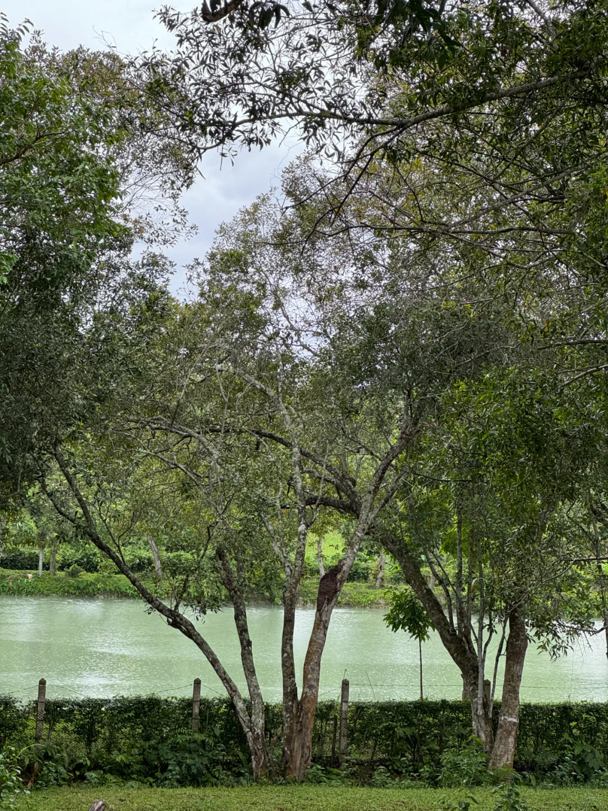

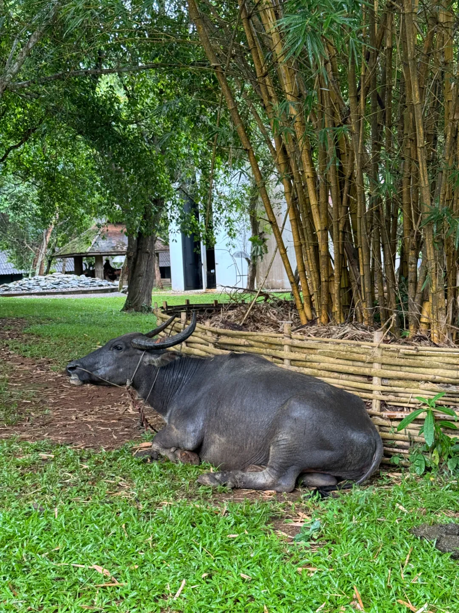

在黑屋的整个屋群里，有很多种动物的残骸，其中出现最多的是牛角，我不清楚这些牛角具体是什么品种，也不知道它们是否都是假的，这些只是仿品，但我觉得大概率是真的，它们被拼成了各种不同的样态，或座椅、或高梯……

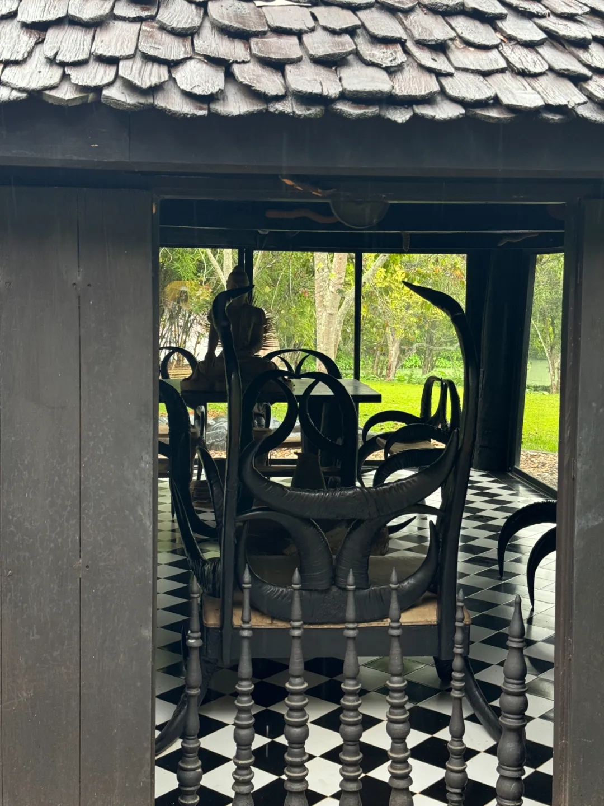

除了最多的牛角以外，黑屋最初给我冲击的是以下几点：

1. 展厅里墙上挂着的风干的动物头骨；

2. 桌上摆放的狼、巨鳄、蟒蛇风干的头颅和皮样；

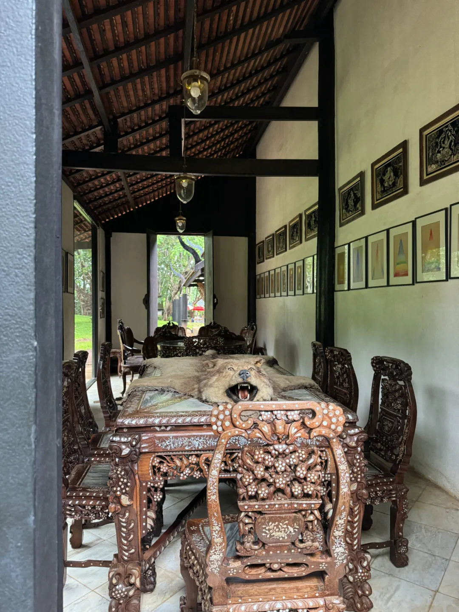

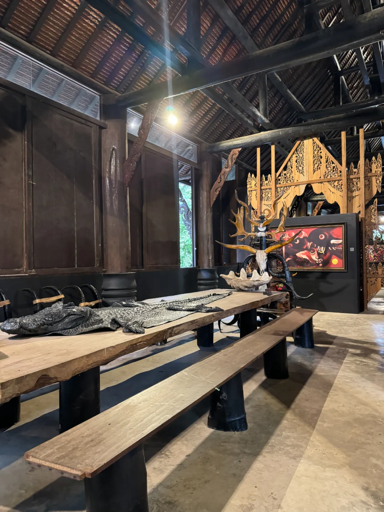

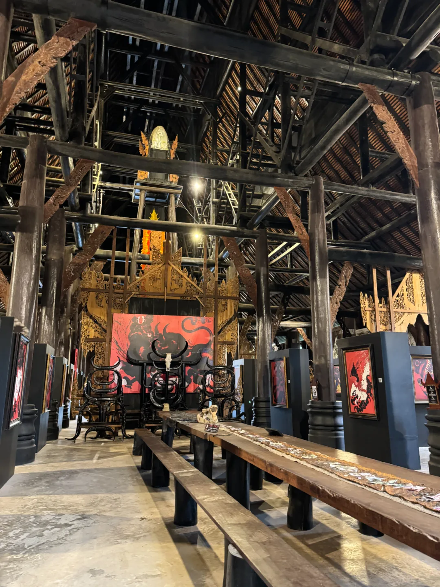

3. 展厅里动物嗜血的绘画；

4. 还有后来才知道的黑屋主人的正放在展厅的骨灰；

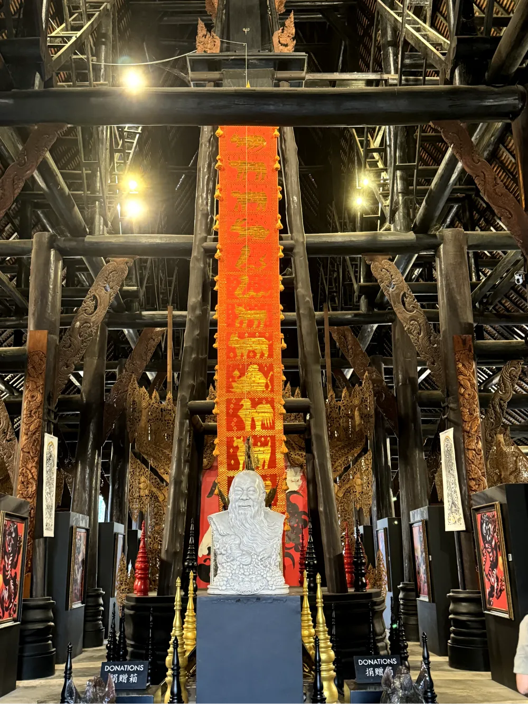

我看完和我朋友说：这是一场动物的献祭

跪拜匍伏的象，被摆放在人类餐桌上的头和皮毛，或许身体“已被分食”，只留皮毛和头骨，再结合现实，被奴役和统治、人类与环境……能想象和反思的东西太多太多，不自觉沉重。

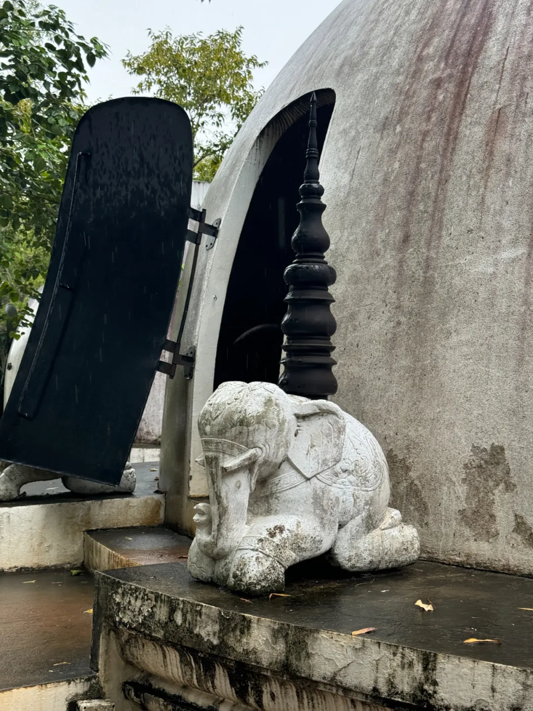

至于一些生殖崇拜的雕像和展品，其实很多博物馆也都有，黑屋里也不是特别多，并没有觉得太有冲击力，但是可以从这些展品上有些思考。因为在这个展馆里呈现的我所看到的象征男性的 dick 都相对夸张：一个是长着巨大 dick 的野人雕像，另一个是一个女人躺在一个巨大的 dick 上面。其实看过不少表示生殖崇拜的展品，也有很多侧重在母性的力量，但显然这个黑屋主人更偏向的是男性的生殖力。

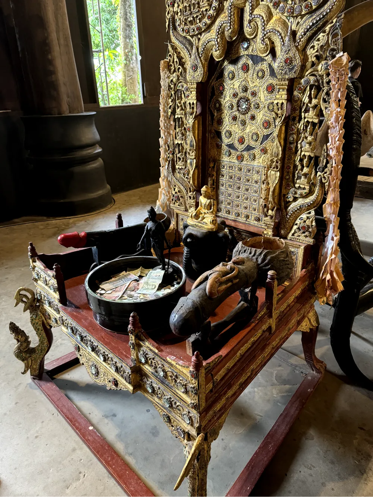

总结一下，黑屋带给我很大的冲击力，让我们第一次如此感受到绿与黑的碰撞与冲击，尤其以一种让我有点害怕和恐惧的方式呈现。然而它本质上就是一个博物馆，它的装置展出是被人为设计的，所以不可避免带有设计者的偏见和意图，这点我接受但并不喜欢。但不可置否，我还是比较推荐它的，尤其是在雨中别有一番体验，人少且清幽，更添几分自己吓自己的恐惧哈哈。

此外，这边也有很多处石阵，牛角被拼成类似天梯的样子，很有远古祭祀台那味。

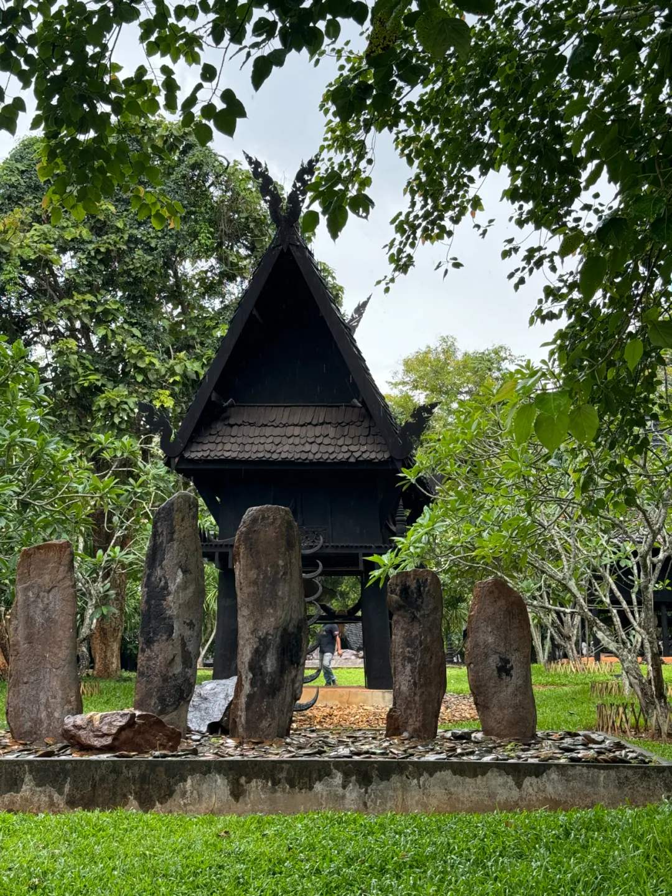

另外值得一提的是，在黑屋里有一个单独的地方大概是流浪猫的捐助站，我发现泰国还蛮多这种的，比如我在语言学院买咖啡的时候，也会有流浪猫狗的救助信息。

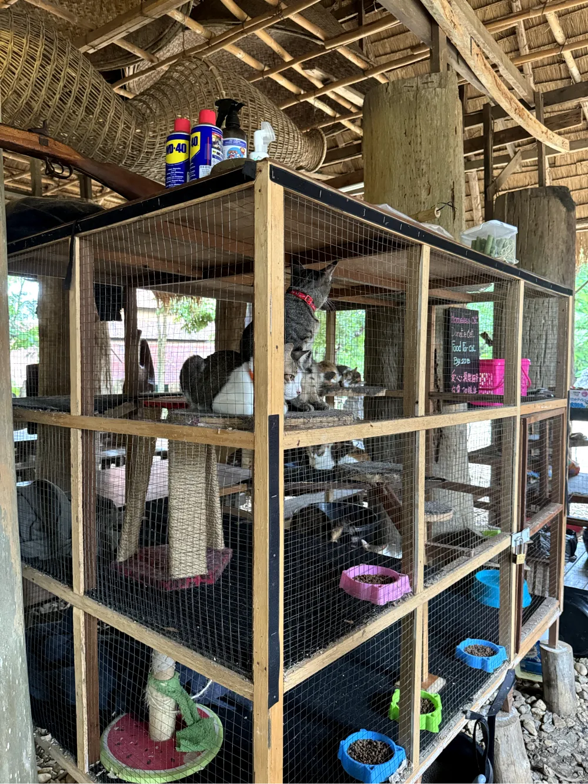