# Introduction
My curiosity about Da Nang, Vietnam, was sparked last year when a friend visited Suzhou and raved about the city. Later, I stumbled upon posts comparing Da Nang to Chiang Mai, which piqued my interest even further. Last month in Chiang Mai, locals told me that many people were moving to Da Nang due to the lower cost of living and the "burning season" in northern Thailand. Da Nang seemed like the next ideal haven for digital nomads.

Before heading to Argentina, I chatted with my best friends about our Lunar New Year plans. Without much hesitation, I suggested Da Nang. We compared a few other options, but nothing matched Da Nang—and given their lingering concerns about last year's incidents in Thailand, Da Nang became our final choice. And so, our journey into becoming "sitting ducks" began.

As someone who is always on the road, I had a momentary lapse in judgment—I completely forgot how overwhelming the crowds can be during the holidays and underestimated how insane the flight and hotel prices would become. I vow: never again will I travel during peak holiday seasons!

 

# ✈️ The First Trial: Flights and Accommodations
I flew to Da Nang from Chiang Mai, while my friends flew from Shanghai. We all thought we were being "smart" by waiting, but I grossly underestimated the collective power of holiday travelers and overestimated my own luck. As a "wait-and-see" traveler, the holiday flight prices gave me a humbling reality check.

Regarding our Airbnb: we ran into an extremely deceptive situation. I'm detailing it here in hopes that others can stay alert. Since one of my friends insisted on a villa and we booked our flights before finalizing accommodation, our options in Da Nang during Tết were limited. A week before our trip, seeing that most decent hotels were sold out, we settled on a homestay for about 6,000 RMB for six nights.

To our surprise, just as I landed and finished my visa process, I received a message from my friends saying the homestay had major issues—too many geckos and outdated facilities. I initially dismissed it as a standard Southeast Asian living experience, thinking my friends were overreacting. But when I arrived, they told me they had already negotiated a full refund with the landlord. As a long-time Airbnb user, I was stunned: a full refund during the peak holiday season? My friends told me they had offered to pay for the first night, but the host declined and promised a full refund. As it turns out, in a foreign land, when something seems too good to be true, there’s usually a scam behind it. Always keep evidence—we were indeed being played.

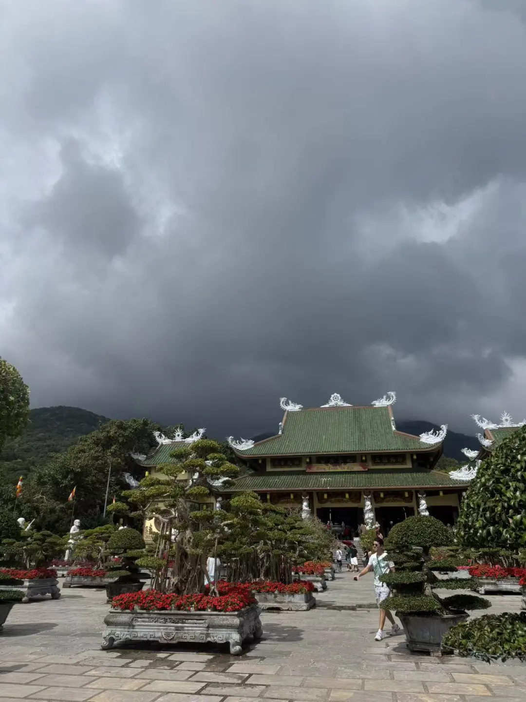
*Image: Son Tra Peninsula, near Linh Ung Pagoda*

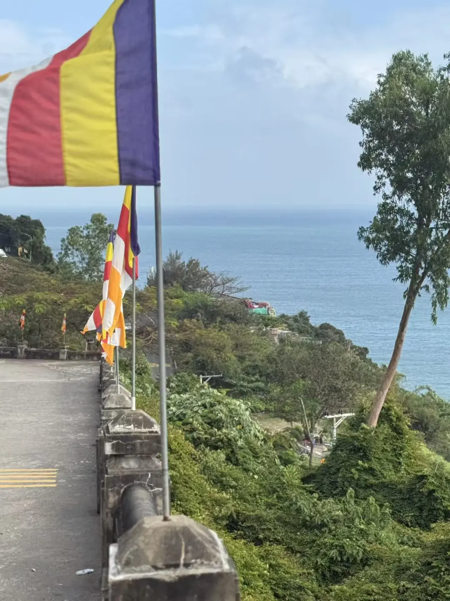
*Image: Son Tra Peninsula, near Linh Ung Pagoda*

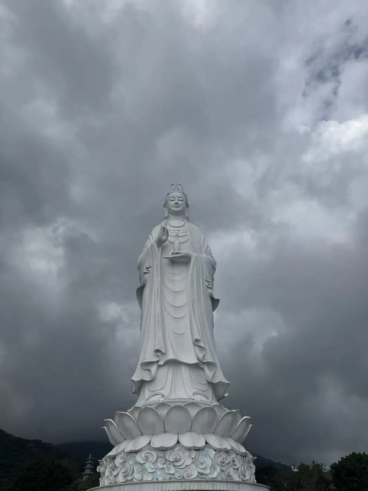
*Image: Son Tra Peninsula, Southeast Asia's tallest white Lady Buddha statue*

Let me break down the players: The real host (A) used his agent’s identity to register the Airbnb account. We were communicating with the host (A) on the platform, but he told us to add his agent (B) on WeChat, effectively moving the communication to a third-party platform. Host A never appeared, and Agent B claimed the host was away traveling with family for the New Year. Agent B only showed us the place in person, and because the host used his own photo on the profile, my friends thought Agent B was Host A. Later, dealing with the gecko issue, Agent B delegated to another guy (C), whom I met upon arrival. C had been a middleman coordinating between my friends and the host team. He told my friends that the host agreed to a full refund, and my friends even took a photo of the translated message. So when I arrived, I simply confirmed with them that the refund was guaranteed, and we rushed to book a hotel. The booking process was rushed due to lack of availability and our exhaustion from red-eye flights. Before leaving, I added C on WeChat, thinking he could help us with cheaper bookings next time.

There were several issues here:  
1. Language barriers leading to cognitive bias  
2. No recorded proof of C’s promise of a refund  
3. Host A's identity was hidden, and we were all out of sync—my friends thought B was the host, while I thought C was B’s agent. None of us were right. 😂

The next morning, the host informed us he wouldn't refund us, claiming geckos were normal and that he never made such a promise—it was just a "misunderstanding." We felt scammed. We reported it to Airbnb, but they replied that bugs and geckos are "normal" and they couldn't do anything if the host refused.

I reached out to C. His response confirmed my suspicions: Host A was not the person in the profile photo; he was simply manipulating the account using B’s identity. C confirmed that they had promised a full refund and even suggested that A’s behavior was dishonest and not the first time he had done this. He urged me to report the host's lack of integrity and safety issues to Airbnb.

At that time, we were in Hoi An, a famous international trading port known for its well-preserved architecture. During the New Year, the ancient town was glowing with lanterns and crowded with tourists. The Airbnb ordeal cast a shadow over my interest in Hoi An; the bustling crowd suddenly felt hollow.

The "smoking gun" proving platform fraud came when I saw the homestay re-listed by the host for the exact same dates we had already booked. The host's greed was his undoing. We went back to Airbnb support, highlighted the fraudulent activity, and eventually the host offered a Plan B—a partial refund for four nights. We refused, escalated the issue, and finally, the next day, we received a full refund. 

To be honest, I’ve used Airbnb countless times, but this was a first. Given my stereotypes and later experiences with some locals, this kind of behavior in Vietnam felt strangely "reasonable" in a warped way.

 

# 💰 The Second Trial: Being Fleeced
We were prepared for shops to be closed during Tết, but the extent of the closures was absolute. Only tourist-centric spots were open, and naturally prices were inflated. A bowl of beef pho near My Khe Beach cost 95k VND, while the same dish near Cho Con market was only 30k–50k. A lemon tea at Mixue, normally 15k, was marked up to 18k—a 20% increase.

I can understand "tourist pricing" and holiday surcharges, but this was excessive. Still, compared to domestic prices in China, 18k VND is only about 5 RMB. Let’s just treat it as a "digital red envelope" for the workers who couldn’t go home. Besides, Vietnamese law mandates triple pay for public holidays, so a 20% markup is actually relatively restrained.

But compared to Chiang Mai, Da Nang loses hands down. Chiang Mai’s commercial maturity, price transparency, and service attitude are far superior. Even as a leader in Vietnam's tourism industry, Da Nang’s tourism management often feels like short-sighted utilitarianism—a "grab the money and run" mentality that, under the extreme pressure of the New Year, devolves into blatant profiteering.

I usually avoid tourist traps, but I was traveling with two childhood friends who insisted on them. The experience was underwhelming, especially in Hoi An.

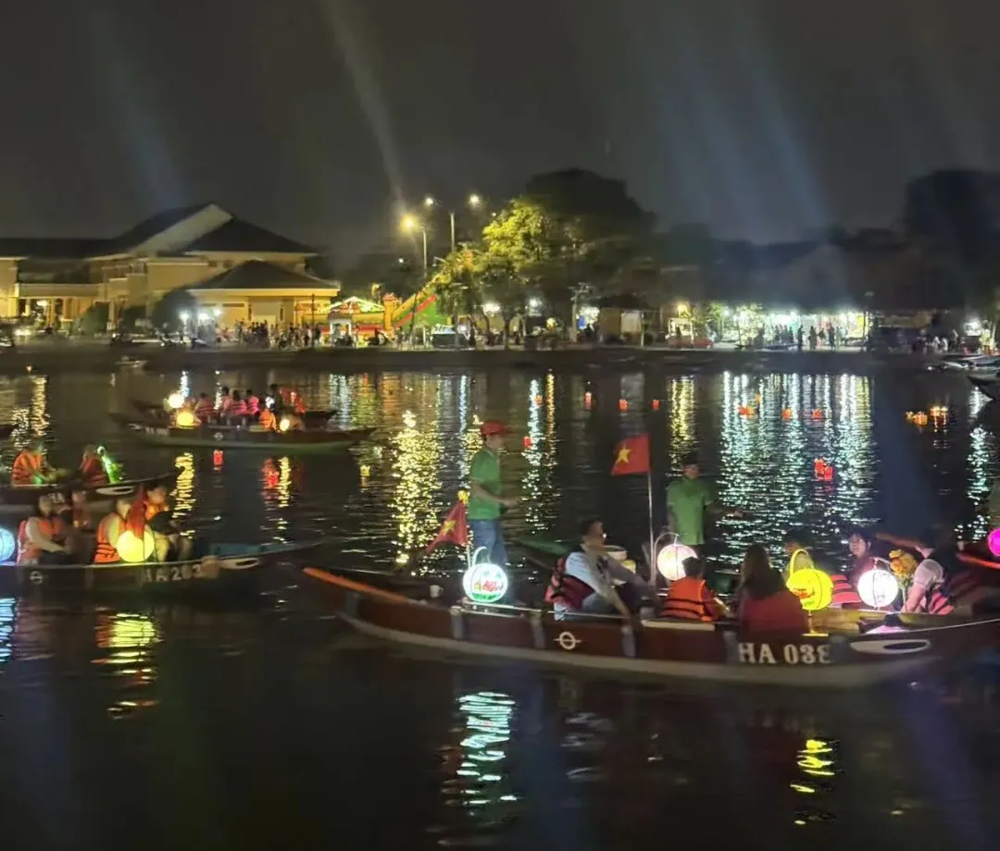
*Image: Hoi An Ancient Town, boat ride and floating lanterns*

Unlike Da Nang, where you can walk out of a tourist zone into a local neighborhood, Hoi An is essentially a "dead-end" scenic destination. During the holidays, supply and demand were completely out of balance. Many people working in Hoi An aren't locals; they are fortune-seekers from other regions. They have no emotional connection to the land—Tết for them isn’t a festival, it’s an annual harvest season. As a result, price gouging and greed become amplified here.

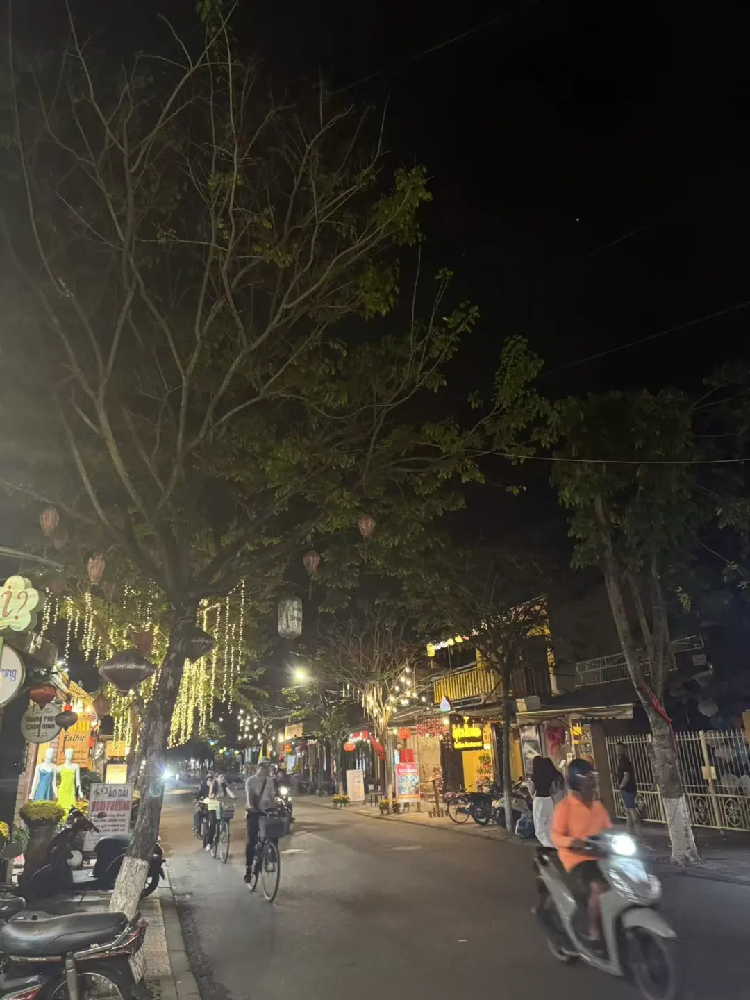
*Image: A street in Hoi An Ancient Town*

A small detail: tipping in Vietnam is not mandatory. For the basket boat ride, 20k–50k VND (approx. 6–15 RMB) is considered generous. We negotiated the price down to 200k VND for four people.

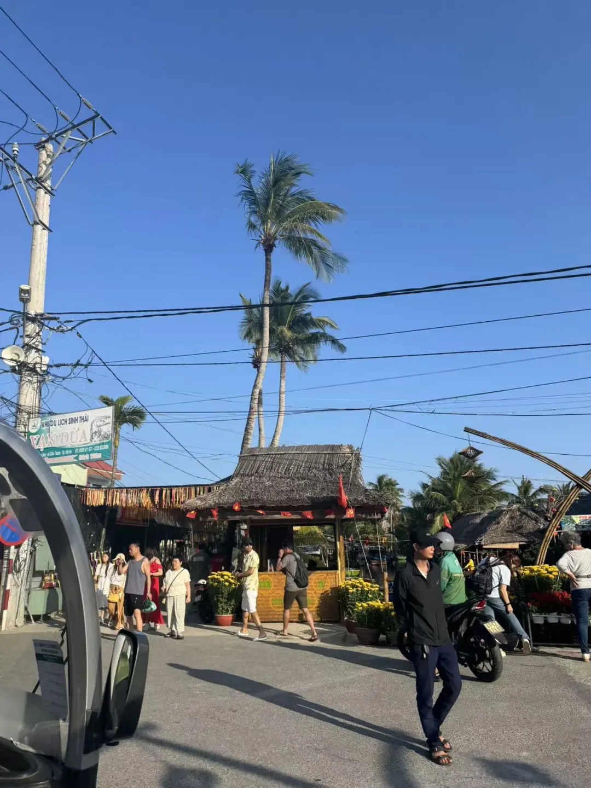
*Image: Basket boat entrance*

The ride includes various "tipping stations"—performances like boat spinning, photo opportunities, and singing.

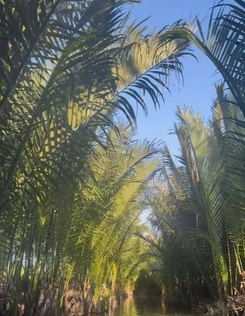
*Image: Coconut forest*

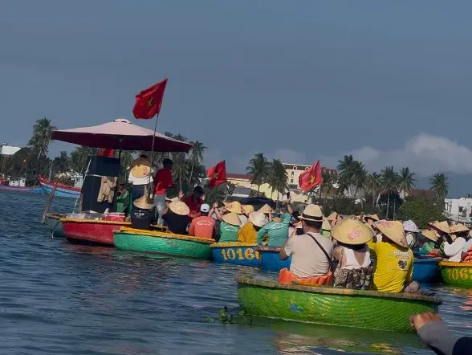
*Image: Floating karaoke station*

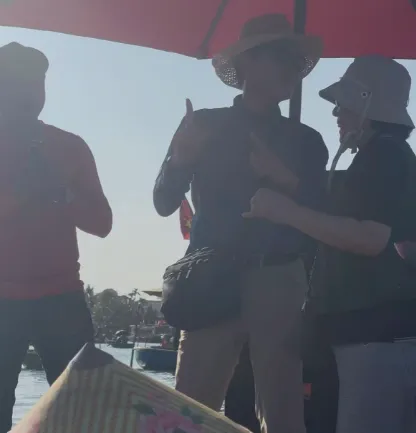
*Image: Floating karaoke station - Korean songs*

My friends were first-time travelers abroad. While I had researched appropriate tipping ranges with Gemini, our boatman began playing the victim—showing us the calluses on his hands and praising China in an attempt to guilt us into giving more money. My other friend’s boatman directly demanded a 100k VND tip. I was speechless.

In an immature tourism market, excessive kindness often breaks the rules, making things harder for the next traveler. It’s not that I’m unwilling to tip—but I hate this kind of moral coercion disguised as hardship. Asking for a 100k tip when the whole ride costs only 200k is simply absurd.

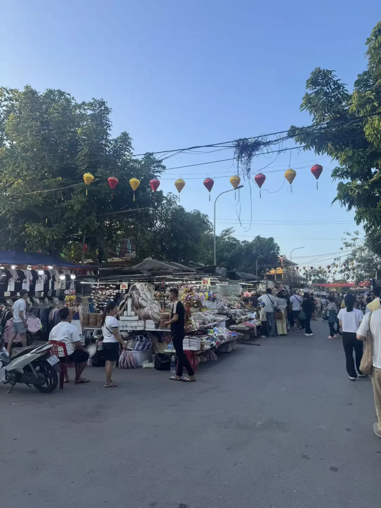
*Image: Commercial street in Hoi An targeting Korean tourists*

We intended to visit a trendy "paddy field cafe" found on social media, only to discover it was closed. Yet while taking taxis around, I glimpsed a much truer side of Hoi An: magnificent family tombs with Fujian-style aesthetics scattered throughout the vast rice fields.

To tourists, this "proximity of life and death" might feel eerie, but to locals it represents ancestral pride—something they fiercely protect, even while squeezing extra money from tourists during the holidays.

The boatmen begging for tips at every corner might be guarding such a tomb, built with a family's lifetime of savings. This strange mixture of extreme materialism (scamming) and extreme traditionalism (tomb building) formed the most absurd yet authentic undertone of Central Vietnam.

It reminded me of the graveyards in Arashiyama, Kyoto. The root is the same: the Confucian obsession with filial piety and final resting places. But while Arashiyama’s tombs exude Zen-like serenity, Hoi An’s tombs shimmer with the anxiety of the living.

 

# 🤢 The Third Trial: Food Poisoning
Luck is precious; misfortune, however, rarely travels alone. My "iron stomach" finally gave out in Da Nang.

On our last morning, after snorkeling, we headed to Cho Con market hoping for some good food. But the market was largely closed, with only a few street vendors still operating. The environment looked questionable, but we were hungry.

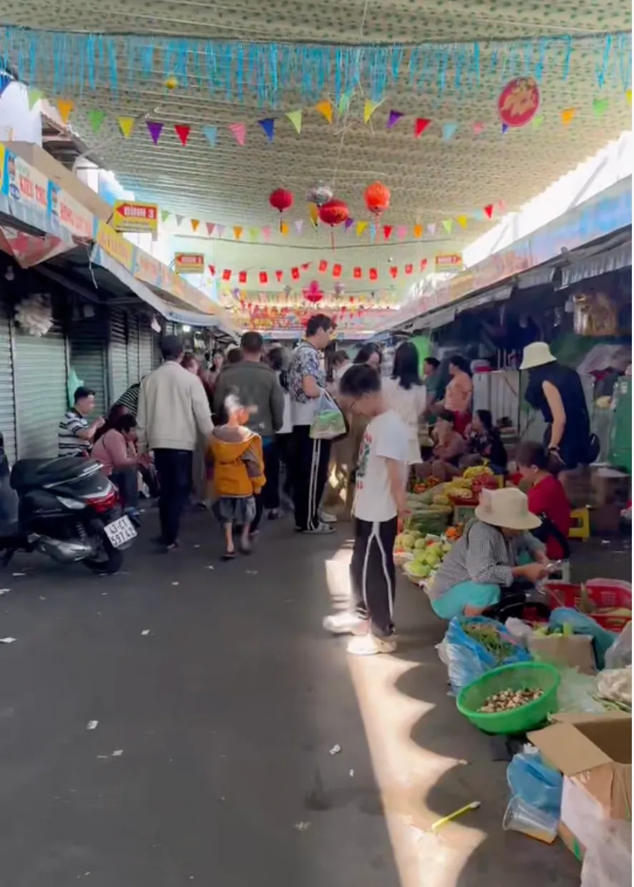
*Image: Cho Con market, Feb 20th, 1:00 PM*

The market felt a bit like Chiang Mai, only much less hygienic.

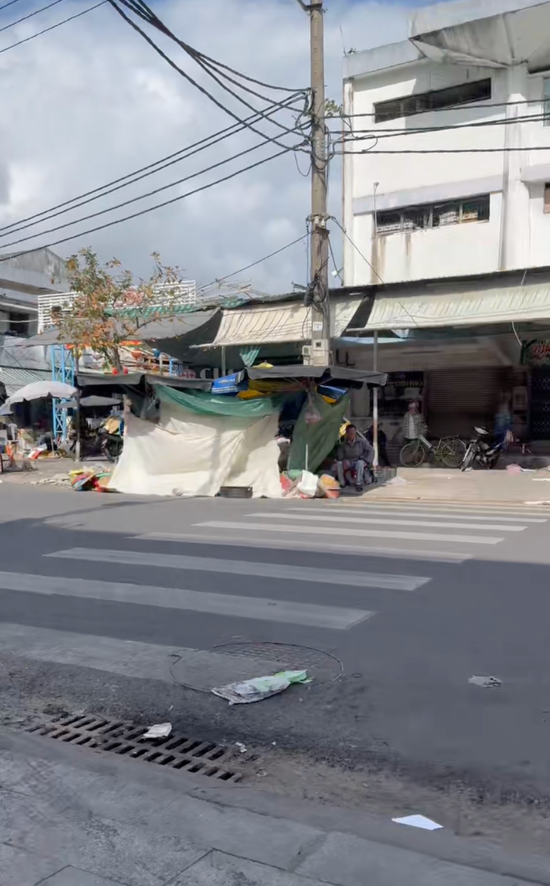
*Image: Familiar power lines and market, but cleanliness left much to be desired...*

We wanted one last bowl of pho. A grandmotherly vendor signaled 50k VND for a bowl, which I suspected was a tourist price. Sure enough, 300 meters away at a proper restaurant, a bowl with premium toppings cost exactly the same.

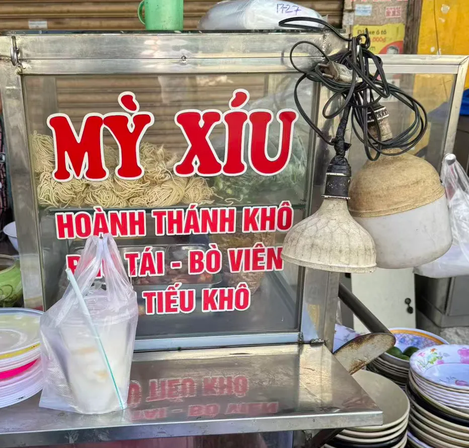
*Menu translation (top to bottom): Mỳ xíu (Char siu noodles, yellow alkaline noodles); HOÀNH THÁNH KHÔ (Dry wonton); PHỞ TÁI - BÒ VIÊN (Beef pho + beef balls); HỦ TIẾU KHÔ (Dry rice noodles).*

I thought it would be soup noodles, but the vendor served dry noodles instead. Later I noticed a group of Chinese tourists who were much more cautious, confirming every detail before ordering. We were simply too eager to pay—lesson learned. 🤣

The noodles were cold, which was strange. I mixed in the vegetables and lime, but the sauce was overly sweet and cloying. The fish balls were rubbery. Not great.

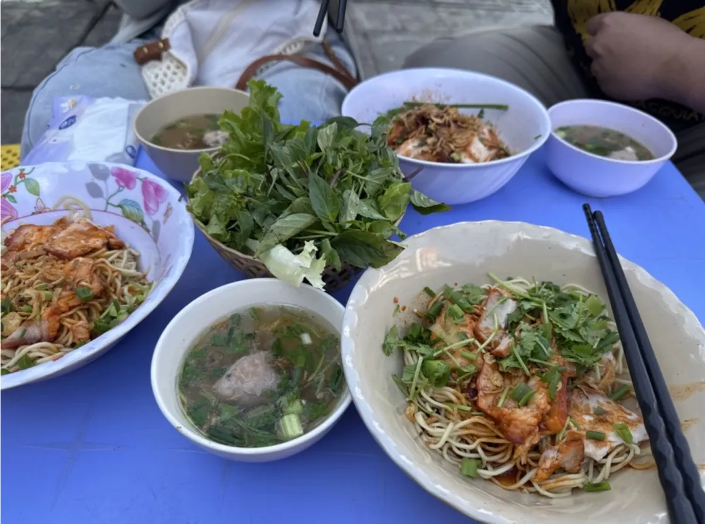
*Image: Dry char siu noodles*

Afterward, we passed a famous old-school fish cake noodle shop, *Bà Lữ*.

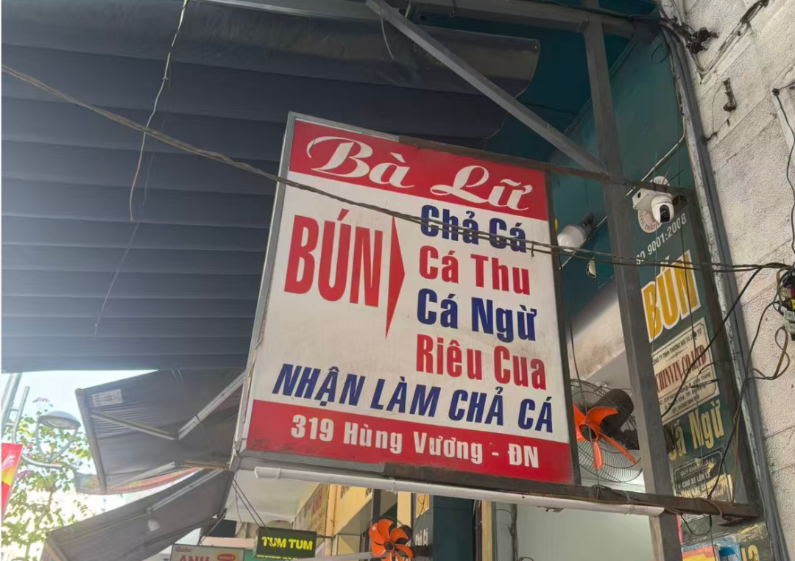
*Image: Famous fish cake noodle shop Bà Lữ*

It was packed with locals. We ordered two bowls of the "all-in" fish noodle soup. The shop had raised prices for the holiday, but reasonably. The auntie running the shop was lovely and even showed us how to eat it.

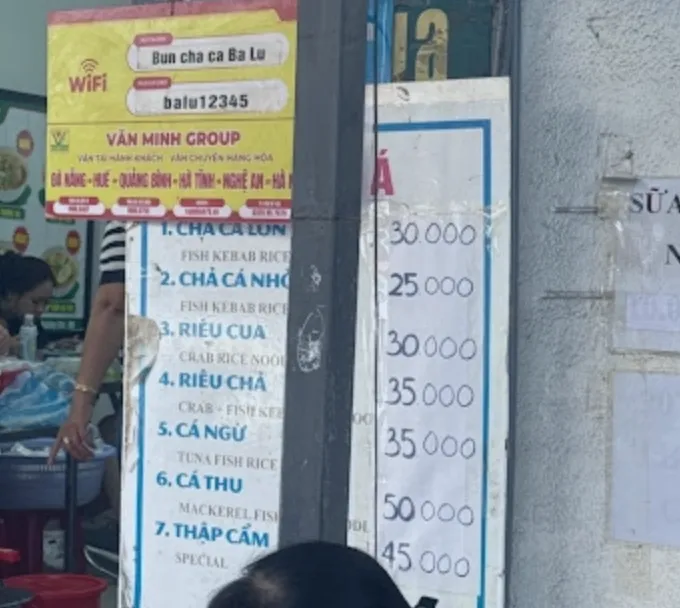
*Image: Fish noodle shop holiday pricing*

Halfway through the meal, I suddenly felt dizzy and nauseous.

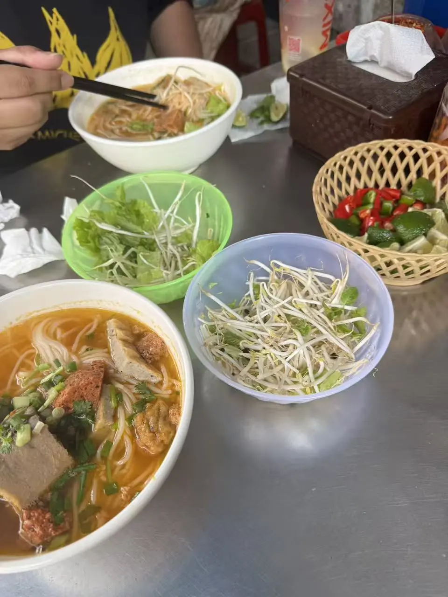
*Image: The "all-in" fish noodle soup*

When I ate the crab paste, the nausea hit hard. This wasn't like the fake fish balls in Chinese hotpot—this was dense, rich, and intensely seafood-heavy.

By the time we walked ten minutes toward a coffee shop, I couldn’t take it anymore. I grabbed a taxi back to the hotel and spent the rest of the day in the bathroom vomiting.

It was a miserable night. Luckily the vomiting stopped by morning, but I was still weak, sore, and fighting a cold. I couldn’t wait to get back to Chiang Mai and collapse in bed.

I never figured out exactly what caused the food poisoning—but take my advice: always carry travel medicine.

 

# ⌛️ The Fourth Trial: Endless Queues
In Da Nang, queuing is a mandatory subject.

It started with immigration.

I opted for a visa on arrival. Here are some tips: Vietnam uses loose-leaf visas for Chinese passports due to territorial disputes. You can apply for a visa on arrival (VOA) through a travel agency or online to obtain an approval letter. It’s best to print it in color. You'll also need two 2-inch photos and cash for the visa fee at the airport.

The immigration queue took an hour.

The departure queue was even worse—about two hours.

Da Nang airport is small, similar to Chiang Mai’s airport. If you don’t have checked baggage, do online check-in. I assumed there would be self-service kiosks to print boarding passes, but there weren’t. I had to queue at the counter anyway and then wait in another long security line.

I arrived at 8:10 AM and didn’t reach the gate until two hours later. 💧

# 🌱 Activities
## 1. Confucian Anxiety at Son Tra Peninsula
Because I was sick, I spent half my time resting at the hotel. We visited Son Tra Peninsula and Linh Ung Pagoda. We walked two kilometers to a small temple before taking a taxi to the summit.

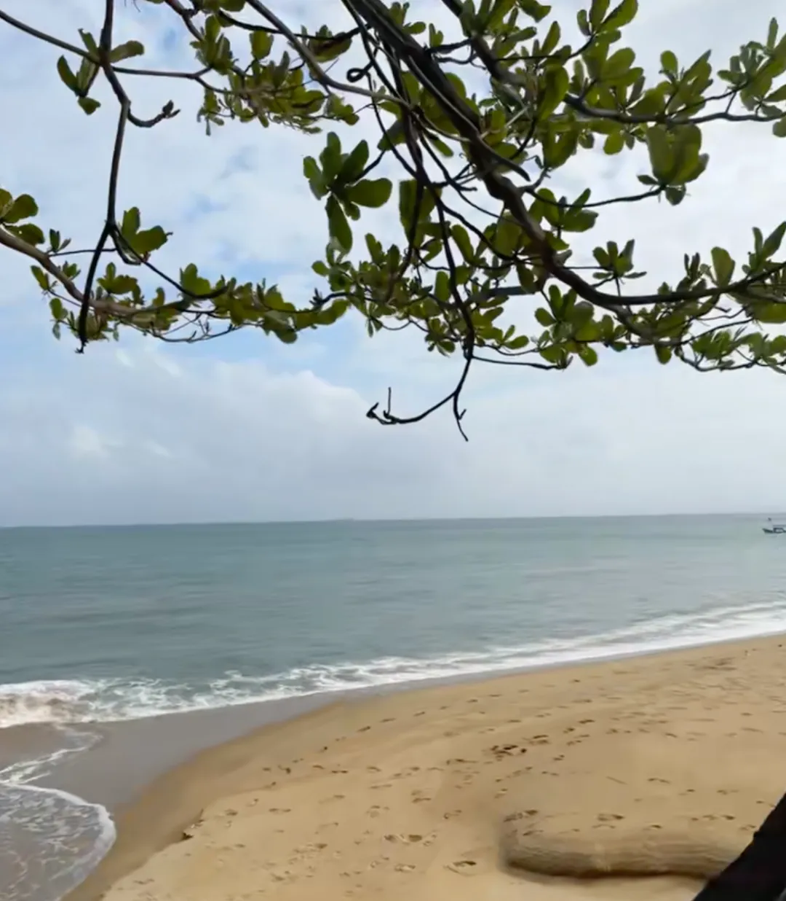
*Image: Sea view in front of a small temple*

Son Tra is beautiful. Unlike Hoi An, which is packed with foreign tourists, Son Tra felt more local.

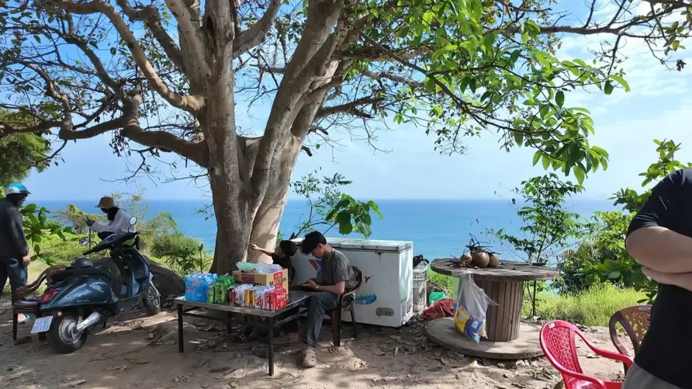
*Image: Small stall on the mountain, 35k VND for a coconut*

I noticed many temples here. Although both Da Nang and Chiang Mai are filled with temples, they represent completely different branches of Buddhism.

First, there is the difference between Mahayana (East Asian) Buddhism and Theravada Buddhism. Vietnam is the only Mahayana-majority country in Southeast Asia. The small temples I saw share cultural roots with those in Fujian and Guangdong. They emphasize transcendence and clan identity. They feel inward-looking, almost like ancestral halls, which is why they are small and solemn.

Thailand, on the other hand, is a typical Theravada Buddhist country. Temples in Chiang Mai are luxuriously gilded—a reflection of the tradition of "making merit." They function as social centers for the community, almost like a shared living room. In contrast, Da Nang’s temples feel more like studies or ancestral halls.

Finally, Chiang Mai’s secularization feels joyful—religion is integrated with daily life, consumption, and social interaction. Da Nang’s secularization feels anxious—steeped in pragmatism and a desire for protection. It feels very Confucian, very Chinese.

In short:  
In Chiang Mai, temples are golden, lively community living rooms.  
In Da Nang, they are quiet brick structures—the back study that shelters ancestral souls.

One blossoms into a grand bazaar; the other retreats into a heavy clan imprint.

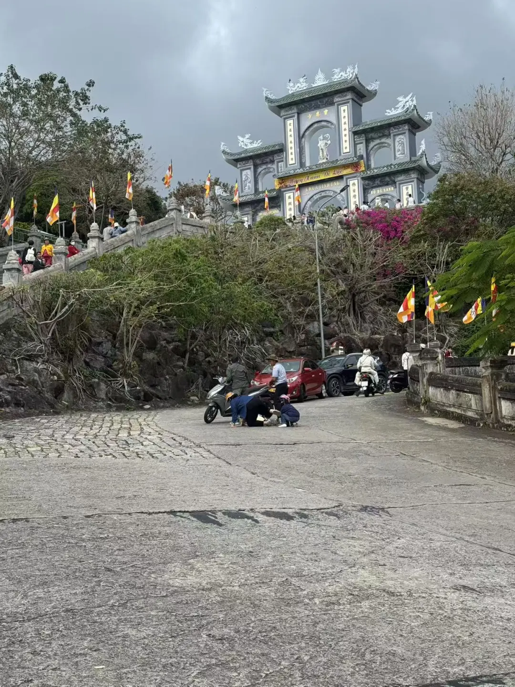
*Image: A scooter accident on the way down*

## 2. Snorkeling Tragedy: A Dark Comedy of "Rowing the Boat"
The snorkeling was disappointing. Compared to the Maldives, it was almost nonexistent.

Our paddle board flipped before we even started because my friend's husband was too heavy and inexperienced. Two sets of snorkeling gear sank into the four-meter-deep water.

The boatman just laughed at us. 🤷

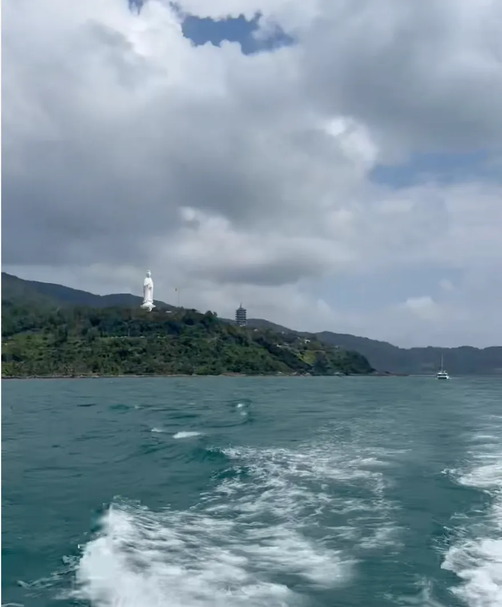
*Image: View from the return boat*

## 3. Grab Driver’s "Commission Map"
One piece of advice: don’t blindly trust Grab drivers.

I used to think local drivers were the best food critics, but Da Nang completely updated my mental model.

Local restaurants and Grab drivers operate within a commission-based ecosystem. Every restaurant recommendation likely involves a cut for the driver.

When we were dropped off at the jetty for snorkeling, the driver immediately made a phone call—almost certainly confirming whether we were his "commission customers."

Even when drivers ask you to cancel platform orders and pay privately, it’s often part of their survival strategy. It’s difficult to judge.

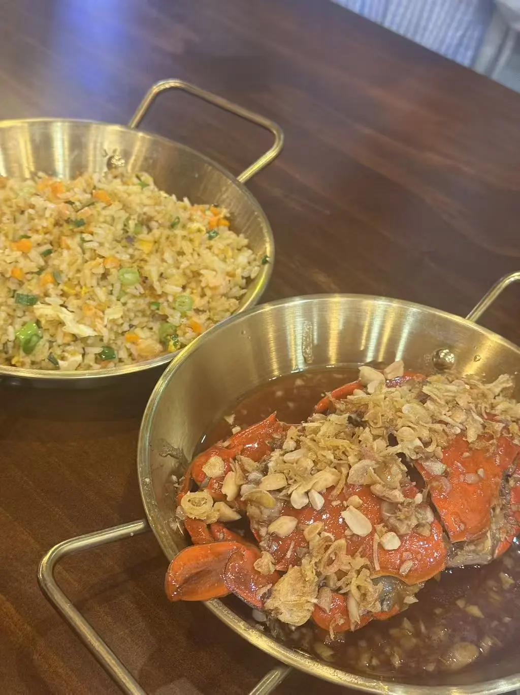
*Image: Tamarind-flavored blue crab, very sweet. Don't recall the price, maybe 135k/kg.*

 

# 💬 Afterword
When I finally lay down in Chiang Mai, I felt saved.

Da Nang is great—but perhaps not during Chinese New Year. The city feels like a teenager: full of energy, but also restless and aggressively utilitarian.

If you ask when I’ll go again?

My answer: avoid all public holidays, or bring a much stronger stomach.

On the flight from Da Nang to Bangkok, I sat next to a German mother and daughter. The daughter shared her candies with me.

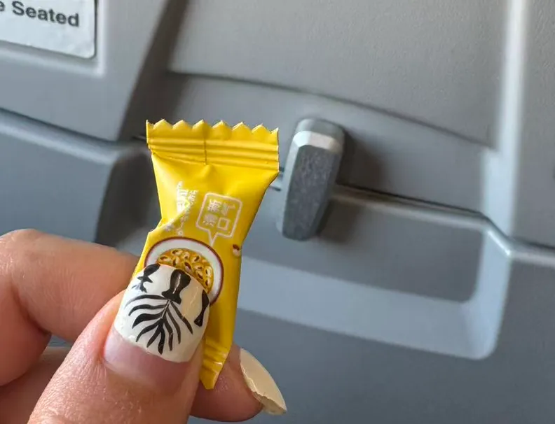
*Image: Candy shared by the German girl on the plane*

We chatted about our travels.

When you meet people from different countries in a foreign land and realize you’ve both visited the same places, sharing stories and impressions—it’s a beautiful moment.

Feeling exhausted from illness and the constant rushing around, I had begun to feel tired of traveling.

Yet as we landed, the daughter and her mother said to me:

"Never, never stop travelling!"