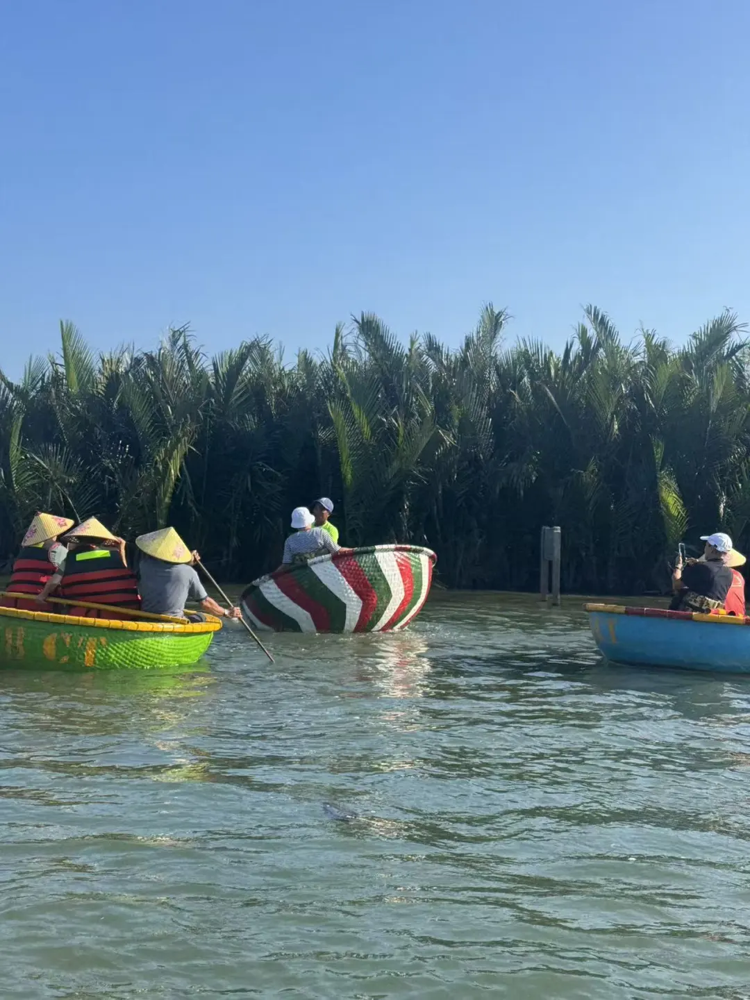

# 引言
对于越南岘港，实则好奇已久，萌芽于去年友人来苏访问，向我安利之时提及岘港。后我偶然刷贴，有人称岘港与清迈相似，更引发我的好奇之心。上个月在清迈，有人告诉我，由于越南更低的物价还有清迈的烧山季，很多人现在准备从清迈迁到岘港。岘港俨然是另一个数字游民理想之地。

出发阿根廷前与闺蜜闲聊，筹划过年计划，不假思索我便提出不如考虑岘港作为我们的春节磨时间之处。后来又对比了几处，都不如岘港，且他们仍旧碍于去年的事件不敢前往泰国。遂，我们最终选择岘港作为春节过年之处。于是，这条成为猪仔的道路也就开启了。

作为一个一直在路上的人，脑子进水忘记了假期国人的战斗力有多可怕，更小觑了假期的机酒有多癫狂。我再！也！不！要！节！假！日！出！去！旅！游！

 

# ✈️春节岘港第一劫——机酒
我从清迈飞岘港，我的朋友们从上海飞岘港，而我们都是等等党。我低估了国人的战斗力，也高估了自己的运气。作为「等等党」，我最终在春节的机票价格面前被教做人了。

关于 Airbnb 住宿，这里遇到了一个非常、极度、特别坑的事情，在此详细陈述，希望遇到类似的事情的朋友可以警惕。由于我某个朋友特别想要住别墅，外加上我们是先定了机票后再选住宿，而岘港过年期间住宿的选项已经不多。我们在出发前一周看到之前心仪的，不错的酒店大多售罄，遂决定选了一个六晚六千人民币出头的民宿。

谁曾想，我刚落地办理签证就收到了朋友的消息，说民宿有比较大的问题——壁虎太多，且房间设施较为陈简。但我当时心想这其实是东南亚普遍存在的问题，我的朋友们也太胆小且麻烦了吧，就这点小问题。等我到达民宿，他们告诉我已经和房东沟通好，房东答应全额退款。由于我是多年爱彼迎用户，我还纳闷这房东这么好，在春节期间竟一晚房钱也不收，甚至全额退款？因为我的朋友们事后告诉我当时他们提出付当晚的房费，但房东并未收取，给的回复是说全额退款。事实证明，并非偏见和歧视，在异国他乡，事出反常必有妖，一定要留下证据，我们后来果然被坑了！

*图记：山茶半岛，灵应寺附近*

*图记：山茶半岛，灵应寺附近*

*图记：山茶半岛，东南亚最高的白色观音坐像*

先梳理下人物关系与事情经过：真正的房东（A）使用了他代理人的身份注册的爱彼迎账号，与我们在爱彼迎上沟通的是房东本人。但是房东让我们添加他的代理人（B）的微信联系，相当于是把我们从爱彼迎平台引到了第三方平台进行沟通。与此同时，房东本人始终没有出现，出现的是房东的代理人，其声称房东在春节期间携家带口旅游。并且当时这个房东的代理人也只在线下带我朋友们看了个房，但因为房东使用的账户是用他的头像，所以我的朋友们一直以为这个代理人（B）就是房东本人（A）。后续处理壁虎事宜是他委托另一个小哥（C），也就是我到达时候见到的人。C 在我到达前已经作为中间人帮我朋友们联系了房东团队，但具体他联系的是 B 还是 A 不可知，但他给的回复是说房东愿意全额退款，我朋友有将翻译拍照留存。因此我到达后只是向他们确认房东是否真的愿意全额退款，我朋友表示没问题后我们着手定酒店。酒店预订过程其实也比较仓促，因为当时房源紧张，外加我朋友们坐了红眼航班，早已劳累不堪，预定完后我们就火速打车赶往酒店办理入住。因为 C 说下次如果来岘港，可以帮我们订价格更优惠的酒店，所以临走前我加了他的联系方式。

以上过程中有几个问题：1. 语言不通，存在认知偏差； 2. C 帮我们联系房东获得全额退款承诺的时候并没有录音留存； 3. 房东 A 的身份隐匿，外加我们信息不同步——我的朋友们以为 B 是真正的房东，我以为 C 是 B 的代理人，结果都不是😂

到达岘港的第二天上午，我们收到了房东拒绝退款的提示，理由是：东南亚遇到壁虎非常正常，且房东并未作出过全额退款的承诺，完全是我们的误会，意思他们当时仅是让我们在爱彼迎群里联系房东，而不是答应全额退款。我们觉得这像是一场骗局，但不敢完全确定。我们立即向爱彼迎平台发起投诉，傍晚我们收到了平台无能为力的回复，意思是昆虫、壁虎很正常，房东不答应退款的话平台也没办法。

因为我加了 C 的联系方式，于是我便问他那天房东的回答究竟如何。他的回答完全证实了我的猜测，也就是他告诉我房东 A 其实并不是爱彼迎账号头像上的人，而是利用 B 的信息在爱彼迎平台上操控账号与我们沟通的人，C 分明收到了他们会全额退款的承诺，并指出房东的行为极为不诚信，存在信用问题，让我强调安全和房东的不诚信问题报给爱彼迎平台。并且，从 C 的话语来看 A 这样的操作不是第一次。

彼时人在会安古镇，这是越南北部知名的的国际贸易港，因其建筑和文化保存完好受到历史学家重视。过年期间，会安古镇张灯结彩，遍地是来此的游客，后面我也会讲讲我对会安的印象。爱彼迎的事情，让我本来对会安古镇的一点点兴趣因为这件事也蒙上了一层阴翳，觉得眼前的热闹繁杂索然无味。

二次挂出房源是欺诈平台的铁证。爱彼迎退款出现转机是在后一天晚上临睡前，我发现我们原来订的民宿被房东重新上新了。甚至，照理来说 2.15-2.21 的时间是被我们预定，应该这个期间都是被锁定的，但现在仅有 2.15-2.20 被锁定，21 号确是独独空出来的。还得感谢这个房东的贪心，事情很明显了，房东就是故意的——先是答应我们会全额退款让我们另寻他处，等我们离开后又变卦想要吞下我们六晚的房费。我们找爱彼迎中介协调后先是拒绝全额退款，后又抛出 Plan B，答应退还我们四晚房费。与此同时，他再次挂出房源，在岘港现在旅游高峰时期，他可以收取两方租金。要是遇到个懒得掰扯的人，这钱他真是轻松赚了。当晚爱彼迎人工客服正好回电给我们，我们向其表达了房东的违规操作和欺骗行为。第二天，我们收到了退款。

说实话，这不是我第一次通过爱彼迎预订民宿，甚至已经太多次了，但的确是我第一次遇到这样的事情。而这个事情发生在越南，根据我的刻板偏见和我后来与当地一些人的接触感受，这确实是一定程度上合理的。

 

# 💰春节岘港第二劫——只能被宰
虽然去岘港前已经有了一定准备，越南人也过春节，过年期间很多店会关门，但没想到到了后发现他们关的真彻底。越南人没有深受儒家影响文化影响我是绝对不信的，他们过年就放九天呢，而且那个春节关门程度和国内没什么两样。确实只有针对游客的地方开门，想吃饭？那就不可避免会加价。根据我吃了几顿对比下来，我在美溪沙滩附近的粉店吃一碗牛肉粉是 95k 越南盾，而在靠近沙洲市场的店吃价格是 30k ~50k。我记得我们在雪王点了一杯柠檬茶，原价 15k，春节期间是 18k，直接涨 20\%。

我可以理解游客区是另一个价格，也可以理解春节期间的涨价，但是这个程度未免太离谱了。当然，如果只是和国内对比， 18k 越南盾的柠檬茶换算成人民币也就 5 块多，95k 的粉大约 27 块。虽然涨幅离谱，但绝对值还在接受范围内。就当是给那些大过年不回家的越南打工人发个「赛博红包」了。并且了解后得知，越南法律规定，法定节假日加班工资通常是平日的 300\%。像雪王这种连锁店，涨价 20\% 甚至算「良心」。

但是如果和清迈对比，那么从我的角度来说，清迈无疑是完胜的——清迈的商业化成熟度，价格的透明度和服务业的态度，实在是超出太多了。管中窥豹，岘港已经是越南城市里「素质和管理」的佼佼者了，但即便如此，岘港的旅游业更多像是过度开发下的功利主义，「赚一把就跑」的小农意识，在春节这种极端环境下演变成我看到的「吃相难看」，难以想象其他地方的离谱程度。

以往我旅游一般都不会去游客区，基本上都是扎进本地人遍地的地方。但是这次和我两个发小出行，游客打卡的地方她们是必去的。我们筛选了几个游客必去的打卡地，叠加了春节 buff 后，体验确实不咋地，给我留下较差印象的是会安古镇。

*图记：会安古镇，游船+放花灯*

和岘港不同，如果说岘港以汉江为界分为游客区和本地居民区，你走两步还能步行到居民句，那么会安就完全是为游客打造的地方，它是一个「没有退路」的纯景区，春节期间，这里的供需关系彻底失衡。会安的很多从业者并非本地原住民，而是外地来「淘金」的。他们对这片土地没有情感联结，春节对他们来说不是过节，而是「一年一度的收割季」。所以，价格爆炸、吃相难看在这里被无限放大了。

*图记：会安古镇某街道*

有一个细节，在越南，小费并非强制。对于椰子船（Basket Boat），通常给 2万 - 5万 越南盾（约 6-15 元人民币）已经是非常体面的认可了。一般在路口就会有人来询问是否要坐椰子船，我们当时讲价讲到 20 万越南盾四个人。

*图记：椰子船项目入口*

椰子船划行一段会有不同的给小费点，比如摇船、拍照、唱歌等等。

*图记：椰林*

*图记：水上点歌站*

*图记：水上点歌站-韩国歌*

我们四个人两人一个船，我与一个发小，另一个发小和她老公。我在坐船的时候就已经问好了 Gemini 老师大概的小费价格，我准备自己给钱，虽然和我同船的发小觉得没必要。但我因为坐船过程里确实觉得他们干这个活比较辛苦，我觉得给一点也没什么。

*图记：椰子船，中间船夫在摇船表演*

而我另一个发小和她老公都是第一次出国，他们没啥经验，他们船的那个船夫中间就有卖惨示意。给我们看他手上的老茧，大致意思就是说干这个活特别辛苦，并且一直在夸赞中国，说中国的好话，他真的就差直接说给我钱了。我原计划是一共给个五万越南盾，但是我一开始拿错成了 5000，我朋友他们那个船的船夫说太少了。我还没反应过来，我朋友他们就问多少，那个船夫说十万，他们就给钱了，我真的是没话说。在不成熟的旅游市场，过度宽容的善意往往会变成破坏市场规则的推手，让下一个游客的处境更难。并不是说不愿意给，而是我很讨厌这种卖惨式的道德绑架。而且我们四个人椰子船体验总共就二十万，你小费直接张嘴要十万，傻子也觉得对比这个物价是有点离谱。更甚者，我另一个发小和我说当时那个船夫也要让我发小给他拍张拍立得，客观评价来说，我发小他们那个船夫给我们留下的印象就是老油条式的。

*图记：会安古镇针对游客的商业街*

原本奔着小某书上的网红稻田咖啡去，结果被春节的闭门羹直接怼到了乡间的街角。但在打车穿梭的过程中，我反而看到了会安更真实的一面：大片的稻田中间，散落着极具闽南色彩的华丽家族陵墓。这种「生死同邻」的景观，在游客眼里可能是略显诡异的视觉冲击，但对当地人来说，这或许就是他们即便春节期间要狠宰游客、也要守住的那份「宗族底气」。

那些在路口疯狂拉客、卖惨要小费的船夫，背后可能就守着这样一座耗尽家财修筑的祖坟。这种极致的物欲（宰客）与极致的传统（修坟），在这一刻汇聚成了越南中部最荒诞也最真实的底色。这种家族陵墓群也让我想起在京都岚山经过的那块墓地，我不禁思考他们的根源是什么呢？大抵上就是儒家文明的「孝」与「归宿」——无论是在京都岚山，还是在越南会安，其核心根源都是儒家文化对宗族和祭祀的执着。但不同的是，岚山的墓地透着禅意的静谧，而会安的陵墓却在艳丽中透着生者的焦虑。

 

# 🤢春节岘港第三劫——食物中毒
幸运总是难能可贵，而倒霉总是接踵而至。没错，我这个铁胃在岘港吃出了毛病。最后一天上午结束了浮潜，我与朋友打车到康恩/沙洲市场（Cho Con）附近，想碰碰运气。但事实上整个市场内都没有几家店开门，只有一些摆摊的小贩。我们本是去觅食的，但是看着市场的环境比较恶劣，没敢吃。

*图记：2.20 下午一点左右的沙洲市场*
沙洲市场出来，这里真的和清迈好像，只是卫生环境情况清迈真的要好很多。

*图记：熟悉的电线杆子和市场，但是清洁方面....*
我们一心想在离开岘港前多吃几次 Pho，出市场看到对面有个老奶奶摆摊正在卖粉面一类的东西，我朋友上前要了三碗。因为语言不通，这个老奶奶直接拿了一张纸币出来，示意是 5 万越南盾，但我严重怀疑这个老人家她是看我们是游客报了个更高一点的数字。因为我们后来吃完这个面，步行 300 米到了另一家有店面的粉店，顶配的粉也就是 5 万越南盾，甚至给料更大气。

*菜单翻译由上至下分别是：Mỳ xíu（叉烧面），通常是黄色的碱面；HOÀNH THÁNH KHÔ：干拌云吞；PHỞ TÁI - BÒ VIÊN: 生牛肉河粉 + 牛肉丸；HỦ TIẾU KHÔ: 干拌粿条（这种通常会配一小碗清汤，口感很有韧性）*

根据菜单翻译，我以为是有汤粉的，但实际这个老奶奶并没有问询我额外的诉求，默认就给我们仨上了一样的干拌面。形成鲜明对比的是，后来有一大群国人来吃，没先给钱而是把所有的东西都问清楚了，指明要汤面才点的单付得钱，对比起来我和我朋友们实在是太爽快给钱了，又学习到了🤣。

我一开始是有点不想吃的，因为我个人不喜欢吃面，但是问了 AI 后告诉我 Mỳ xíu (叉烧面)，这种路边小摊做干拌面通常很有特色，我决定一试。这个吃法是把生菜和罗勒（九层塔）用手撕成小块，然后把它们埋进干拌面搅拌。AI 和我说面应该是热气腾腾的这样可以激发香料的味道，但事实上我吃得这个面是凉的，唯有一碗热汤。搅拌的时候可以再挤一些青柠或者是辣椒酱，吃几口干面，喝一口热汤，这样不会觉得干。

说实话比较一般😂。第一个就是面是凉的，我那碗酱比较多，酱偏甜口，因此吃到后面感到发腻。而汤的话还可以，但是那个肉丸一点也不弹牙，口感不佳。

*图记：干拌叉烧面*

吃完后我们继续步行，没走多久到了一家法棍店，我个人对面包类的食物也不种爱。我朋友买法棍的间隙，我发现旁边一家粉店有很多人在吃，于是我忍不住问了问 AI，没想到这家店竟然是岘港非常有名的老字号——Bà Lữ（吕奶奶）鱼饼粉店。

*老字号鱼饼粉店 Bà Lữ*

这家店主要卖的是各种越南中部风味的面粉类，是当地人和游客都很推崇的地道早餐/宵夜点。于是我们在隔壁买了法棍，又在这家点了两碗全家福鱼粉。

*图记：鱼粉店过年价格，每样基本涨幅在 5000 VND*

这家店春节期间也涨价了，但是和原来的菜单对比起来涨价幅度比较合理，而且店里阿姨的服务态度很好，会主动用动作示意我们该如何吃。我和我朋友分食一碗，这个全家福鱼粉里面有很大块的鱼籽、鱼饼和蟹肉糜。我在吃完鱼籽以后其实就觉得比较撑了，因为这家店给料确实很扎实。吃到一半，或许是我本来就感染风寒免疫力，抑或是上午的出海浮潜消耗了我太多的体力，或者是我的隐形眼镜在眼睛里难以存寄，吃到一半我觉得眼前似有晃动。

*图记：全家福鱼粉*

再之后，我实在是觉得很撑，但还是想把每一个部分都试试。但我吃了蟹肉糜的部分后，反胃感直扑而来。需要强调下，这个鱼粉和国内吃的鱼粉不太一样，以前吃的很多鱼粉都是火锅里的面粉丸子，真正的鱼肉、虾肉、蟹肉这类的比例屈指而数，而我吃的这家的粉，是真的口味比较重的，鱼腥味比较浓。对于大病初愈或体力透支的肠胃来说，可能是一场「虚不受补」的灾难。

本来吃完后我们计划从鱼粉店步行到那家 Tan 咖啡，算是消食，如果中间有路过觉得不错的店也可以再改变计划。谁想到走了十来分钟我的反胃感愈发严重了，已经很久很久没有过这样强烈的反胃的感觉了，后来实在受不了了也不好吐在路边，打了个车硬生生回到了酒店，刚到酒店我就跑进一楼卫生间大吐特吐。

嗯……然后睡了一觉起来又吐，晚上喝水喝多了继续吐，好在第二天早上起来我止吐了，不然再一天的返程待机、转机真的会要我命。事实上第二天醒来和没命也没差，前一天的出船项目耗尽了我的体力，返程那天浑身腰酸背痛+感冒流鼻涕+一丢丢恶心感，真是让我迫不及待想要快点回到清迈，赶紧躺下。

其实最后我也没搞明白到底是什么原因诱发我的食物中毒症状，但在此提醒大家旅游在外做好措施，比如带一些药品以防万一。

 

# ⌛️春节岘港第四劫——无尽长队
从落地岘港的开始，就注定了排队是一门必修课，首先是入境。

事实上我走的是落地签，当时线下办理另纸签很快。这里讲讲办理越南签证的一些注意事项吧。越南只对中国采用另纸签，越南另纸签是一种不直接贴在护照上，而是签发在独立粉红色 A4 纸上的签证，通常因新版中国护照（E开头）的地图纠纷而采用此形式。在中国境内的大陆居民办理越南签证有几个方式：

第一，直接在国内找中介办理另纸签，另纸签价格分单次和多次，单次 25 美元，多次 50 美元，此外中介或者旅行社会收取一些代办费用。我朋友他们当时找的价格是 218 元一个人，顺丰快递到付。直接办理另纸签的好处是不需要再线下换成另纸签了，省去一些麻烦。

其次，可以办理电子签，电子签也适用于人不在大陆境内的人。办理电子签的话其实没必要找中介，自己到网站上去填写信息就行了。但是越南的这个电子签最短的批理时效是工作日三天，也就是说周末是不算的。我这个重度拖延症患者想到要去弄签证的时候已经是周四晚上，而我周日就要飞，所以电子签不保险，我选了落地签。

没错，第三种方式就是落地签，也就是批文入境越南。这个批文需要通过旅行社或者中介申请，时间越紧迫价格会越高，我当时还剩下两天的时间，批文费用（中介费）价格是 108元。需要注意的是落地批文只能走空路，而且不是所有越南的入境口都可以用，支持的机场是河内(HAN)、胡志明(SGN)、岘港(DAD)、芽庄(CXR)、富国岛(PQC)。批文最好是彩印，因为有人反应有时候会卡。到了机场后要在专门的批文柜台填表，再支付单次或多次签证的费用，另纸签签证价格是一致的。记得还要携带两张白底二寸照片，付钱的时候一起给。

当时入境排了要有一个小时。出境更是夸张，约莫两个小时。岘港机场其实挺小，估计和清迈机场差不多，但是有时候运气不好排到的队伍就会比较慢。关于航班值机，如果没有行李要托运的话可以线上提前两小时值机，我以为线下会有自助机器可以直接打印登机牌，但事实上是没有。所以忘记线上值机的我只能跟着去值机柜台排队，之后又去出境安检队伍大排长龙。一顿操作下来，早上八点十分到机场，两个小时后才到达登机口，再晚一点抵达就来不及了💧。

# 🌱玩乐项目
## 一、在山茶半岛看见「儒家式的焦虑」

因为此行我生病了，在岘港的一半时间我几乎都在酒店。除了会安古镇一日游，打车去了山茶半岛，逛了逛灵应寺，我们走了两公里，下到了一个小庙，之后又打车到几乎山顶的地方。

*图记：小庙前的海景*

山茶半岛还不错，因为在岛上可以远眺远处的海景。如果找一个午后，就在山上搬个凳子发呆，也是很舒适的体验。比起会安古镇遍地是外国游客，我们在山茶半岛明显感受到本地人的数量增加。也会有很多本地人自驾，在山上找块地方露营或者是就坐着。

*图记：山上小摊，35k VND 一个椰子价格还行*

此外，我发现岘港的庙在数量上也不少，虽然没有我在清迈的那么夸张。虽然岘港和清迈都满大街是寺庙，但它们代表的是两种完全不同的佛教分支，背后承载的社会结构和「审美逻辑」也大相径庭。研究后发现可以拆解为以下三个核心原因：

首先，是关于北传（汉传）和南传佛教的差别，也就是儒家底色与皇室审美的博弈。越南是东南亚唯一的汉传佛教国家。我看到的那些小庙，根源其实和中国闽南、广东一脉相承。之所以觉得和中式很像，是因为它们强调的是「出世」与「宗族」。建筑细节上多用青砖、灰瓦、飞檐和大量剪瓷雕，这些就是我看到的闽南元素。而之所以比较「小」，是因为汉传佛教在越南的民间，往往与宗族祠堂合二为一。这种庙是「内敛」的，它更像是一个家族或者小社区的灵位安放处，不需要惊人的体量，但需要那种厚重的、肃穆的烟火气。

而泰国是典型的南传佛教。相比较于岘港的寺庙，像我在清迈见到的寺庙都是无比奢华，这是因为在泰国文化里，给寺庙贴金、盖得金碧辉煌被视为最大的「积功德」（Making Merit）。寺庙不仅是宗教场所，更是「天国在人间的投影」。此外，清迈的很多大寺庙，如契迪龙寺、双龙寺在历史上都有王室背景。寺庙的「金碧辉煌」与「周围破陋」的居民房的对比，本质上是一种宗教崇拜带来的资源倾斜。

其次，算是「生活化」的不同路径。清迈的庙可以理解为是「客厅」，它是一个全功能社区中心。泰国男孩子一生要出家一次，大家的生活琐事都围着庙转，所以它必须大，必须有广场，必须敞亮。而岘港的庙可以理解为是「书房」或「灵堂」，更侧重于祭祀和修行。是了，这也是为什么会觉得它「贴近中国」，是因为它承载了太多的「祖先崇拜」。那种小而紧凑的空间，是为了让人跪在蒲团上和祖先对话，而不是为了让大家在院子里摆摊卖奶茶。

最后，摒弃掉外表的奢华程度不谈，对比起来，清迈的世俗化是「欢快」的，信仰已经完全融入了消费和社交，佛祖和市集可以共存。而岘港的世俗化是「焦虑」的，就像我之前观察到的，越南人的世俗化往往带着一种「实用主义」和「求保佑」的紧迫感。庙宇虽小，但承载的是关于发财、求子、安顿死者的具体诉求。嗯，确实很儒家，确实很中国。这可能也是为什么很多中国人愿意来泰国，喜欢泰国的原因吧，谁不艳羡且想要松弛和快乐呢。

总结来看，在清迈，寺庙是闪耀的金子，是全社区共用的热闹「大客厅」，即便周围房屋破旧，佛祖也得住得体面； 而在岘港，寺庙是沉默的青砖，是收容宗族灵魂的「后书房」。它缩在街角，有着闽南式的飞檐，比起清迈那种张扬的、天国般的奢华，岘港的庙宇更像是人间烟火里的一处克制的退路。 同样的信仰，一个向外绽放成盛大的集市，一个向内收缩成沉重的宗族印记。

*图记：正巧看到有人下山转弯翻车了*

巴拿山的话，本来在我们的计划中，但因为一开始租不到车，到后来天气不好就放弃了。后来我收到反馈，春节期间的巴拿山人也很多，但天气好的时候非常值得一去。

 

## 二、浮潜惨剧：关于「荡起双桨」的黑色幽默

这次遗憾的是没约到冲浪，但去了浮潜。嗯...说实话，浮潜了个寂寞。虽然本来也没有特别高的期待，前年马代的海水体验还是太天花板了。尽管如此，我们去到的那片海域水质比较一般，能见度很低，我啥也没看到。勉强算是在海上扑腾和游了泳，狠狠减肥了。

我们报的这个出海项目囊括浮潜、桨板等，如果要乘坐香蕉船和海上摩托需要额外付费。玩桨板的时候发生了一个惨剧，请大家引以为戒。由于我发小的老公块头较大且不熟水性，所以我们的桨板在还没有出发就翻了。这一翻导致掉了两副浮潜镜，而船停靠位置的水有四米多深，能见度很差，因此就算有船员帮我们下潜寻找也未能所获。因为此事，随行船员看到我们就发笑，🤷害。整个项目实际游玩时间大概是一个半小时，临了我们的桨板刚划出去没多久船员就示意要返航，我们又吭呲吭呲划回去，唱着「让我们荡起双桨」，从没觉得那么应景。

*图记：回程的船向远处望去*

 

## 三、避坑指南：Grab 司机脑子里的「抽成地图」

哦对了，这次旅行感受下来，我建议大家不要盲目相信 Grab 司机的推荐，还是多留两个心眼。去岘港前我脑子里还留存着本地司机能推荐不错馆子的固有认知，但岘港之后我已经更新了我的认知系统——本地一些餐厅和娱乐项目和 Grab 司机合作，司机会抽成。比如当时我们从山茶半岛下山准备打车去 C 之前推荐我的本地海鲜餐厅，但到了之后发现餐厅关门了。Grab 司机便问我是否要去吃海鲜，我问他是否有推荐他把我们带到了我们酒店旁边的一家。看 Google 评论的时候我发现很多评论都说是他们 Grab 司机带过来的。并且我们还没下车，服务人员就已经等候在一旁，显然是产业链了哈哈哈。

此外，山茶半岛下面有一个圣托里尼咖啡店也是很网红，我发小一开始想去但被我否了。结果阴差阳错，我们浮潜当天等候地的码头就在这个咖啡店边上。一开始我根本不知道，是我打到的 Grab 司机问我们是哪国人，还问我们是否已经预定。我们要去浮潜，所以就说已经预订。出发前他就和某个人打了个电话，后来推测 99\% 是咖啡店的人，意思应该是：我现在带了几个游客过去，给我提成等等。我们下车前，司机也想要做我们的回头客生意，让我添加他的绿泡泡，意思是他可以在这里等我们结束，然后返程送我们回去，这样做的话他就不需要走平台。

*图记：吃了一顿海鲜的部分图片，这个梭子蟹是罗望子口味，好甜。忘了螃蟹的价格，貌似是 135k/kg（不一定准*

在岘港打车被司机要求取消订单不走平台也不少见，那不是我们第一次遇到。我们从会安古镇打车回岘港那晚，司机就是从平台接到我们，上车后要求我们取消平台订单。具体如何操作还是看个人吧，因为理解他们的出发点，很难单纯评价这种行为的好与坏。

 

# 💬后记
回到清迈躺下的那一刻，我才真正感受到了什么叫「得救了」。岘港很好，但它或许不属于春节。它像是一个还在青春期、充满功利与躁动的旅游城市，在传统文化的加持下，把人性中的勤劳与贪婪同时放大了。如果你问我下次什么时候再去？我的答案是：避开所有法定节假日，或者，干脆带一个更强大的胃。

从岘港到曼谷的飞机上我的边上是一对来自德国的母女，女孩入座前一声惊呼，我俩相视一笑，后与我分享她的糖果。

*在飞机上德国女孩分享的糖果*

闲聊中我得知女孩即将在曼谷度过她的生日，曼谷是这对母女此行最后一个地点。她们也在岘港待了一周，对于即将到来的曼谷之行，她们充满期待。很有意思的是女孩喜欢曼谷是因为曼谷的商场以及夜市，她喜欢都市。女孩妈妈与我则有更多共鸣，尤其当我们回忆起在岘港的旅行经历和感受。没想到她们昨天也去了沙洲市场，听到我出现食物中毒症状后女孩妈妈感叹自己的谨慎。当然，聊天过程里也涉及到很多过往的旅行，当你在异国他乡遇到其他国家的人，而你又去过他们的地方，你们聊起那边的生活……嗯，很有意思。

因为生病外加奔波，那时候我是对于旅行感到非常疲倦的，甚至有点厌了。然而飞机降落后，女孩和她妈妈跟我说：“Never never stop travelling!”

