没想到我又去广东了，在没有任何计划的情况下，自从四月初回国，不到半年时间，莫名其妙地今年已经四顾广东。

第一次是在四月初，从香港后在深圳待了几天；第二次是迪拜回来后，五月去汕尾和我朋友玩；第三次是欧洲回来，先是从布达佩斯到广州，在白云机场中转看了蓝天白云。结果没过几天，作为无业游民帮朋友组织了个活动，顺带就有了一场广深游，在广州待了两周。

本文将主要讲讲本次为期两周的广州印象。

 

# 🐔🍜🍷 关于食物
这次广州游，感觉对广州又有了新的一些感受。好吃是必然的，最深入我心的就是一个姐子喝醉以后一直和我讲的：在广州，鸡有鸡味，鱼有鱼味。

术业有专攻，在南京吃鸭，在广州吃鸡。作为一个爱吃鸡的人，广东简直是吃鸡胜地，这里的鸡确实和别处不同。广州我觉得应该是吃鸡比较融合之地，还没有去过吃鸡胜地清远，但广州也已经很不错了。每次不管下什么馆子，必须点个白斩鸡吃一吃，才好叫做来了广州。

个人偏爱 Q 弹的口感，肠是好东西啊！除了鸡以外，让我舌尖感受到非凡快乐的还有肠粉和生肠。如果说我在清迈不间断尝试粿条，那么在广州，我就是在不断尝试各种肠粉，目前吃到现在，最爱的肠粉是豆角鸡蛋肉肠粉。入口是弹滑的肠粉混着鸡蛋和肉糜，爽脆的豆角中和了肠粉的滑腻，太好吃啦！豆角肠粉，平平无奇的单品，却是令人舌尖一亮的搭配。没想到生肠在广州的普及度和入菜率也很高，咀嚼爆炒生肠的时候，就像生肠在舌尖跳舞，弹性十足，脆嫩入味，太好吃啦！

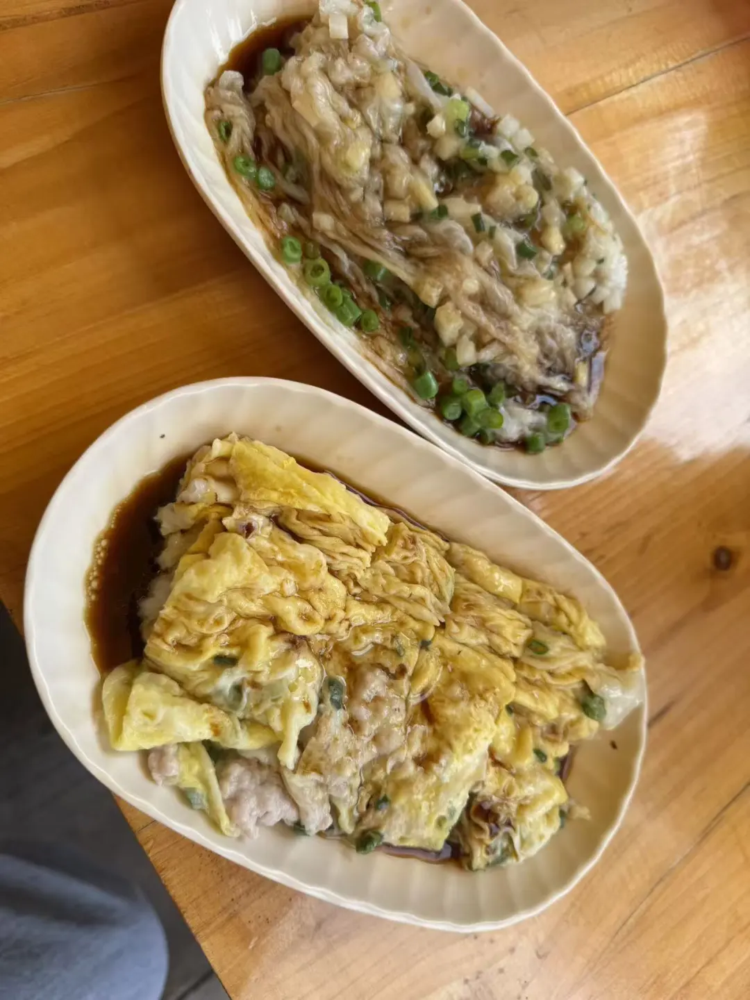
*我是肠粉脑袋;)*

本次最佳：甜甜屋，十分匹配我的 taste，在性价比拉满的情况下好吃不贵，除了爆炒生肠我甚是喜欢，还吃到了本次行程最嫩的白斩鸡，好爱！这是一家在巷口的本地菜，据说老板娘一开始不会说普通话，是后来食客越来越多后才学的。去的时候就要排队了，当时是在二楼和一对情侣拼的桌。我发现我真的很爱吃鸡，附带葱油一类的东西，我可太爱了。（对不起太好吃了顾着吃没拍照）

对于鸡的评价还来自我的新加坡 bro，虽然他并不是一个对于吃非常挑剔的人，甚至可以说毫不挑剔，但是他也逐渐理解广东做鸡的水平了，起码他觉得完胜新加坡鸡饭的鸡，好！除了鸡以外，他后来自己去广州市里探了一些云吞面，终于明白我的挑剔不是没有理由的了。这就不得不提到上次我去新加坡的时候，他带我去吃了一家他经常在新加坡去的米其林云吞面档口，他以为会听到我的夸赞，但我仅仅回复：还行。当时那家云吞面其实属于中等，无功无过，没有很惊艳。后来他又给我发了一个他网红朋友在新加坡的云吞面探店评测攻略，其中就有之前他带我去的那家，但对不起啦，我实在是没法违心地的说那个实在很好吃，「还行」是我觉得对那个云吞比较高的评价，因为当时我认为清迈大学社会学院的那个阿姨档口的更好吃。

没想到我人生中一晚喝最多品种的鸡尾酒特调是在广州。离开广州前一天和几个很久没见的朋友吃饭，时光荏苒，已是两年，大家这两年的经历各有不同。从别人的眼里看我，也是变化良多，原来我真的是看起来更加自信、更外向了，好！

一开始是在瑰丽的赤醉吃了个简餐，一人点了一杯。赤醉 vibe 还不错，可以选露台或者是室内的位子，坐室内晚上可以看乐队演出。不知道是不是每天都不一样，我们去那天是黑人乐队，记得当时那位叔叔很会唱。chill 的氛围还不错，但是酒一般。

于是我们又开始了第二轮——从瑰丽穿过广州塔附近走到应该是五羊邨附近又喝了一轮。第二家去的水平显然要高于赤醉，碎冰款很好喝，我记得我当时点的是叫「血色沙漠」？有点记不清了。

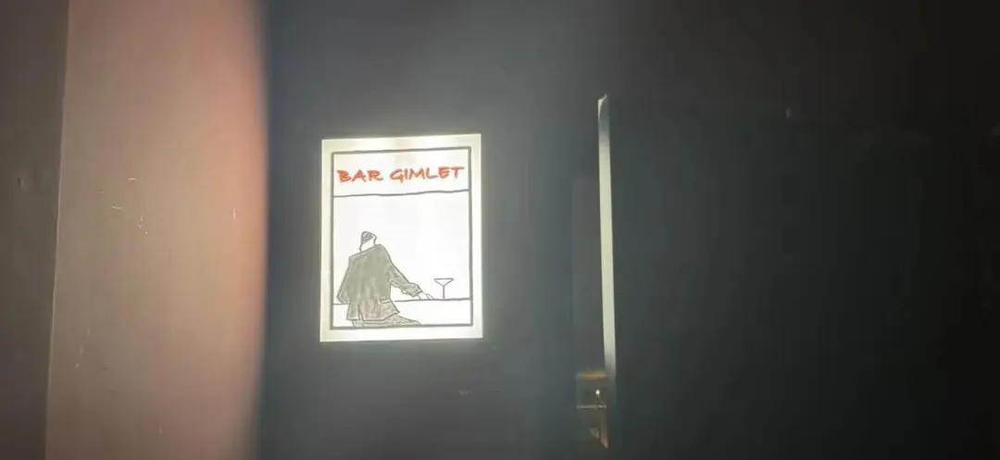
原计划去庙前冰室直接第三轮，路上经过了一家没什么人，感觉还不错的，盲选尝试了一波，他们家做的是茶饮和酒的特调，康宝茶系列的竟然出乎意料的好喝。

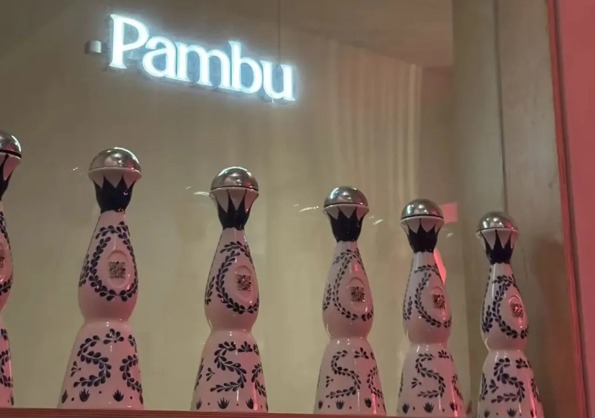
*去的时候店里只有我们，装潢绮丽*

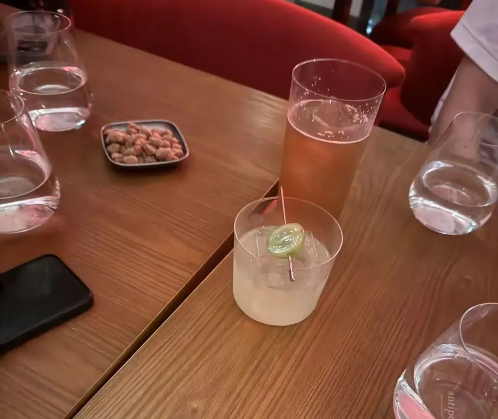
*最看起来平平无奇的竟然最好喝*

喝完这一轮又走到了最终的目的地庙前冰室，到达的时候离他们闭店还剩下不到一个小时，所以不用排队，直接就进了。不得不说，贵是贵的，但好喝也是好喝的，很多口味都有惊喜。喝到最后，我传奇姐朋友已经醺了，一直念叨：在广州，鸡有鸡味，鱼有鱼味（此处点题）。计算了一下，那天晚上我们四个人一共点了并喝完了 22 杯鸡尾酒，嗯，本次 cocktail journey 是有点疯狂。但是好喝的，非常记忆深刻的体验。

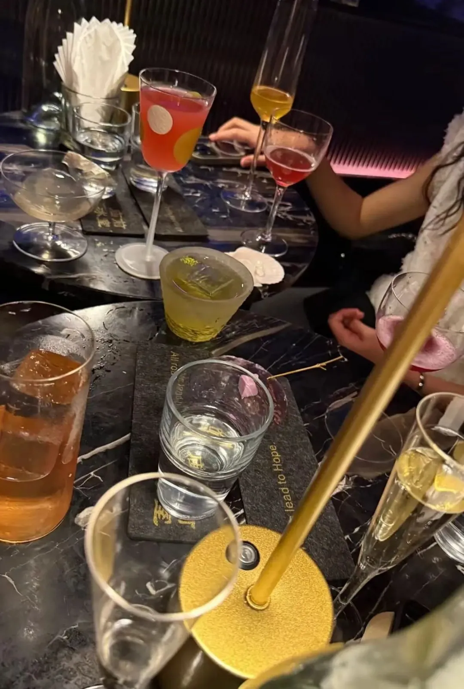
*真的喝了好多，说实话最令人惊喜的是其貌不扬的 Black Box*

除了这一段经历，我们有一晚吃完饭也找到了一家很不错的 Bar，主要是无烟的酒吧，非常爱。本来要去的不是这家而是另一家，当时停车不好停，停好车走到我们要去的那家，一进门就是扑面而来的烟味我直接跑了。走去原先那家的时候经过了一家像是咖啡店的 Bar，外面看起来平平无奇，结果走进发现门上写了「No smoking」，并且还有位，里面都是小姐姐们，简直太棒啦！衷心希望国内这样的无烟 Bar 可以更多些。

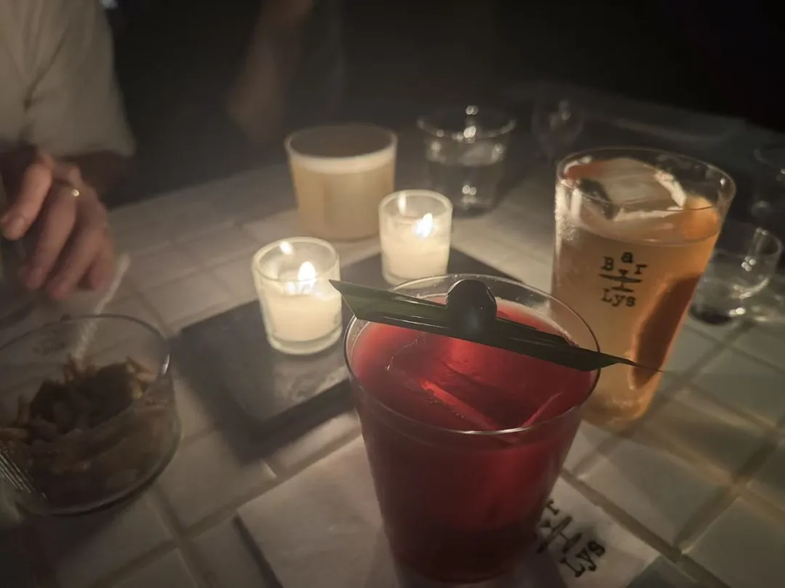
*称职的司机是不喝酒的，Yeah！*

在广州还去到了一家开在花都小区里的咖啡+Bar，叫「Knock Konck Log」。

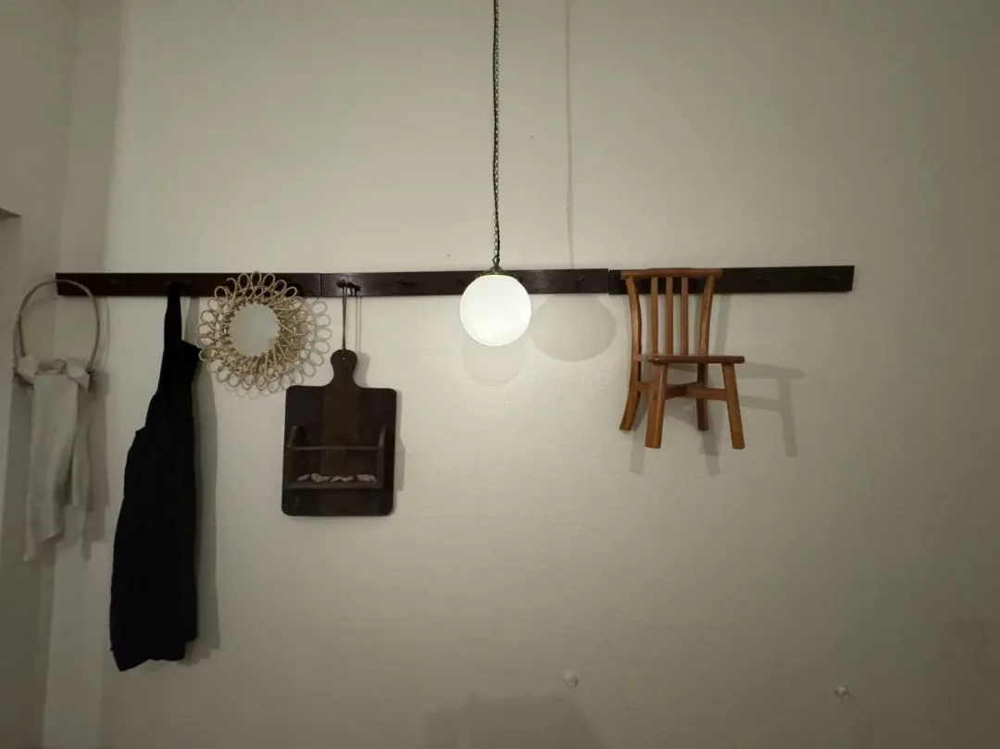
*小店角落一隅，很像小渔村*

店长是小狗（忘了他的品种）。那天去的时候店长刚好割完蛋，不太开心哈哈哈。狗子太吸睛，忘记酒好不好喝了，无功无过那种，没有人吸烟就行。

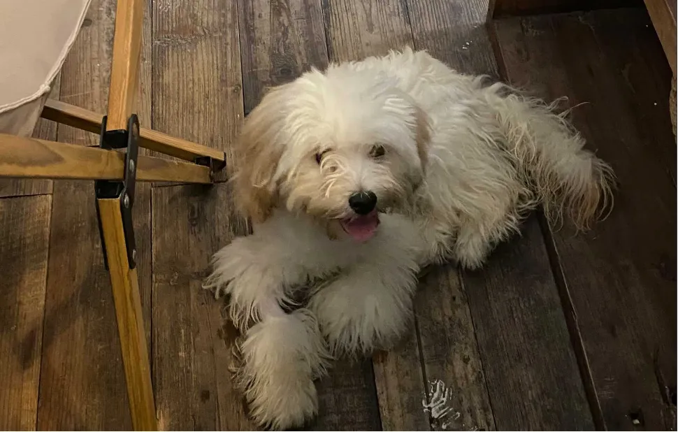
*这已经是康复后的店长，所以比较开心 lol（从老板朋友圈偷的图)*

他们家的菜单有错别字应该是故意的吧。

饼干挺抽象的，闻和看起来很像橡皮泥。当时是老板做了好玩后拿给我们玩的，但我朋友好奇吃了，她竟然觉得挺好吃的，神奇的广东人 lol。

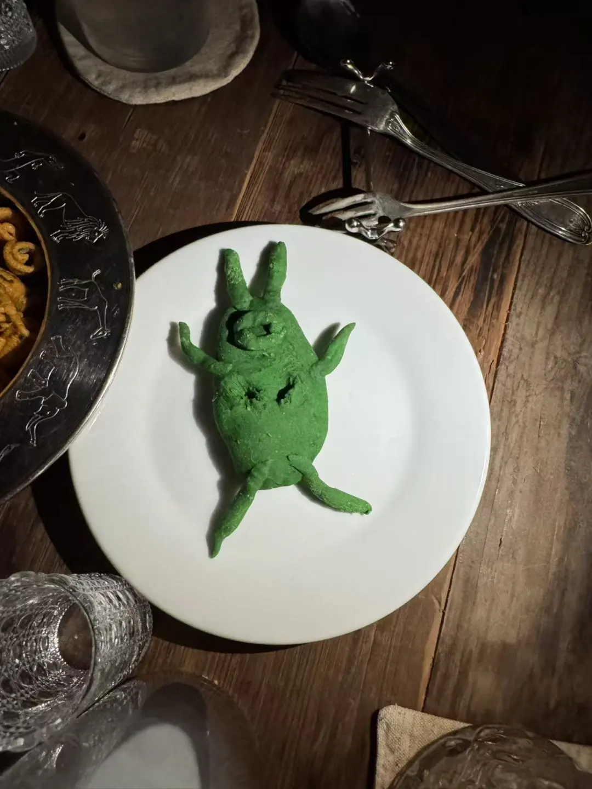
*这个比较抽象*

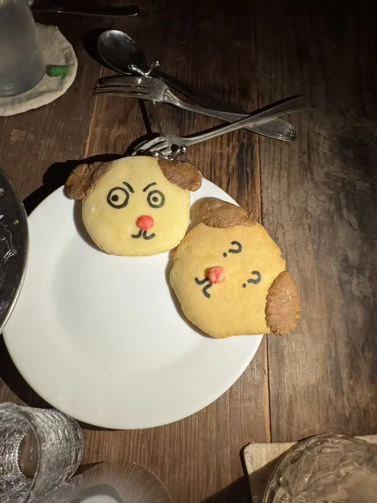
*这个应该是就店长模样改造的🍪，味道还可以*

严重怀疑是吃的太好，外加上熬夜，以及广州的潮湿，在广州那几天严重爆痘，可以感同身受我朋友。舌尖上的广州是毫无毛病，潮也是真的潮，潮到风湿。

 

# 🎠 长隆野生动物园
上一次去动物园是什么时候呢？记不清了，可能 11 岁的样子。这次驱车去了长隆野生动物园，其实我们五个人当时可以买优惠票的，但熬了个夜就错过了时间，算了算了。

去了才知道长隆野生动物世界是私人的，而且到了以后我朋友告诉我疫情期间老板为了养动物所以卖了周围的一块地，所以周围有一些房产楼在建造。感觉蛮唏嘘的，支持一波。

去了之后确实感觉长隆的动物的生存环境还是不错的，对比其他的动物园，无论是管理方面还是对于动物的环境布置方面，动物们的自由度相对更高一些。最近刚去了迪士尼，感觉长隆其实还可以向迪士尼、环球学习一下，提升一下周边文创的设计，或者做一些特色的 IP，或者搞一些联名，让动物们吃得更好。

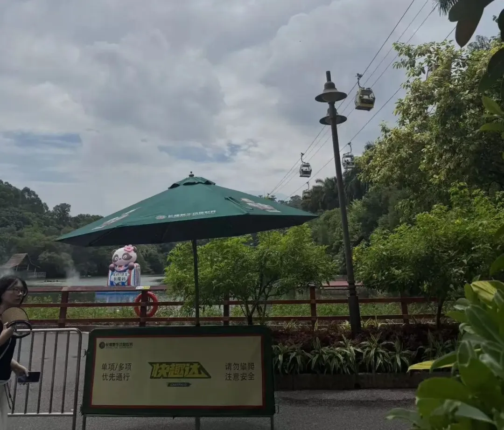
*真的很热呀，但天气不错*

 

# 🚗 技能提升
特别值得一提的是：我的车技在广州练成了！

本人的驾照是在 20 年考完的，但是和众多我的朋友们一样，自从考完以后我就没碰过车了。期间一直有想要练车的念头，奈何并不强烈也没有什么必然的理由，直到上次挪威之行。如果我可以熟练开车就可以有多一个出行租车的选择，那么不仅是在国内，在国外旅游直接开车也会更爽。于是我就拜托我妹我姑陪我练车，练了一两天基本已经能开。

计划广州之行的时候我朋友告诉我她爸的车能留给我们开，这样我们后面就可以从广州开车去深圳。原计划是另外的几个新加坡、台湾的朋友带着驾照来国内换临时驾照，因为我当时不是很自信。结果第一天我试开表现还不错，被我朋友夸奖了，收到正向反馈后我也非常争气，表现持续良好，并且开上了瘾。于是我就做了本次我们广深游的全程司机——日常出行吃饭，外加进广州城区，以及直接开了高速去深圳。

就像之前文章里提到的那样：游泳还不是很好的时候直接就下了海，再回泳池发现 1.9 米也不过如此，一般情况下淹不死人；冲浪不会也没什么，摔得越多学得越快；开车也是这样，在一开始堪堪是一张白纸的时候，直接在夜晚开了高速、应付了广州市里的电瓶车和复杂的交通。兵来将挡，水来土掩，做好基础的准备，实践是最好的成长，那么就去做吧。（并不是鼓励大家在忽视安全的情况下盲目做这些，我还是有做一些练习和准备的）。

现在已经在期待如果年末去南美的话，我是不是可以利用我的车技了，嘿嘿。